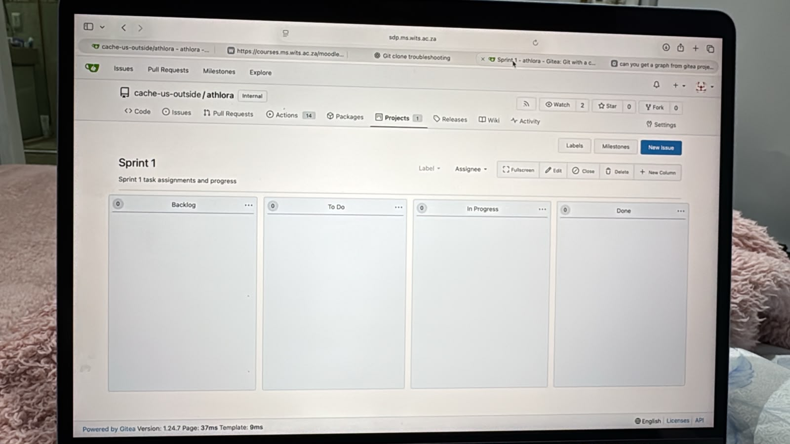

# Sprint 1 Meeting Records

This document is a concise record of the material planning, delivery, and review discussions from Sprint 1. It is derived from the retained [raw meeting transcript](./raw-meeting-transcript), the client-meeting record, and the repository's merged commit history.

## Sprint Context

- **Delivery focus:** establish the Athlora application foundation and deliver the first 100m coaching workflow.
- **Work tracking:** the Gitea Projects Kanban board tracked issues through `Backlog`, `To Do`, `In Progress`, `In Review`, and `Done`.
- **Quality expectation:** work was developed on branches, merged through pull requests, and checked through the affected automated checks before completion.

## 12 August 2026: Product Identity and Project Setup

### Discussed

- The team selected **Athlora** as the product name.
- The team confirmed that the product scope was athletics as a whole, while the first delivered vertical slice would focus on 100m timing.
- The repository, frontend, backend, and documentation scaffold were created.

### Decisions and Outcomes

- The project repository was created under the Athlora name.
- Development and documentation would be maintained together so that implementation changes could be recorded as they landed.
- The repository history records the scaffold commit on 12 August: `feat: scaffold Athlora monorepo (frontend/backend/docs/e2e)`.

## 14 August 2026: Kanban Setup and Delivery Plan

### Discussed

- The team adopted Gitea Projects as the Kanban work board and agreed that all development, documentation, and setup work should be represented by issues.
- The implementation dependency order was identified, beginning with foundation work and then progressing through roster, event, timeline, result, and dashboard work.
- The team agreed on the branch, pull-request, and merge workflow.

### Decisions and Assignments

- Issues `#27` and `#38` were identified as early parallel work that would unblock later integration.
- Issue `#24` was reported complete; issues `#25` and `#26` were allocated and subsequently reported complete in the raw transcript.
- The Kanban board became the shared place to assign and update work rather than relying on chat alone.

### Evidence

## 16 August 2026: Sprint Work Allocation

### Discussed

- The team reviewed remaining work against the Sprint 1 target and agreed to continue in dependency order.
- Issues `#29` and `#33` were reported complete.
- The team discussed the remaining workload, test failures, and the need to keep the board current.

### Decisions and Assignments

- Vareshan took issues 6 and 10 in the team's work sequence.
- Aaliah took issues 7 and 9.
- Tyra took issues 8 and 11.
- The team agreed to resolve failing checks before merging affected work.

## 17-18 August 2026: Integration and Completion Work

### Discussed

- The team coordinated the remaining implementation work, tracked completed issues, and prepared for a client demonstration.
- Issue `#43` was reported complete, followed by work on `#46`.
- Issue `#31` was reported complete while `#47` remained outstanding at that point.
- A merge conflict affecting issue `#44` was identified, resolved, and then merged.

### Outcomes

- The repository history records merged pull requests for the results, timeline, dashboard, E2E, account-lifecycle, and weather work during this period, including PRs `#62` through `#74`.
- The team scheduled a client meeting to demonstrate the work and gather further requirements.

## 20-23 August 2026: Review, Documentation, and Release

### Discussed

- The team reviewed Sprint documentation, the ERD, E2E guidance, the development plan, Gitea board evidence, and pull-request review expectations.
- A temporary hosted-backend outage was checked and later confirmed resolved.
- The team prepared the release and completed outstanding project documentation.

### Outcomes

- Documentation and release work were reported complete on 23 August.
- The repository history records the documentation refresh and the Sprint 1 meeting-record pull request, PR `#81`.
- Feedback from the client meeting was recorded as future backlog input in [Sprint 1 Client Meetings](./client-meetings).

## User Stories and UAT Traceability

The detailed stories and UATs are retained in [Sprint 1 User Stories and Acceptance Criteria](./user-stories). The merged history supports the main implementation sequence below; individual UAT status should only be marked complete when its stated verification was performed and recorded.

| Area | Implementation Evidence |
|---|---|
| Authentication and ownership | PRs `#2` and `#50` |
| Athlete roster and archival | PRs `#54`, `#57`, `#67`, and `#68` |
| Events and participants | PRs `#55`, `#56`, `#58`, `#59`, and `#70` |
| Timeline, results, and corrections | PRs `#60` through `#66`, `#73`, and `#74` |
| Dashboard and athlete insights | PRs `#65`, `#66`, `#67`, `#73`, and `#74` |

## Improvement for the Next Sprint

Record pull-request reviews consistently before merge and keep the Gitea issue/board state current as work changes. This was identified in the Sprint 1 chat and supports clearer traceability for the next Sprint.

## AI Declaration

This document was synthesized from existing project evidence with the assistance of OpenCode[gpt-5.6-terra].
