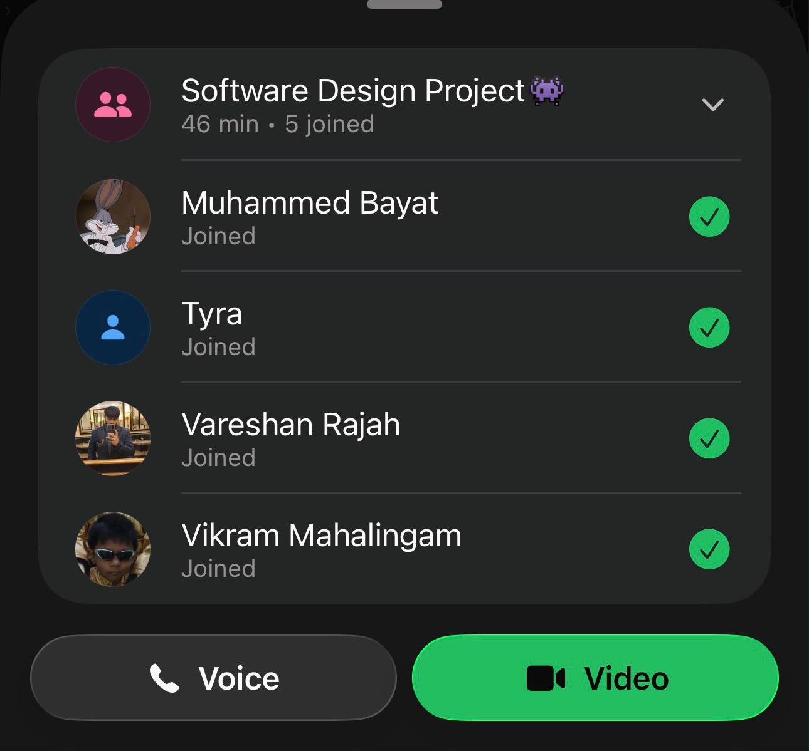

# Meeting 1 - 05/08/2026

## What we spoke about

- file management 
- spoke about git methodologies
- tools to use
- UI, colour scheme
- set up
- timeline
- testing: test cases + beta testing (by people) - can use google forms
- work tracker: trello
- design & dev plan

## Attendees

- Aaliah Reddy (2798790)
- Vareshan Rajah (2809069)
- Vikram Mahalingham (2800630)
- Muhammed Bayat (2811604)
- Tyra Mohamed (2800066)

## Proof of meeting

