# Sprint 2 Raw Meeting Transcript

This is the retained, date-bounded WhatsApp project-chat export for Sprint 2. It is chronological source evidence for the concise [Sprint 2 meeting records](./meeting-records). The archive includes messages from 25 August through 14 September 2026 only. Sensitive values, including credentials, personal email addresses, access tokens, and request headers, have been redacted.

## Attendees

- Aaliah Reddy
- Vareshan Rajah
- Vikram Mahalingam
- Muhammed Bayat
- Tyra Mohamed

## Chat Transcript

### 2026/08/25

**[11:45:38] Vareshan Rajah:** Shervaan Govinder is marking us today, don't know who he is😭

**[11:51:42] Muhammed Bayat:** How yk

**[12:05:24] Vareshan Rajah:** Moodle

**[12:07:35] Vikram Mahalingam:** Looks like we’re his only group so at least we don’t have to wait

**[12:13:18] Aaliah Reddy:** ‎sticker omitted

**[17:43:57] Muhammed Bayat:** Quick question

**[17:44:25] Muhammed Bayat:** Do we want to implement more of the stuff now like the races and track and field n stuff

**[17:44:30] Muhammed Bayat:** Or can we wait abit still

**[17:45:17] Muhammed Bayat:** I think we should wait until it’s like polished for 100m so that if we want any changes we can make then just to that one instead of making it to all

**[17:45:34] Muhammed Bayat:** N then once we’re happy with the final product we can incorporate the rest

**[17:46:33] Vikram Mahalingam:** I don’t think it’s that complicated to extend it now cause they’ll all use the same functions in the backend

**[17:46:59] Vikram Mahalingam:** So making major changes won’t be that complicated for all the disciplines

**[17:47:14] Vikram Mahalingam:** You’ll just change the backend functions

**[17:47:54] Muhammed Bayat:** Okay vik don’t disappear while you here

**[17:48:22] Muhammed Bayat:** ‎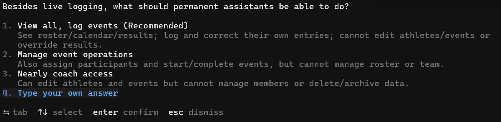

**[17:48:35] Muhammed Bayat:** 1 right

**[17:48:46] Vikram Mahalingam:** Yup

**[17:50:53] Muhammed Bayat:** ‎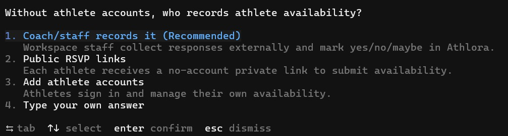

**[17:51:40] Muhammed Bayat:** 2 seems nice but idk how difficult itll be to implement  n stuff esp since current atheletes could have like dummy accouhnts

**[18:08:35] Vikram Mahalingam:** I think 1

**[18:08:54] Vikram Mahalingam:** Just cause 2 wouldn’t make sense in real life ‎[edited]

**[18:09:55] Vikram Mahalingam:** I think we can do the QR code thing so they can view the event but can't edit anything

**[18:10:09] Vikram Mahalingam:** But that's a bit deep iwl

**[18:50:36] Muhammed Bayat:** go crazt ‎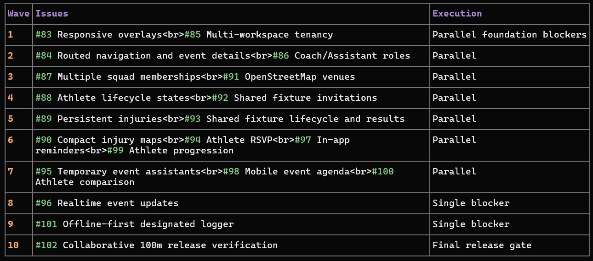

**[18:51:14] Vikram Mahalingam:** 👍

**[18:52:02] Muhammed Bayat:** get ur agent to pull issue , read the current description and then push and create pr

**[18:52:15] Muhammed Bayat:** if u remeber just get someone to review the PR

**[18:52:19] Muhammed Bayat:** or assign it urself

**[18:52:30] Muhammed Bayat:** dont forget to assign urself the tasks u do

**[18:52:38] Vikram Mahalingam:** Ok lovely

**[18:53:25] Muhammed Bayat:** just these will probanly take alot longer then before coz they arent split into subtasks and stuff so yea just jkeep note of that

**[18:53:53] Vikram Mahalingam:** Ok np

### 2026/08/26

**[09:22:12] Muhammed Bayat:** @⁨Vikram Mahalingam⁩ you busy with 85 or can i do it

**[09:50:58] Vikram Mahalingam:** Nah you can go ahead

**[10:44:23] Muhammed Bayat:** ‎Muhammed Bayat pinned a message

**[11:45:06] Muhammed Bayat:** Wave 2 is done

**[11:45:11] Muhammed Bayat:** Can carry on from there

**[11:46:30] Vikram Mahalingam:** Ok cool

**[11:47:47] Aaliah Reddy:** and 1?

**[11:48:03] Vikram Mahalingam:** Done as well

### 2026/08/29

**[17:29:01] Muhammed Bayat:** wave 3 done

**[17:30:38] Muhammed Bayat:** guys please work on this like just leave it running in the back and carry on with ur wonderful lives 😭

**[17:31:11] Muhammed Bayat:** u can use this promt

**[17:31:12] Muhammed Bayat:** “read the agent built spec, pull issue 87, read the contenst of the issue ie telling you what needs to be done commit and push and create a pull request for it, use this PAT [REDACTED -- personal access token] ill delete the token once done”

**[17:31:32] Muhammed Bayat:** if were still exporting chats pls remove this lol

**[17:59:06] Muhammed Bayat:** guys

**[17:59:21] Muhammed Bayat:** please delete ur local repos and reclone them

**[17:59:36] Muhammed Bayat:** otherwise the mirror will break again

**[18:06:13] Vareshan Rajah:** Okay this wasn't me, but should we not export our chats?

**[18:06:40] Muhammed Bayat:** Wum

**[18:07:18] Vareshan Rajah:** Like our transcripts?

**[18:07:48] Muhammed Bayat:** I’m lost iwl

**[18:07:56] Vareshan Rajah:** Okay nvm

**[18:08:52] Vareshan Rajah:** I understand what you meant now

**[18:09:04] Muhammed Bayat:** Also just note lowkey somethings broken so you prolly won’t be able to use the app , someone can try fixing it or we can just wait till we finish the issues n then fix

**[18:09:29] Vareshan Rajah:** Ohh chaai😭

**[18:09:46] Vareshan Rajah:** Where's this token from?

**[18:19:46] Muhammed Bayat:** You can use this one

**[18:19:59] Muhammed Bayat:** Like copy and use this exact msg just change the issue no

**[18:20:41] Vareshan Rajah:** Would not affect who it shows did the issue then?

**[18:21:19] Muhammed Bayat:** It’s just to access the issue

**[18:21:30] Vareshan Rajah:** Ohh okay calm

**[18:21:58] Vareshan Rajah:** Okay I'm gonna work on wave 4 now

**[19:32:21] Vareshan Rajah:** @⁨Muhammed Bayat⁩ @⁨Vikram Mahalingam⁩ , which one should I choose? ‎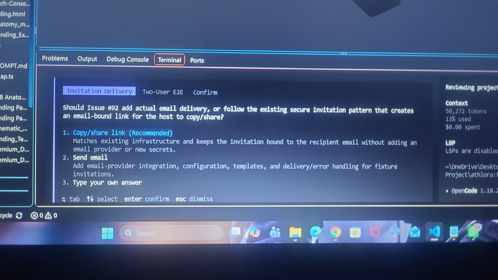

**[19:32:54] Vikram Mahalingam:** I think option 1

**[19:33:05] Vikram Mahalingam:** I don’t want another email fiasco 😭

**[19:33:12] Vareshan Rajah:** Okay calm

**[19:33:36] Vareshan Rajah:** I don't know how the agent was going to do the email thing tho

**[19:49:38] Muhammed Bayat:** Yea

**[19:54:43] Vareshan Rajah:** It's seems like the AuthO is broken or something😭

**[19:56:14] Muhammed Bayat:** Who knows 😭

**[20:08:27] Vareshan Rajah:** Ya @⁨Muhammed Bayat⁩ you the one that has to fix it, coz I don't have access to the Render logs

**[21:38:49] Muhammed Bayat:** Alrighty

**[21:39:15] Muhammed Bayat:** I’m sure you guys have it too like swear you have access to the render backend

**[22:36:57] Vareshan Rajah:** I'm not sure iwl

**[23:45:14] Vareshan Rajah:** Wave 4 is done

### 2026/08/30

**[09:02:14] Tyra:** I’ll do wave 5 today

**[10:51:31] Aaliah Reddy:** i’ll do 6

**[10:52:31] Muhammed Bayat:** dont forget to reclone

**[10:52:41] Muhammed Bayat:** but you can login again

**[11:30:00] Aaliah Reddy:** reclone from gitea though right?

**[11:30:08] Aaliah Reddy:** what’s the deploy one on normal github for?

**[13:18:05] Muhammed Bayat:** Yuhh

**[13:18:35] Muhammed Bayat:** I think render needed a normal GitHub to launch off

**[13:44:14] Aaliah Reddy:** kk

**[13:44:24] Aaliah Reddy:** i wanna do wave 6, do i need to wait for 5 to be done first?

**[14:10:40] Muhammed Bayat:** Yeaa

**[14:11:24] Aaliah Reddy:** @⁨Tyra⁩ let me know when you’re done with 5

**[14:44:55] Aaliah Reddy:** i also did some research on how to incorporate a codecov into gitea, lmk if i must implement it

**[14:55:33] Tyra:** Yes will do 👍sorry I’ve been working on it but today open code is taking long with the responses 😭🫩

**[15:22:55] Vareshan Rajah:** Okay @⁨Muhammed Bayat⁩ and @⁨Vikram Mahalingam⁩ , please can yall just check out the assistant coach thing, so my chat did it based on the issue, but I'm not sure if that's how yall exactly wanted it

**[15:23:31] Vareshan Rajah:** The assistant that I added is:

[REDACTED -- email address]

[REDACTED -- password]

**[15:25:12] Muhammed Bayat:** Yea well check it once all the stuff are done 😭

**[15:25:19] Muhammed Bayat:** Coz there’s probably a few stuff we’d like to change

**[16:26:46] Tyra:** Which deepseek free model do you guys use on opencode because the Gemini model that I was using said the quota ran out

**[16:27:21] Vikram Mahalingam:** Deepseek is down right now try the mimo one

**[16:30:15] Tyra:** Thank you !! Mimo is working

**[19:00:36] Tyra:** Done with wave 5 😮‍💨

**[19:00:49] Tyra:** Sorry for taking so long

**[19:01:16] Aaliah Reddy:** it’s okay😭

**[19:01:31] Aaliah Reddy:** i’ll see if i have time to do 6 now, i should though

**[19:12:00] Aaliah Reddy:** @⁨Muhammed Bayat⁩ must i do this pull request? ‎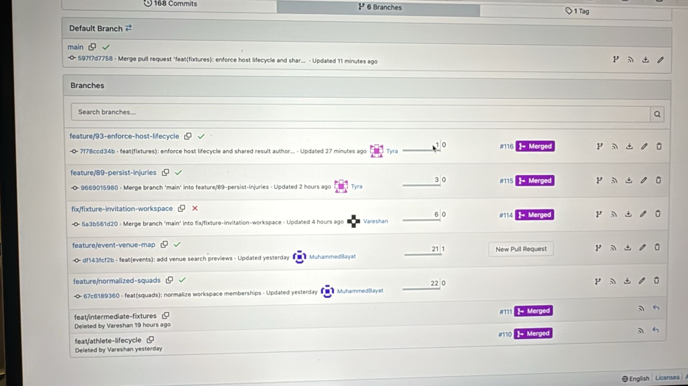

**[19:12:23] Muhammed Bayat:** Yupp

**[19:13:29] Aaliah Reddy:** ‎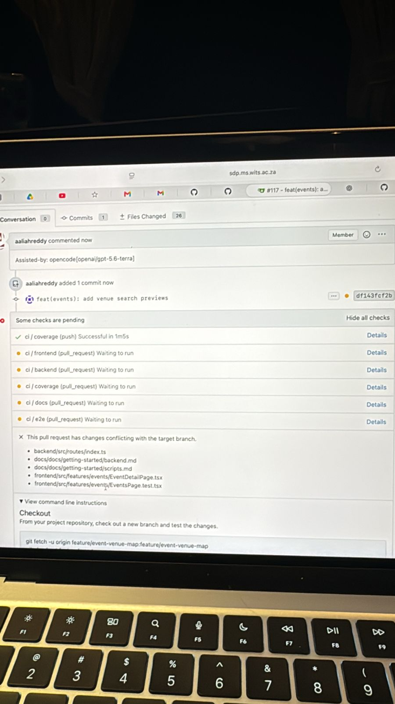

**[19:13:54] Aaliah Reddy:** idk if it has conflicts now because of tyra’s stuff

**[19:14:14] Tyra:** ‎sticker omitted

**[19:14:39] Muhammed Bayat:** Uhm Tyra did you merge ur pull

**[19:14:50] Aaliah Reddy:** she did

**[19:14:53] Tyra:** Yes but both merged successfully

**[19:15:02] Muhammed Bayat:** Yeaaa

**[19:15:10] Muhammed Bayat:** @⁨Vikram Mahalingam⁩

**[19:15:13] Muhammed Bayat:** Can you help

**[19:15:23] Muhammed Bayat:** Genuinely have no idea how to resolve it

**[19:16:12] Vikram Mahalingam:** Yea Aals your branch is probably behind so in vscode pull in main and merge the updated main with the branch your working on

**[19:16:25] Aaliah Reddy:** just from now on always remember to do your pull request right after you finish

**[19:16:35] Aaliah Reddy:** i haven’t created a new branch as yet

**[19:16:35] Vikram Mahalingam:** Tell your agent to merge and fix conflicts

**[19:16:52] Aaliah Reddy:** i’m trying to fix momo’s one 😭😭

**[19:17:10] Vikram Mahalingam:** Yea same difference

**[19:17:23] Aaliah Reddy:** okay slay

**[19:17:31] Vikram Mahalingam:** Update the main and merge it with whatever branch you’re working on

**[19:17:40] Muhammed Bayat:** Ohh might’ve happened when I was tryna fix the login 😭

**[19:17:52] Vikram Mahalingam:** It’s a pain but idk an easier way😭

**[19:19:13] Vikram Mahalingam:** Also can you guys delete the branches you’re finished with just to reduce the clutter

**[19:19:30] Vikram Mahalingam:** I don’t want to accidentally delete a branch you’re working on😭

**[19:28:45] Aaliah Reddy:** kk all fixed now

**[19:28:54] Aaliah Reddy:** and i deleted the branches

**[19:32:27] Aaliah Reddy:** anyone know why this is the case? ‎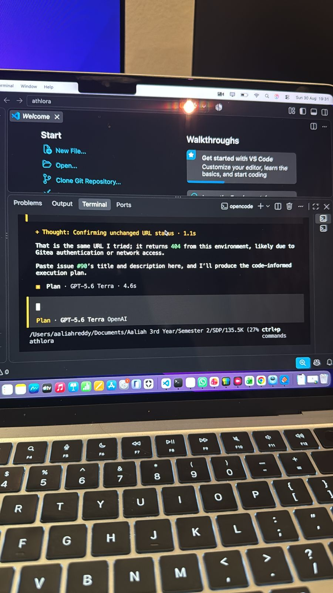

**[19:33:05] Vikram Mahalingam:** Iwl idk how these tokens work😭

**[19:33:17] Aaliah Reddy:** oh i didn’t put the token in that’s why😭

**[19:33:23] Aaliah Reddy:** but it told me to never share it 😭😭😭

**[19:51:09] Muhammed Bayat:** Ehh

**[19:51:22] Muhammed Bayat:** It’s okay

**[20:00:16] Aaliah Reddy:** wave 6 is done

**[20:01:29] Aaliah Reddy:** nvm i lied

**[20:01:41] Aaliah Reddy:** didn’t realise there’s a few more in there

**[20:09:23] Muhammed Bayat:** 😭😭😭

**[20:10:34] Aaliah Reddy:** help ‎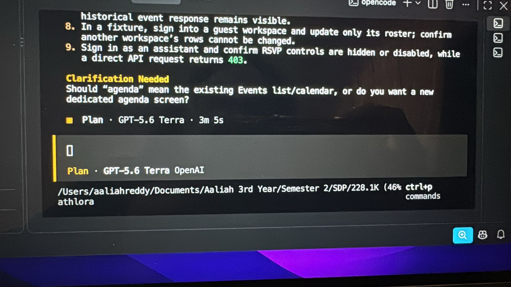

**[20:11:09] Muhammed Bayat:** Existing

### 2026/08/31

**[10:02:59] Aaliah Reddy:** wave 6 is done sorry guys 😭 ‎[edited]

**[10:31:35] Aaliah Reddy:** is anyone else’s gitea just not loading?😭

**[10:33:31] Muhammed Bayat:** Wits WiFi and everything is down atm

**[10:33:35] Muhammed Bayat:** So who knows 😭

**[10:33:48] Muhammed Bayat:** But yea mines isn’t loading too

**[10:48:26] Muhammed Bayat:** It’s back up

### 2026/09/01

**[14:05:32] Aaliah Reddy:** okay so i did some research the other day and we can’t add a codecov onto gitea so i just changed our coverage report to give an overall coverage and it will fail if the coverage is less than 70%, what i can do is add a function that updates the readme with the overall coverage if you guys want that but this is what it is at this stage ‎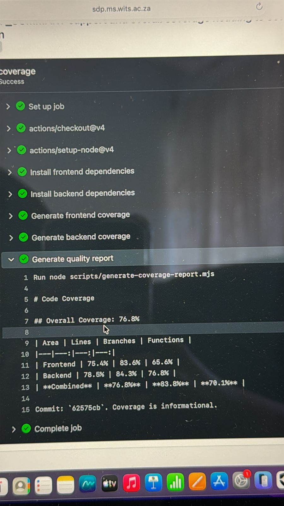

**[14:08:23] Muhammed Bayat:** Coool

**[14:09:16] Aaliah Reddy:** i might have to fix something tomorrow from wave 7 will let you guys know when it is fixed

**[14:59:38] Muhammed Bayat:** Cool and then can 8 and 9 be done Tom after we right so then I can spend Thursday morning making fixes before we show harshil

**[15:11:00] Aaliah Reddy:** i’ll fix 7 and do 8, and then someone else can take 9

**[15:11:11] Vikram Mahalingam:** I can do 9 and 10

**[15:11:29] Vikram Mahalingam:** I’ll also add the terms and conditions/ privacy policy

### 2026/09/02

**[07:21:12] Aaliah Reddy:** sorry guys i did wave 6, will fix it later

is anyone else willing to do 7? then i can do 8 lol

**[10:21:38] Aaliah Reddy:** @⁨Tyra⁩ please can you do wave 7🫣

**[10:37:52] Tyra:** Okay will do

**[13:30:06] Aaliah Reddy:** kk, i’m gonna do my fix for wave 6 now quickly

**[13:30:37] Aaliah Reddy:** i don’t think we should be done by everything tomorrow, but i do think we should aim for friday

then we can spend some time on CGV next week

**[13:37:52] Aaliah Reddy:** @⁨Tyra⁩ don’t push anything else yet, i just need to fix something

**[13:56:34] Aaliah Reddy:** nvm you can continue

**[13:56:48] Tyra:** @⁨Aaliah Reddy⁩ i started working on wave 7 before you fixed wave 6 so I now deleted the work I did for wave 7 😭😭

**[13:56:56] Aaliah Reddy:** NO

**[13:57:01] Aaliah Reddy:** you didn’t have to do that😭

**[13:57:02] Tyra:** Sorry

**[13:57:04] Aaliah Reddy:** wave 6 was done

**[13:57:10] Tyra:** Oh 😭😭

**[13:57:13] Aaliah Reddy:** there was just a small mistake

**[13:57:18] Tyra:** Okay I’ll start wave 7 properly now

**[13:57:22] Aaliah Reddy:** but i’m not gonna fix it now so don’t stress

**[13:57:26] Aaliah Reddy:** kk when you’re done i’ll do 8

**[14:20:19] Aaliah Reddy:** just made a note of some of the fixes that need to be made, will do it after tyra is done ‎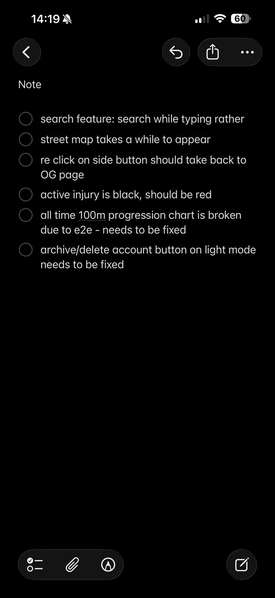

**[14:23:06] Aaliah Reddy:** the only issue from wave 6 is the progression charts because of the e2e failure so the feature does not work currently

**[17:53:20] Vareshan Rajah:** So I'll do all the UI fixes tomorrow morning

**[17:54:42] Aaliah Reddy:** tyra is still busy with wave 7 cause she’s failing test cases

the UI fixes are just the colours of the buttons for archive and delete account

i was gonna do all of it today, but im not sure if tyra is winning that side 😭😭😭

**[17:55:02] Aaliah Reddy:** i can do it now but i don’t want to conflict with any of her stuff

**[17:56:13] Vareshan Rajah:** Nah but there's also some of the drop boxes that aren't following the themes as well

**[17:56:27] Vareshan Rajah:** If you want you can do them when she's done, just let me know

**[17:58:08] Aaliah Reddy:** okay yeah just keep a note of everything you see that needs to be fixed

**[18:01:23] Aaliah Reddy:** also we must try finish all the issues by friday, then we can make the google form and send it to our friends to test the app

**[18:02:25] Muhammed Bayat:** We need to do that ?😭

**[18:08:24] Aaliah Reddy:** yuhh

**[18:09:31] Aaliah Reddy:**

**[18:09:32] Aaliah Reddy:** so for stakeholder review imma create a form specifically for harshil to use and test the app and also document tomorrows meeting

and then create a separate form for user feedback 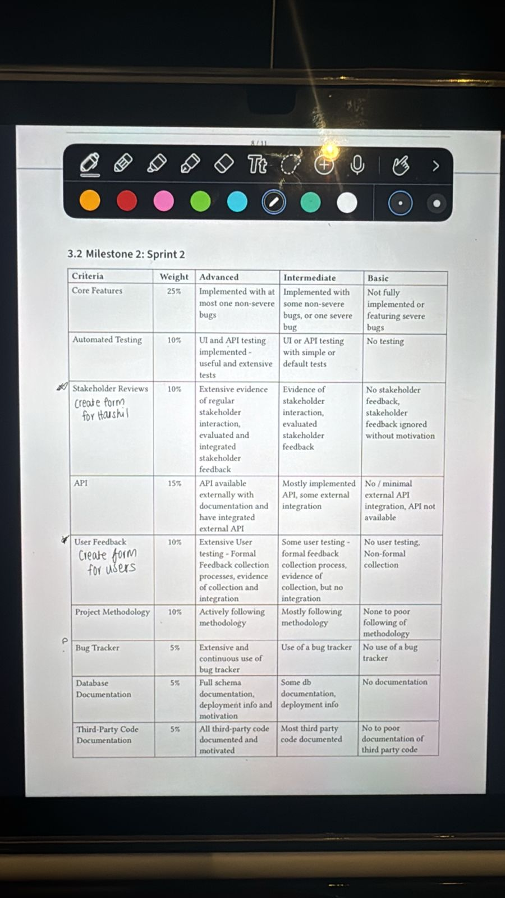

**[18:09:33] Aaliah Reddy:** ‎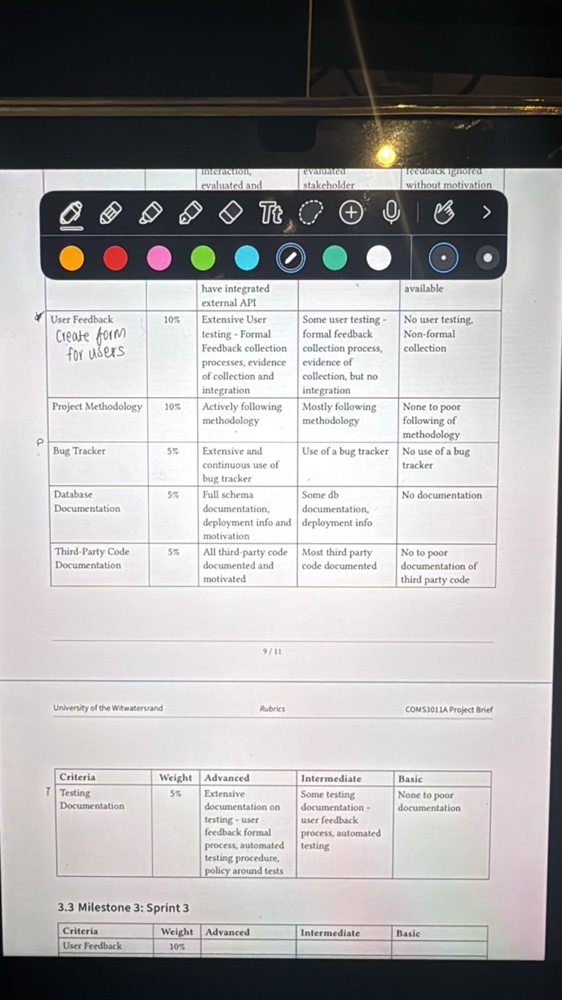

**[18:09:58] Aaliah Reddy:** also idk what the whole bug tracker thing is🫣

**[18:10:16] Vikram Mahalingam:** I’ll check that tonight

**[18:10:21] Aaliah Reddy:** and we need to do testing docs

**[18:21:14] Vikram Mahalingam:** For the bug tracker @⁨Muhammed Bayat⁩ @⁨Aaliah Reddy⁩ ‎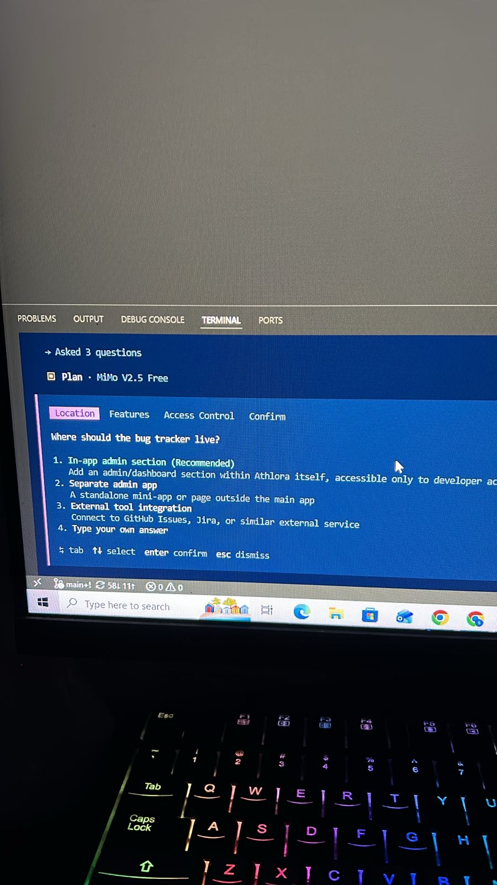

**[18:21:34] Muhammed Bayat:** 1 sounds good

**[18:21:45] Muhammed Bayat:** Yoh this sprints so heavy

**[18:22:17] Vikram Mahalingam:** ‎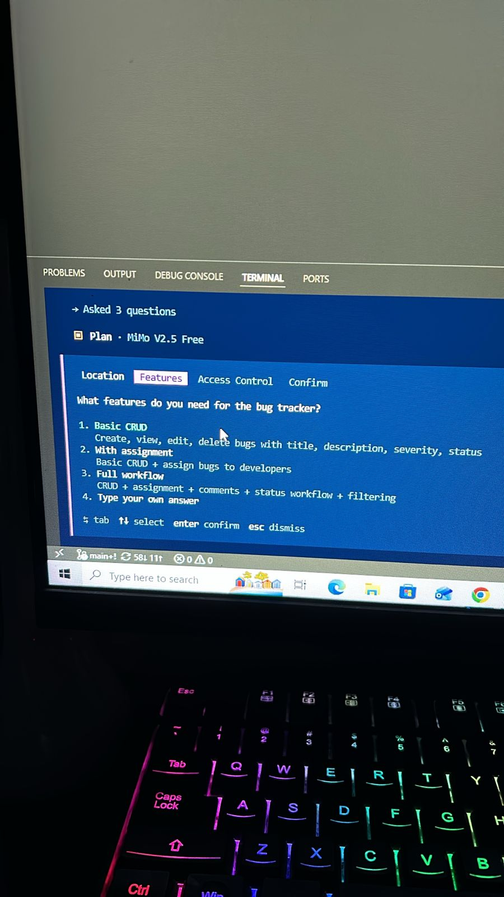

**[18:22:47] Muhammed Bayat:** 3?

**[18:22:57] Muhammed Bayat:** Don’t think we’ll ever use it but it’ll be good to see it I think 😭

**[18:23:17] Vikram Mahalingam:** We need to use it for the rubric 😭

**[18:23:50] Vikram Mahalingam:** I think 1 no? ‎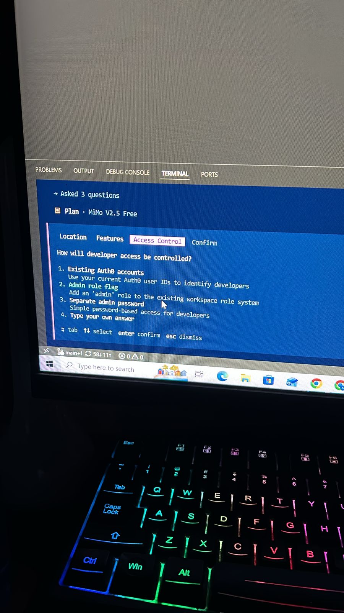

**[18:24:18] Muhammed Bayat:** Yup

**[18:24:35] Aaliah Reddy:** ‎You deleted this message.

**[18:25:41] Aaliah Reddy:** stakeholder form: https://docs.google.com/forms/d/e/1FAIpQLSf-xFEwLchzZ4CBUa-km10bYpuQXXWrI662CgtDrGP8h52pHA/viewform?usp=dialog

please lmk if yall are fine with this

**[18:26:31] Muhammed Bayat:** Great 👍

**[18:26:44] Muhammed Bayat:** That was so unc coded im so sorry 😭

**[18:26:58] Aaliah Reddy:** must i include the deploy link in the form maybe?

**[18:27:26] Vikram Mahalingam:** Just need to change the version and stakeholder to user otherwise it’s perfect

**[18:27:36] Aaliah Reddy:** no there’s 2 forms

**[18:27:44] Aaliah Reddy:** one for harshil our stakeholder/client

**[18:27:46] Aaliah Reddy:** then one for user

**[18:27:47] Vikram Mahalingam:** Oh my bad💀

**[18:27:56] Aaliah Reddy:** what’s the version now?😭😭

**[18:28:15] Vikram Mahalingam:** We’ll have to release it tomorrow

**[18:28:30] Aaliah Reddy:** why not release it when we finish all issues

**[18:28:31] Vikram Mahalingam:** It’ll probably be 0.3.0 since we made so many changes

**[18:28:36] Aaliah Reddy:** i think we’ll only be done by friday

**[18:29:32] Vikram Mahalingam:** Yea that’s fine but we’ll only send the surveys once we’re done everything for the sprint so the version will be different by then

**[18:37:49] Muhammed Bayat:** Okay lmk what’s done by Tom morning so I can see if everything’s working n Raj and make Ui changed so we having some thing new to show harshil

**[18:37:54] Aaliah Reddy:** yeah

stakeholder: https://docs.google.com/forms/d/e/1FAIpQLSf-xFEwLchzZ4CBUa-km10bYpuQXXWrI662CgtDrGP8h52pHA/viewform?usp=header

user: https://docs.google.com/forms/d/e/1FAIpQLSfOHFipdWqCi4i5rajCJ5AKPmxHWK2_2Lx3gKcM0wSQ8isIRA/viewform?usp=header

**[18:38:02] Aaliah Reddy:** lmk if theres any issues

**[18:39:33] Aaliah Reddy:** yeah during the break, on monday we can send them out

**[18:39:53] Vikram Mahalingam:** Ok perfect

**[18:40:01] Aaliah Reddy:** he hasn’t seen a lot that we’ve done actually 😭

**[18:41:21] Vikram Mahalingam:** I’ll get the bug tracker implemented when we’re done with the issues then

**[19:47:18] Tyra:** Guys i think i might need help 🫩I don’t know how to fix these checks under the pull request 🫪I’ve completed wave 7 but im failing the exact same checks for each and every issue

**[19:47:26] Tyra:** Any suggestions on how to fix it ?

**[19:48:06] Vikram Mahalingam:** I’ll see what I can do

**[19:48:26] Tyra:** thank you  🙏

**[19:54:05] Aaliah Reddy:** i did set the test coverage to be over 70% for everything, not sure if that could be the issue

**[20:43:30] Tyra:** I’m not sure but it keeps saying the tests timed out

**[22:54:05] Vikram Mahalingam:** The timeout stuff is sorted and merged

**[22:54:26] Vikram Mahalingam:** There may be some minor stuff you need to fix tomorrow though😭

### 2026/09/03

**[07:27:00] Tyra:** Thank you so much 🙏

**[13:48:14] Aaliah Reddy:** client meeting: 03/09/2026

showed our current version

does have some issues that we need to fix

fixes: injury man on tile, progression charts, live weather

more stuff to add: deployment info and motivation, bug tracker kanban board, testing documentation, database documentation with schema diagrams, break up tech stack into third party code documentation and reduce dependencies [edited]

**[13:54:48] Aaliah Reddy:** bugs:

- light mode colours

- ⁠injury man on the tile

- ⁠progression charts

- ⁠live weather

- ⁠side buttons to take you back to original page

**[13:54:54] Muhammed Bayat:** okay so first need to make like a stats dashboard where you can see teams athletes results kinda thing, this needs to be a separate page that you can reach from the landing page

comparison unavailable for 2 athletes saying internal server error.

injuries don't like save and aren't persistent

loading the injury summary when an injury is recorded takes supper long and often has to be refreshed, also the models not that great on the dashboard page you should see the same model that's used when you open the fiteness and injury map with the injury in red.

also when recording an injury make it more nicer like they select the stuff then idk which fields (date injured and return date) are mandatory or optional so like fix that as well they both should be optional and make sure it persists

a lot  of the stuff takes long to load and often prompts refresh which is annoying do some fixes about this.

when creating an event I can find a venue and it searches , first I want it to search by letters so if I enter like fnb then it like pops up without me habving to clikc th esearch for venues button and then when its selected make sure it stays there highlighted. also make its own scrollable section under the searh so that it doesn't scrill with the whole event thing. since we have this here we can remove the latitude and logiture like fields and stuff.

in the event once its created the pen-Meteo forecast,Event-day weather ,The weather service is temporarily unavailable ,Retry forecast so this isn't working.

when adding players to the event theres that big authoritative 100m outcomes which is fine , under that the event roster  there kinda like a search where you can fildtrer if its attending maybe what what put that search at the top of its current event roster box as a sort function kinda thing.

okay now the whole create fixuture invidation thing this doesn't need to be a link what needs to happen is on whoever im sending the invite too right. on there dashboard there should be something that pops up saying you've been invited and under there events tab there should be a tab for incoming events so there they should see the details of the event but not the sending teams roster and stuff and then from there they can request changes after they can see the thing and they can deny and confirm, if they request changes o nthe sending coaches dashboard as well there should be an something about event changes requested and on the events tab there shold be a similar sub tab that like says what changes they made and then they make it and resend the invite and should be fine for the opponent/s to accept.

I cant see how well the live logger and stuff works as I need when an opponent coach accepts an event in his event tab the event is there where he can like check his own roster and add his own stuff so in the life logging you can see everyone that's taking part.

the compare atheletes doesn't rly work.

in each players like when you view the progession is unavailable due to internal server error stuff and retry doesn't work I don't want to have to prompt retry but let it be there.

also idk if its done but in a life logging of an event there should be a link/qr code or soemthign that I can send out and the ppl that receive it should need to enter a name and club and they should only have access to the live logging for that and should beable to log stuff for that event once the event is over their session should expire.

**[16:54:05] Aaliah Reddy:** yall is anyone else chat gpt now working

**[16:54:24] Aaliah Reddy:** and my open code isn’t working either 😭 ‎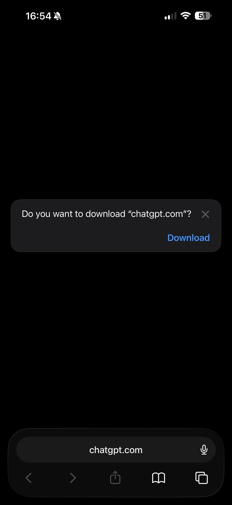

**[16:59:45] Aaliah Reddy:** ‎You pinned a message

**[17:17:16] Aaliah Reddy:** i added a few bugs to the tracker ‎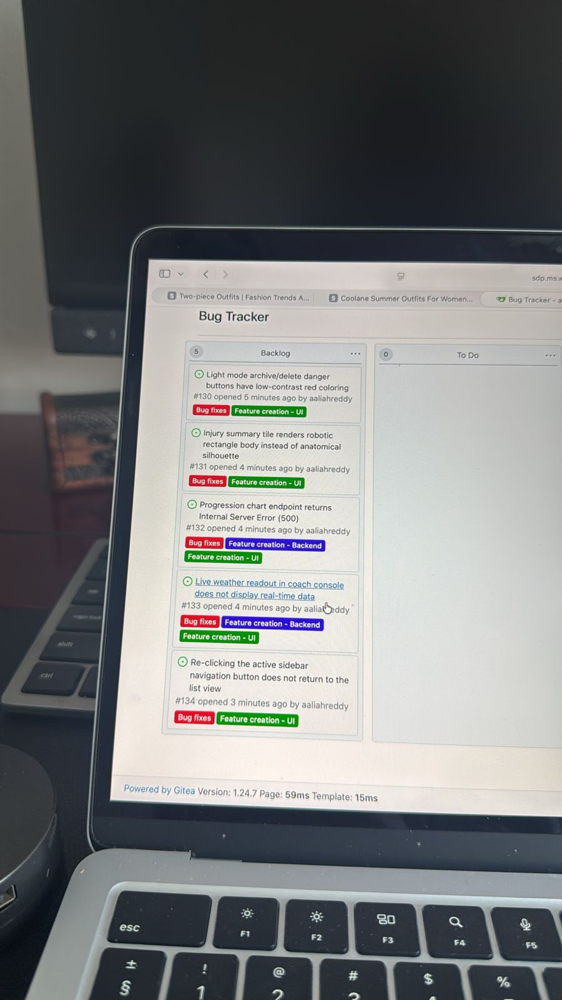

**[19:23:39] Muhammed Bayat:** ‎sticker omitted

**[19:23:41] Muhammed Bayat:** ‎sticker omitted

**[19:54:37] Aaliah Reddy:** finished the progression charts and it works fine now

**[19:55:17] Aaliah Reddy:** @⁨Vareshan Rajah⁩ the rest are all UI fixes, except for the comparison chart i’m adding that as a bug fix in the kanban now

**[19:59:18] Vareshan Rajah:** Alrighty, I'll get started with the UI bugs now

**[19:59:23] Aaliah Reddy:** wait

**[19:59:26] Aaliah Reddy:** can you do it tomorrow

**[19:59:34] Aaliah Reddy:** i’m doing the comparison chart now too😭😭

**[19:59:45] Aaliah Reddy:** then when you done with the UI i’ll do wave 8

**[19:59:58] Vareshan Rajah:** Ohh okay

**[20:01:22] Aaliah Reddy:** also i created a token specifically for reading and writing issues which you can give to the agent and then like if you find a bug just ask it to create a new issue in the same format as the others and it can also read all the issues or whatever issue number you have

**[20:14:36] Vareshan Rajah:** Ohh okay

**[20:14:41] Vareshan Rajah:** What's the token?

**[20:16:32] Aaliah Reddy:** so just go onto your gitea in settings then application and you can generate a token there

**[20:27:08] Aaliah Reddy:** i’m done now

**[20:27:48] Vareshan Rajah:** Okay I'll start now with it

**[21:11:18] Vareshan Rajah:** @⁨Aaliah Reddy⁩ what's the point of this stats tab, coz it's literally the exact same as the Dashboard? ‎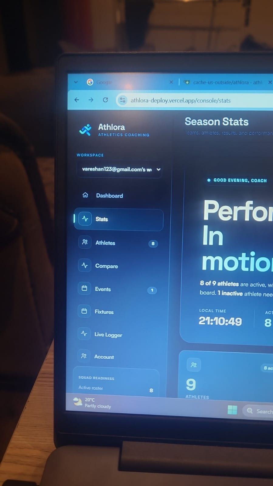

**[21:11:38] Aaliah Reddy:** i was gonna ask the same idk where that came from lmao

**[21:11:52] Aaliah Reddy:** cause before i pushed anything i checked the deployed site and it was there 😭

**[21:12:37] Aaliah Reddy:** also pooks sorry on the landing page, the little navigation tab is overlapped by the words, can you just fix that too

**[21:12:55] Vareshan Rajah:** Wth, okay I'm just gonna leave it😭

**[21:13:11] Vareshan Rajah:** Ya I will

**[21:13:12] Aaliah Reddy:** i think you can remove it iwl

**[21:13:16] Aaliah Reddy:** no idea where it came from

**[21:13:29] Vareshan Rajah:** Alrighty

**[21:14:47] Aaliah Reddy:** also so weird but i noticed on the local version the weather fix works but on the deployed site it doesn’t 😭

**[21:15:36] Vareshan Rajah:** Okay I'll have look at it

### 2026/09/04

**[10:42:58] Vareshan Rajah:** Okay so I've completed all the bugs

**[10:43:25] Vareshan Rajah:** I haven't done the UI fix tho with like the drop boxes and the landing page

**[10:43:53] Vareshan Rajah:** I think I'll do that last, just incase the remaining waves creates new ones

**[10:44:19] Muhammed Bayat:** Yea cool I’m busy working on stuff rn too

**[10:50:29] Vareshan Rajah:** Ohh and the weather does not work on the deployed

**[10:50:45] Vareshan Rajah:** But it works locally, why I have no idea😭😭

**[10:51:13] Aaliah Reddy:** let me know when i can do wave 8

**[10:51:55] Vareshan Rajah:** Ya just wait for Moe to finish what he's doing

**[10:52:33] Muhammed Bayat:** I checked it now it was fine ?

**[10:52:59] Vareshan Rajah:** Ohh💀

Last night it wasn't working

**[10:53:18] Muhammed Bayat:** ‎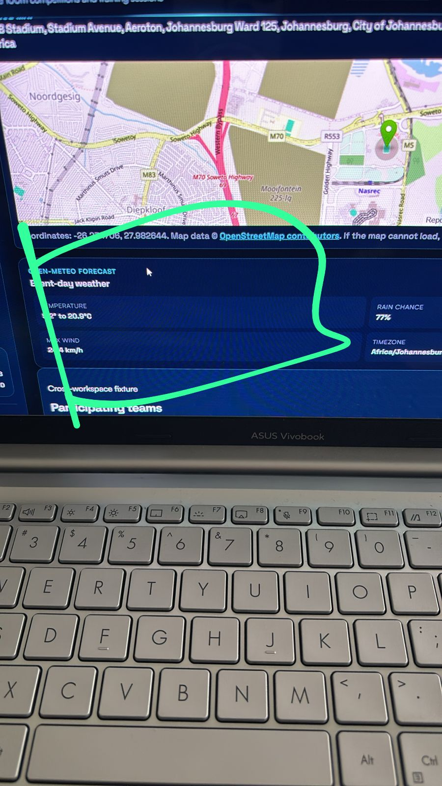

**[10:53:20] Muhammed Bayat:** Looks good

**[10:53:38] Muhammed Bayat:** I’ll let you know imma get rid of this workspace stuff n what not

**[10:54:04] Vareshan Rajah:** Okay calm ‎[edited]

**[10:54:37] Muhammed Bayat:** Also lol when you invite other coaches that link

**[10:54:43] Muhammed Bayat:** Is to send to ppl without an account

**[10:54:51] Muhammed Bayat:** If they alrdy have an account

**[10:55:00] Muhammed Bayat:** On their dashboard the invite will come

**[10:55:09] Muhammed Bayat:** So I’m busy just fixing some small stuff there

**[10:55:24] Vareshan Rajah:** Is this for the workspace?

**[10:55:47] Muhammed Bayat:** Like if I invite another club to an event

**[10:56:04] Muhammed Bayat:** This workspace thing was dumb fr 😭

**[10:56:14] Vareshan Rajah:** Ohh okay

**[10:56:28] Vareshan Rajah:** Ya I don't know what was happening with it😭

**[11:30:31] Muhammed Bayat:** This model tried to push without committing

**[11:30:35] Aaliah Reddy:** chat should be working now

**[11:30:53] Muhammed Bayat:** I went to reset the limit 😭😭

**[11:30:56] Vareshan Rajah:** Dawg, my chat was always working

**[11:31:05] Aaliah Reddy:** yeah mine was working yesterday

**[11:31:09] Aaliah Reddy:** it just didn’t work for a little bit

**[11:31:31] Vareshan Rajah:** Ohh I see

**[11:31:34] Muhammed Bayat:** Nah I was using it for cgv as well

**[11:31:39] Muhammed Bayat:** So burnt through a lot

**[11:31:54] Vareshan Rajah:** Switch to Terra😭

**[11:31:57] Muhammed Bayat:** But my open code has my dads account and this guy also uses it

**[11:32:01] Muhammed Bayat:** Yea I did

**[12:59:49] Aaliah Reddy:** @⁨Muhammed Bayat⁩ can i do wave 8?😭😭

**[13:01:26] Muhammed Bayat:** My open codes tweaking it’s saying limits up again😭😭

**[13:01:31] Muhammed Bayat:** I’ll let yk when I’m not

**[13:01:33] Muhammed Bayat:** Down

**[13:01:35] Muhammed Bayat:** Done

**[13:01:39] Muhammed Bayat:** So sorry 😔

**[13:02:07] Vikram Mahalingam:** Try nemotron it’s limits are quite high

**[13:02:31] Vikram Mahalingam:** Just ask it to read the docs properly so it commits correctly

**[13:27:03] Muhammed Bayat:** Cool

**[14:50:16] Muhammed Bayat:** im done

**[14:50:43] Muhammed Bayat:** theres def some broken stuff so can someome pls fix whatever

**[14:59:18] Aaliah Reddy:** let’s maybe try get through all the issues then we can make a list of everything that’s broken and fix

**[15:06:56] Muhammed Bayat:** Sounds good

**[18:30:32] Aaliah Reddy:** yall idk if gitea is down

**[18:30:42] Aaliah Reddy:** it’s not letting me pull and doesn’t load when i try to go into it online

**[18:31:18] Aaliah Reddy:** i fear it is down, will try again later

**[18:31:25] Aaliah Reddy:** even moodle isn’t working 😭

**[18:32:04] Vikram Mahalingam:** Yea its down😭

**[19:59:39] Muhammed Bayat:** It’s back up

**[20:16:27] Aaliah Reddy:** iwl, i’ll do wave 8 first thing in the morning 😭

### 2026/09/05

**[11:16:50] Aaliah Reddy:** i finished wave 8, but found some bugs that i’m trying to fix

**[11:42:13] Aaliah Reddy:** okay so i only managed to fix one of the bugs before my chat limit exceeded, it’ll be back in 3 hours then i can fix the rest, but whoever is doing wave 9, can do it

**[11:43:06] Aaliah Reddy:** there’s 2 bugs still in the bug tracker so if whoever is going 9 and has time you can do those aswell otherwise i’ll just do it

**[12:11:10] Vikram Mahalingam:** Nah it’s cool I’ll take care of it

**[17:46:54] Muhammed Bayat:** You guys want to implement the rest of the like races and stuff this sprint ?

**[18:27:47] Vikram Mahalingam:** We can it shouldn’t be too hard

**[18:42:14] Muhammed Bayat:** Cool lmk when ur done

**[18:44:37] Vikram Mahalingam:** 👍

**[18:51:46] Aaliah Reddy:** we can, but then pause the deploy so that we can send it out

**[18:52:27] Vikram Mahalingam:** Or just keep it unmerged until we get the feedback

**[18:52:43] Muhammed Bayat:** Cool

**[19:12:49] Muhammed Bayat:** ‎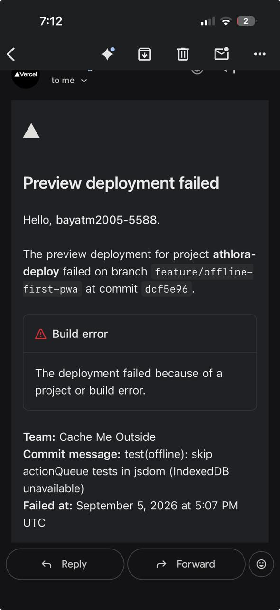

**[19:13:35] Vikram Mahalingam:** Yea my bad there's some dependency thing breaking everything

**[19:15:02] Vikram Mahalingam:** But I haven’t merged it yet so why are you getting a deployment error?

**[19:15:31] Muhammed Bayat:** Idk 😭😭

**[19:15:49] Muhammed Bayat:** Think it redeploys on commits

**[19:15:55] Aaliah Reddy:** all my stuff was working before

**[19:16:15] Vikram Mahalingam:** Yea it’s the new stuff I just added

**[21:24:51] Vikram Mahalingam:** Everything’s done

**[21:24:52] Vikram Mahalingam:** I’ll update the docs and add the testing docs tomorrow

**[21:39:18] Vareshan Rajah:** Okay calm, then I'll fix the UI tomorrow as well ‎[edited]

### 2026/09/06

**[10:02:33] Vareshan Rajah:** Okay I'm starting to fix the UI now

**[11:54:40] Vareshan Rajah:** Heyy guys so I think I've fixed most of the UI stuff that I could find, please just have a look and see if you notice anything else

**[11:55:10] Vareshan Rajah:** And then I've created an AI Voice Assistant called Athlora

**[11:55:47] Vareshan Rajah:** It's currently only working on the Athletes Page and is so far only used for the adding of an athlete

**[11:56:15] Vareshan Rajah:** Please test it out and tell me what you think, it's still in the process of development😭

**[11:57:30] Vareshan Rajah:** So there's an icon next to the search, then a pop up dialog will appear, then it should greet you and click enable hands free if you want to speak to it, otherwise you can just type as well

**[11:57:51] Vareshan Rajah:** And then to end that AI session just say Sleep or you can type Sleep

**[12:00:27] Vareshan Rajah:** Ohh and you currently can only use it on the deployed site😭😭

I'll send yall, privately,  steps on how to get it to run on yalls local servers

**[12:36:00] Aaliah Reddy:** that’s so cool pooks 😭😭

**[16:44:14] Muhammed Bayat:** New round of issues/fixes/implementations

when you select a location for the event it just looks funky

better time selection menu for an event

event weather is broken again

theres no way to invite another team in the cross workspace fixture part..busy working on this

tried creating a new account manually and it lowkey just broke saying Account connection interrupted

We could not finish signing you in

Your account could not be synchronized. Try again before continuing to Athlora.

Error code: AUTH_USER_NOT_SYNCHRONIZED...this is fixed just the UI needs to get fixed now

**[16:44:20] Muhammed Bayat:** the last ones done

**[16:44:59] Muhammed Bayat:** im still trying to fix the inviting another club to an event but my limits up rn so ill carry on when its back

**[16:45:19] Aaliah Reddy:** okay, are we gonna send it out for feedback tomorrow?

**[16:46:01] Aaliah Reddy:** just make sure these issues are added to the bug tracker

**[16:46:18] Muhammed Bayat:** along with this UI at the top when a new user registers/signs in they now come to a landing page where they can either creatre their own club or they can request to join a current club and then the current clubs ppl will see the requests and theey can decide to give coach/assitant title

**[16:46:36] Muhammed Bayat:** as soon as this multi club in an event is working we can send it out

**[16:47:00] Muhammed Bayat:** if someone wants to this is the current issue you can go ahead and fix it

**[16:47:45] Muhammed Bayat:** say when i try to invite another club to an event i get internal server error and this os the network error i get Request URL [REDACTED -- request URL, headers, and bearer token]

**[16:50:15] Aaliah Reddy:** have you added any of these as issues yet?

**[16:51:37] Muhammed Bayat:** yea i added them now but i created them manually

**[16:51:42] Muhammed Bayat:** lmk if you see them

**[16:51:59] Muhammed Bayat:** so there no like descriptions and stuff

**[16:52:14] Aaliah Reddy:** okay it’s fine i’ll do that then

**[16:52:33] Muhammed Bayat:** thanks

**[16:53:14] Aaliah Reddy:** i’ll ask try fix this

**[16:53:23] Aaliah Reddy:** these internal server errors 😐

**[16:53:40] Muhammed Bayat:** Dude 😭

**[16:54:03] Aaliah Reddy:** i fixed like 3 of those already😭

**[16:54:07] Muhammed Bayat:** And like literally how’d the weather break again swear you fixed it alrdy

**[16:54:19] Aaliah Reddy:** pooks fixed it i think

**[16:54:47] Aaliah Reddy:** also even like the tab buttons, pooks fixed it and then it stopped working again 😭

but i think i fixed it

**[16:55:03] Muhammed Bayat:** But this one once the invite works we just need to make sure another club can add their roster and that when the live event starts all the clubs players are there

**[16:55:18] Muhammed Bayat:** And then once we done w that we’ll send it out

**[16:55:30] Aaliah Reddy:** okay cool, and signup is fine now?

**[16:55:39] Muhammed Bayat:** Yup just the UI page looks bums

**[16:55:52] Muhammed Bayat:** Small potatoe fix

**[16:56:01] Aaliah Reddy:** isn’t it just that white box thing?

**[16:56:05] Aaliah Reddy:** 😭😭😭😭😭😭😭😭😭

**[16:56:27] Muhammed Bayat:** No so once you sign up you on a new page where you need to select a club to join or create ur own club

**[16:56:56] Aaliah Reddy:** also we must implement something to ping the app cause it takes long to load, but we can do that after

**[16:57:20] Muhammed Bayat:** Nah It’s so funny everytime I login and I just see you with a new injury

**[16:57:26] Aaliah Reddy:** 😭😭😭😭

**[16:57:48] Muhammed Bayat:** Also I think before we send it out we can ask chat to just populate some tables with stats so we have some better looking stats to see

**[16:58:12] Muhammed Bayat:** I see 😭

**[16:59:13] Aaliah Reddy:** @⁨Vikram Mahalingam⁩ do you mind doing this before the release?

**[16:59:25] Vareshan Rajah:** It was all working this morning after I did the UI fixes😭

**[16:59:43] Vikram Mahalingam:** Yes np

**[16:59:50] Vikram Mahalingam:** I’ll try do it tonight

**[17:00:08] Vikram Mahalingam:** Lemme know when you guys are done working I don’t wanna mess up your stuff😭

**[17:03:50] Aaliah Reddy:** kk

**[17:06:44] Aaliah Reddy:** also idk why but if i press get started or login, it takes me straight to pooks’ account😭

it might be cache issue on my browser though

**[17:07:06] Muhammed Bayat:** Same thing

**[17:07:10] Muhammed Bayat:** Think it store it in cache

**[17:07:17] Muhammed Bayat:** Just try incognito

**[17:07:25] Muhammed Bayat:** Or private browsing 😭

**[17:07:44] Vareshan Rajah:** Or log out

**[17:11:29] Aaliah Reddy:** i see what you mean about the sign up page thing

**[17:12:53] Vareshan Rajah:** Tell me when yall are done, then I can go in and fix all these UI problems ‎[edited]

**[17:17:35] Aaliah Reddy:** i’m just creating the issues properly, then i’ll fix the multi club events thing

**[17:23:31] Vareshan Rajah:** Alrighty

**[17:33:27] Aaliah Reddy:** @⁨Muhammed Bayat⁩ can i close the sign up issue?

**[17:37:14] Aaliah Reddy:** i got the fixture to send but now i cant accept 😐😭 ‎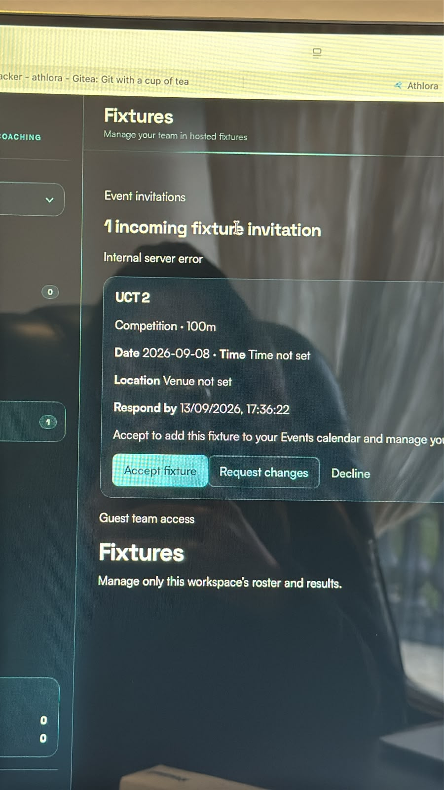

**[17:43:56] Aaliah Reddy:** i managed to fix it, there are some UI issues on the receiver side but nothing too big

**[17:47:28] Aaliah Reddy:** we also need to get the coverage back up😭 ‎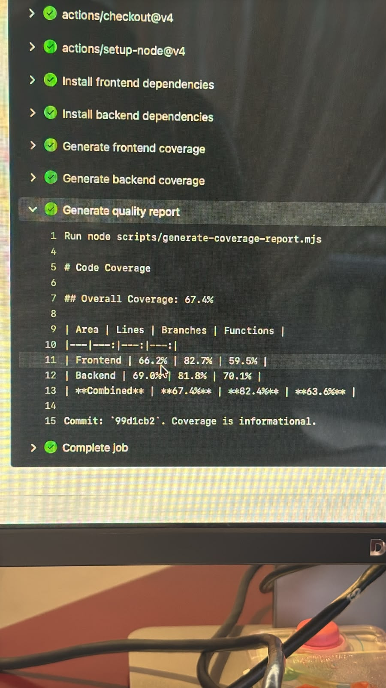

**[17:54:34] Aaliah Reddy:** also not too sure what this is in the events, @⁨Vareshan Rajah⁩ when you’re fixing the weather please also check this out, not sure what it’s meant for ‎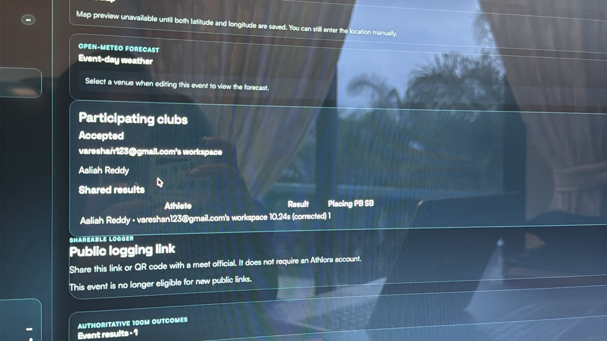

**[17:56:02] Vareshan Rajah:** Wait just circle what I must fix in this picture😭

**[17:56:10] Vareshan Rajah:** Coz I can see the over lapping panels

**[18:00:29] Aaliah Reddy:** this whole thing, overlapping, the table idk what is happening there at all ‎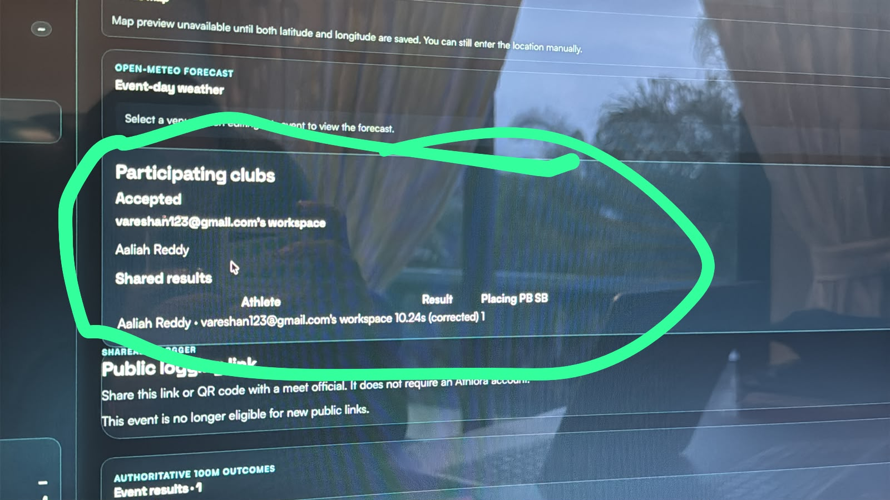

**[18:17:20] Muhammed Bayat:** Yup

**[18:18:25] Aaliah Reddy:** @⁨Vareshan Rajah⁩ you can go ahead, i was gonna try to get our coverage up a bit but i reached my usage limit 🫠

**[18:18:32] Muhammed Bayat:** I think there it’s just supposed to be a list of clubs participating in the event

**[18:19:14] Aaliah Reddy:** i did the location selection and time selection too, i did check that it’s working properly on the deployed site but just lmk if you’re happy with it

**[18:19:41] Muhammed Bayat:** I’m sure it’s fine just whatever it was before was bad 😭

**[18:20:04] Aaliah Reddy:** yeah i just did a thing for when you select it appears under the search bar then you can search again and change it if you want

**[18:24:41] Vareshan Rajah:** Okay I'm going to start fixing the UI

**[18:25:14] Vikram Mahalingam:** Lemme know when you finish I’ll update the docs and populate the stats

**[18:26:16] Vareshan Rajah:** Alrighty

**[18:26:34] Vareshan Rajah:** It shouldn't be too long coz I did most this morning

**[18:26:44] Muhammed Bayat:** Idk  how far aals got with with the fixing it but if it’s like at a point where someone else can pick up maybe they should just to get it fixed

**[18:26:45] Aaliah Reddy:** also vik when you do the release lmk so i can update the google form

**[18:27:04] Aaliah Reddy:** with what?

**[18:27:14] Muhammed Bayat:** The accepting the invitation

**[18:27:20] Aaliah Reddy:** i fixed it

**[18:27:21] Muhammed Bayat:** Or did u say it was done 😭

**[18:27:23] Aaliah Reddy:** it works

**[18:27:23] Muhammed Bayat:** Oh

**[18:27:26] Vikram Mahalingam:** Yea np

**[18:27:33] Muhammed Bayat:** And they can add their own roster

**[18:27:41] Muhammed Bayat:** N when you run the live it works ?

**[18:27:57] Aaliah Reddy:** please just check😭😭😭

cause i just fixed the accepting cause it was an internal server error

**[18:28:16] Aaliah Reddy:** just send an invitation to your club and double check to see if it works as intended

**[18:28:22] Muhammed Bayat:** Cools

**[18:29:00] Aaliah Reddy:** also are we gonna pause the deploy and keep working this week? or are we just not gonna merge? cause won’t not merging create conflicts?

**[18:29:17] Vareshan Rajah:** Can someone borrow me an email that doesn't have an account yet so I can do the sign up page as well😭

**[18:29:30] Aaliah Reddy:** use my student one

**[18:29:36] Vareshan Rajah:** Alrighty

**[18:29:45] Aaliah Reddy:** [REDACTED -- email address]

**[18:30:26] Vikram Mahalingam:** Nah we can work on a separate branch and just test stuff locally until we get the surveys done then merge it back

**[18:30:41] Aaliah Reddy:** so we all use one branch?

**[18:30:43] Vikram Mahalingam:** It shouldn’t cause conflicts as long as it’s just one branch

**[18:30:49] Vikram Mahalingam:** Yea

**[18:30:56] Aaliah Reddy:** okay cool cool

**[18:31:13] Aaliah Reddy:** yeah maybe we fix everything and then we can start with other sports 😭

**[18:31:26] Muhammed Bayat:** ‎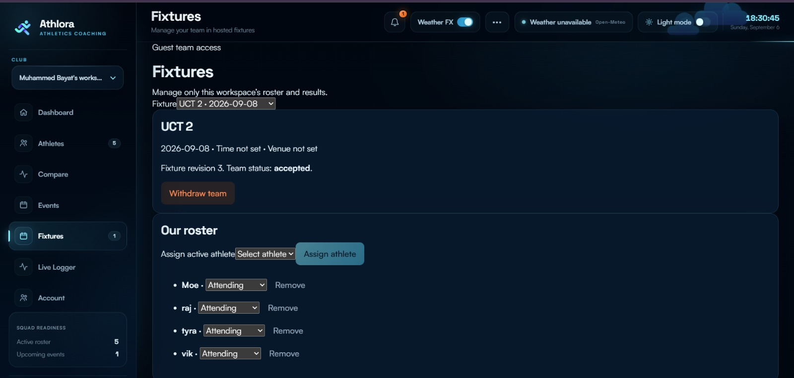

**[18:31:34] Muhammed Bayat:** this is how it currently looks when you accept an invitation

**[18:31:41] Muhammed Bayat:** idk whats the fixture tab for tbh

**[18:31:44] Vikram Mahalingam:** Also the feedback shouldn’t take too long if we’re just giving it to our siblings/kieran

**[18:31:54] Muhammed Bayat:** like surely this can just move to the normal events tab?

**[18:32:02] Aaliah Reddy:** that’s what i thought it would do

**[18:32:39] Aaliah Reddy:** i don’t think so either, but rather just do it now and then we have a few days to put all the responses together

**[18:32:40] Vikram Mahalingam:** Yea what’s the difference between a fixture and an event😭

**[18:32:46] Aaliah Reddy:** cause i won’t be here in the upcoming weekend

**[18:33:51] Aaliah Reddy:** no idea 😭

**[18:34:03] Aaliah Reddy:** but there needs to be something to accept an invitation

**[18:34:34] Vikram Mahalingam:** Isn’t that what the notification thing is for?

**[18:34:51] Muhammed Bayat:** yea it pops up as a notifcation and it pops up on the dashboard

**[18:35:04] Aaliah Reddy:** yeah then we must change that😭

**[18:35:34] Aaliah Reddy:** this app is giving me a headache 😭😭😭

**[18:35:48] Vareshan Rajah:** Okay so what exactly am I meant to display here? ‎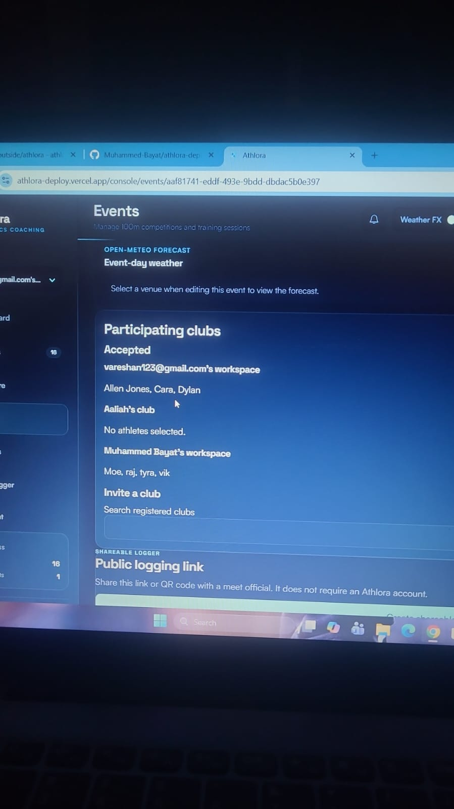

**[18:36:13] Muhammed Bayat:** now theres this issue lmao idk why this is happening ‎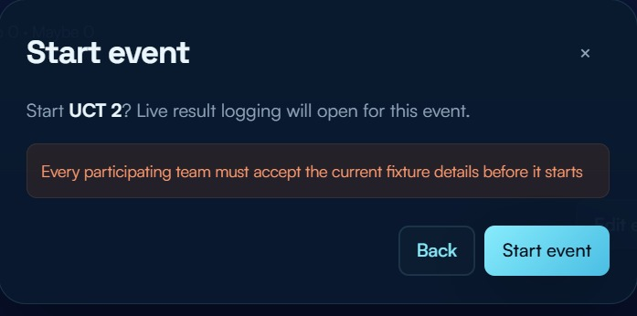

**[18:36:32] Aaliah Reddy:** ‎sticker omitted

**[18:36:55] Muhammed Bayat:** but when i clikc the sharrable link all the ppl from both teams appear atleast so thats food

**[18:36:56] Muhammed Bayat:** good

**[18:37:19] Aaliah Reddy:** i honestly can’t tell you

**[18:37:47] Muhammed Bayat:** lowkey is it not fine like that now raj

**[18:37:54] Aaliah Reddy:** yeah i was about to say

**[18:37:55] Muhammed Bayat:** coz its showing the clubs and their rosters

**[18:38:01] Aaliah Reddy:** just participating clubs and their athletes

**[18:38:20] Vareshan Rajah:** I also think so, but then some of them aren't all like this😭

**[18:38:34] Muhammed Bayat:** wum

**[18:39:00] Vareshan Rajah:** This one looks like this😭 ‎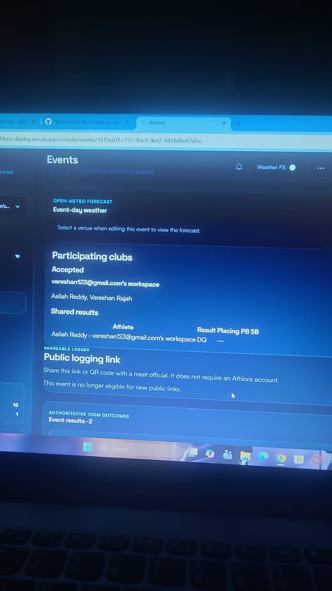

**[18:40:05] Vareshan Rajah:** Okay I think this one looks like this coz it was done before the changes were made

**[18:40:19] Muhammed Bayat:** Yea

**[18:40:54] Muhammed Bayat:** Raj you can use mine [REDACTED -- email address] and the Same password if you need to use like another club

**[18:41:07] Vareshan Rajah:** Is this the sign up page you were talking about? ‎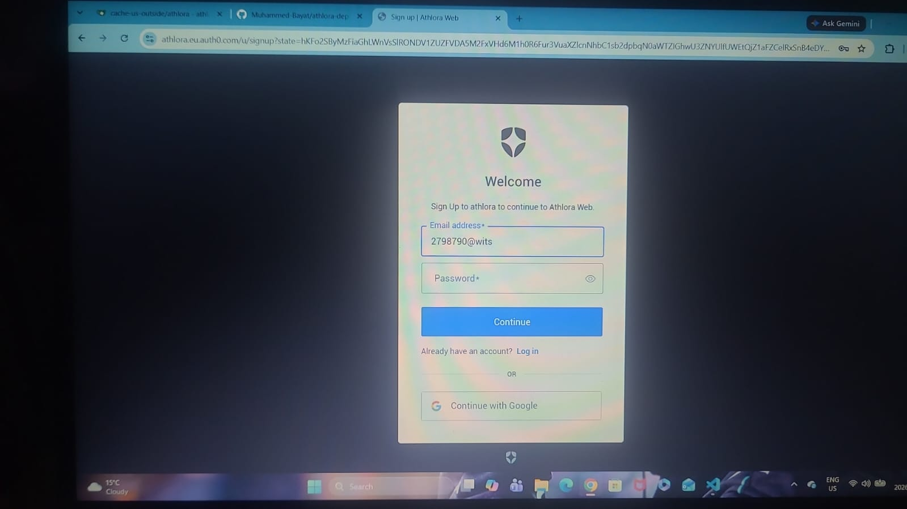

**[18:41:20] Aaliah Reddy:** put an email and password first

**[18:41:22] Aaliah Reddy:** then you’ll see

**[18:42:03] Vareshan Rajah:** Ohh I do see indeed😭

**[19:33:02] Vareshan Rajah:** Its giving Fifa iwl ‎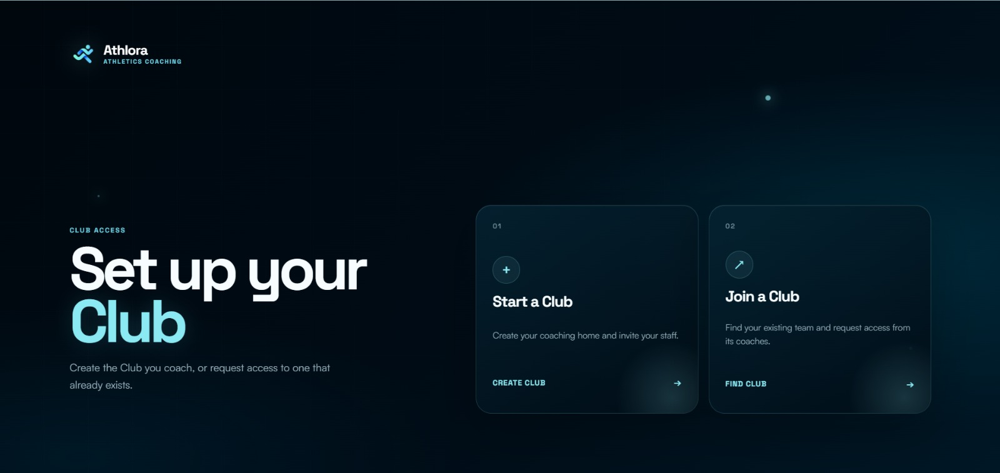

**[19:33:19] Vikram Mahalingam:** Fr

**[19:33:25] Vikram Mahalingam:** Looks sick though

**[19:34:19] Vareshan Rajah:** Okay im almost done, when i push yall can see the new loading screens, its no longer the boring black and grey😭😭

**[19:48:24] Muhammed Bayat:** 😭😭😭😭

**[19:48:48] Muhammed Bayat:** Raj if you till have time on ur limit can you fix this 😭

**[19:49:39] Vareshan Rajah:** Ya I'll check, my chat is still busy with the UI

**[19:50:23] Muhammed Bayat:** Shot

**[20:03:51] Vareshan Rajah:** Ya I hit my limit😭

**[20:04:42] Vareshan Rajah:** Okay I didn't get to finish the landing page fix coz I hit the limit😭

**[20:07:33] Vareshan Rajah:** @⁨Vikram Mahalingam⁩ I'm done, I pushed it now as well

**[22:12:31] Vikram Mahalingam:** Ok the docs are updated and I added a privacy policy / terms and conditions

**[22:12:57] Vikram Mahalingam:** Unfortunately my agent slowed down tremendously so I couldn’t populate the stats😭

**[22:13:12] Vikram Mahalingam:** So can we do that tomorrow and we can make the release as well

**[22:13:57] Vikram Mahalingam:** Also there’s a minor bug where the links in the privacy policy doesn’t go anywhere so I’ll fix that tomorrow as well

### 2026/09/07

**[06:02:21] Muhammed Bayat:** Okay so what alls left to do

**[09:41:25] Vareshan Rajah:** So there's the weather to fix, I don't know if it's broken, coz swear it's just got mood swings😭😭

**[09:41:43] Vareshan Rajah:** Then there's this

**[09:42:38] Muhammed Bayat:** Yea I fixed everything well it should be

**[09:42:43] Muhammed Bayat:** I made a merge request

**[09:42:50] Vareshan Rajah:** Ohh wait I need to do this UI

**[09:42:53] Muhammed Bayat:** But i think im out of time

**[09:43:01] Muhammed Bayat:** Yea I think it should be done

**[09:43:14] Muhammed Bayat:** There’s just some merge Conflicts

**[09:43:23] Muhammed Bayat:** If someone can do them for me and merge

**[09:43:31] Muhammed Bayat:** Then everything should be fine

**[09:44:11] Muhammed Bayat:** I removed this whole thing

**[09:44:16] Muhammed Bayat:** So it’ll just be in events now

**[09:44:26] Muhammed Bayat:** The fixture stuff didn’t make sense lowkey

**[09:44:35] Vareshan Rajah:** Alrighty I'll have a look

**[09:44:42] Aaliah Reddy:** i think vik just needs to fix this and then we’re good

**[09:44:45] Vareshan Rajah:** Ohh okay

**[09:45:46] Muhammed Bayat:** Lmk when you’ve merged and I’ll check one last time

**[09:46:01] Muhammed Bayat:** Hopefully it’s all good and we can just populate and then send it out

**[10:09:32] Vareshan Rajah:** Okay I merged it now

**[10:12:08] Vareshan Rajah:** Ya chaai, this merge broke the production I think😭

**[10:12:14] Muhammed Bayat:** Just see it’s failing test cases😭 so the new versions not gonna be pushed

**[10:12:21] Muhammed Bayat:** Yeaaa💀

**[10:13:14] Vareshan Rajah:** Okay, I'm checking now

**[11:09:25] Vareshan Rajah:** Okay it seems fixed now @⁨Muhammed Bayat⁩ so you can just go through and check whether the stuff you did has changed

**[11:27:51] Muhammed Bayat:** Just one for front end is still broken

**[11:28:31] Muhammed Bayat:** But it’s just tests

**[11:28:37] Muhammed Bayat:** Idk why the fixture tab is there here

**[11:28:39] Muhammed Bayat:** 😭😭

**[11:30:55] Muhammed Bayat:** Wait nvm

**[11:33:20] Muhammed Bayat:** Some internal server errors 😭😭😭

**[11:33:30] Muhammed Bayat:** I’ll work on it later coz I’m still waiting for my limit

**[11:33:42] Muhammed Bayat:** But if anyone else wants to go ahead and try just lmk

**[11:50:48] Vareshan Rajah:** Ohh chaai😭

**[11:51:14] Vareshan Rajah:** Ya I'm also waiting for limit

**[11:51:50] Vareshan Rajah:** Swear this limit thing doesn't do the 5 hours correctly

**[12:11:58] Muhammed Bayat:** Bruh fr 😭😭

**[13:12:17] Vareshan Rajah:** @⁨Vikram Mahalingam⁩  okay so ya the Privacy and TC's links don't go anywhere and also when I checked the box to agree it didn't create the account

**[13:12:52] Vareshan Rajah:** And then there's also internal errors happening when I try to change the RSVP status of an Athlete from pending to attending

**[13:13:16] Vikram Mahalingam:** I’ll get it fixed

**[13:13:24] Vikram Mahalingam:** This one I have no idea😭

**[13:13:42] Vareshan Rajah:** And then there is some UI issues again that I saw, so I can fix the UI once my Chat works again😭

**[13:13:47] Vareshan Rajah:** Okay calm

**[13:14:14] Vareshan Rajah:** I'll have a look at it when I'm doing the UI stuff

**[15:51:48] Aaliah Reddy:** let me know when i can update the forms and send it 😭😭

**[15:52:39] Vareshan Rajah:** I'm waiting for my power to comeback coz my laptop is dead😭

**[15:55:04] Aaliah Reddy:** oh naur 😭

**[16:00:35] Vikram Mahalingam:** Your powers down as well?😭

**[16:12:57] Muhammed Bayat:** Awes lemme work on it

**[16:13:11] Muhammed Bayat:** My limit should be fine

**[16:28:03] Vareshan Rajah:** Ya😭😭

It went off like an hour and a half ago

**[16:29:14] Vikram Mahalingam:** My complex went down for like an hour😭

**[16:29:22] Vikram Mahalingam:** I thinks it’s the rain

**[16:30:14] Vareshan Rajah:** Has yours come back yet

**[16:30:32] Vareshan Rajah:** Ya I also think so, I don't think anyone is stealing cables in this weather😭💀

**[16:31:00] Vikram Mahalingam:** Yea it came back imma start this privacy policy thing after lunch

**[16:33:12] Vareshan Rajah:** Ohh okay calm, also just test with temporary emails if the sign up works, coz it was saying something about not being able to save the T's and C's response

**[16:59:16] Muhammed Bayat:** Brother what lunch

**[16:59:22] Muhammed Bayat:** It’s 4pm

**[16:59:24] Muhammed Bayat:** 😭😭

**[17:21:02] Vikram Mahalingam:** This transcript is gonna expose my eating habits now😢

**[17:21:05] Muhammed Bayat:** Bruh this internal server error 😭😭

**[17:46:29] Vareshan Rajah:** 🤣🤣

**[17:47:16] Vareshan Rajah:** Its so irritating iwl😭

**[17:47:43] Muhammed Bayat:** Bruh I’m crashing out ong

**[17:47:45] Muhammed Bayat:** 😭😭

**[17:49:11] Vareshan Rajah:** Once my God damn power comes back I can take over😭

**[17:49:29] Muhammed Bayat:** My things ran out

**[17:49:30] Vareshan Rajah:** Coz I also saw now, there's so many UI bugs I need to fix as well😭

**[17:49:31] Muhammed Bayat:** 😭😭😭

**[17:49:43] Vareshan Rajah:** Tokens or time?😭

**[17:50:20] Muhammed Bayat:** Usage limit

**[17:50:22] Muhammed Bayat:** But okay

**[17:50:26] Muhammed Bayat:** Lemme just tell you

**[17:51:20] Muhammed Bayat:** Currently there a live event

**[17:51:26] Muhammed Bayat:** It worms the only thing is

**[17:51:48] Muhammed Bayat:** Like club A can’t like enter a time for Club Bs participants

**[17:51:52] Muhammed Bayat:** So just change that

**[17:51:52] Vareshan Rajah:** Okay perfect timing my power came back now

**[17:52:14] Muhammed Bayat:** So just make the change that anyone can enter any like records

**[17:52:39] Muhammed Bayat:** And then just update the guest who logs in with the QR code to see the same live event screen the coaches see

**[17:52:44] Muhammed Bayat:** That should be all

**[17:53:32] Vareshan Rajah:** Okay so I must change it so that coaches can only enter results for their respective athletes

**[17:53:57] Muhammed Bayat:** No

**[17:54:05] Muhammed Bayat:** They can enter results for any athletes

**[17:54:16] Vareshan Rajah:** Ohh okay

**[17:54:46] Muhammed Bayat:** And the dashboard is messed up now so that too pls

**[17:54:48] Muhammed Bayat:** 😭😭😭

**[17:55:06] Vareshan Rajah:** So this must be the exact same event screen the coaches see right?

**[17:55:25] Muhammed Bayat:** Yea

**[17:55:30] Vareshan Rajah:** It might look slight different coz it will be on a mobile device

**[17:55:43] Muhammed Bayat:** Just one thing you know the QR code thingi currently it’s in events

**[17:55:43] Vareshan Rajah:** But the link one on a laptop will look the exact same

**[17:55:55] Muhammed Bayat:** I want to move it to the live fixture page

**[17:56:01] Muhammed Bayat:** Yea that’s calm

**[17:56:16] Muhammed Bayat:** It’s just currently in the live event it shows the person and the club they belong to

**[17:57:46] Vareshan Rajah:** Okay I'll have a look

**[18:29:28] Vikram Mahalingam:** The consent page works now👍

**[18:29:51] Vareshan Rajah:** Ohh okay

**[18:29:55] Vikram Mahalingam:** Hopefully doesn’t break something else😭

**[18:30:29] Vareshan Rajah:** It's fine I just pulled it now

**[18:30:38] Vareshan Rajah:** So if it does I will try fix it😭

**[19:02:36] Muhammed Bayat:** Goodluck soldier

**[19:13:02] Aaliah Reddy:** @⁨Vareshan Rajah⁩ are you winning?😭

**[19:13:40] Vareshan Rajah:** Hmm I'm trying, so far the UI fixes and bugs are coming nice

**[19:13:53] Vareshan Rajah:** Then I just need to do the stuff that Moe was busy with

**[19:15:15] Muhammed Bayat:** If Raj runs out can you carry on coz we neeeed to get this out

**[19:15:43] Aaliah Reddy:** ‎sticker omitted

**[19:15:47] Aaliah Reddy:** FINE😭

**[19:15:59] Muhammed Bayat:** ‎sticker omitted

**[19:16:35] Vareshan Rajah:** It's not too bad, you just moving it from one place to the other😭

**[19:16:43] Vareshan Rajah:** But I'll let you know if I run out

**[19:16:47] Aaliah Reddy:** okay only if you run out

**[19:16:51] Aaliah Reddy:** pray you don’t 🙏

**[19:17:57] Aaliah Reddy:** sorry i couldn’t help today though, i was driving up and down to town cause my dad doesn’t have a car 💔

**[19:18:28] Muhammed Bayat:** All goo..od

**[19:18:39] Muhammed Bayat:** That was my stutter

**[19:18:42] Aaliah Reddy:** are you trying to be a ghost again

**[19:18:49] Aaliah Reddy:** ‎sticker omitted

**[19:18:56] Muhammed Bayat:** ‎sticker omitted

**[19:19:04] Aaliah Reddy:** 😭💔😭💔

**[19:19:05] Muhammed Bayat:** Twas a real ghost but anyways

**[19:19:22] Aaliah Reddy:** yeah he’s under your bed, beware tonight

**[19:19:30] Muhammed Bayat:** ‎sticker omitted

**[19:34:27] Vareshan Rajah:** Ya sorry @⁨Aaliah Reddy⁩ 😭😭 ‎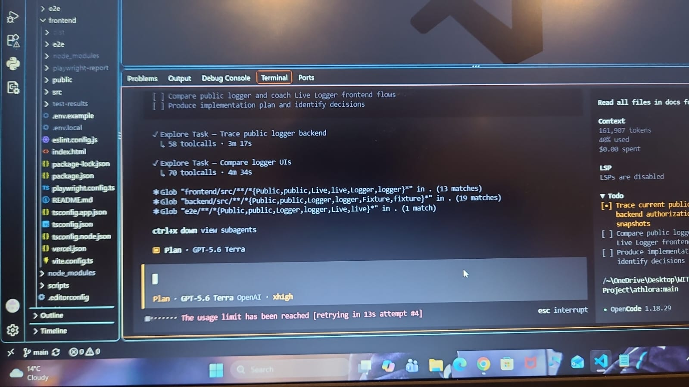

**[19:34:49] Aaliah Reddy:** ‎sticker omitted

**[19:34:50] Aaliah Reddy:** ‎sticker omitted

**[19:34:51] Aaliah Reddy:** ‎sticker omitted

**[19:34:51] Vareshan Rajah:** Wait one sec, I'll send you the prompt to use

**[19:35:03] Aaliah Reddy:** kk, just push and merge whatever other changes you did

**[19:35:06] Aaliah Reddy:** then i’ll do it quick

**[19:35:26] Vareshan Rajah:** Okay so this is what we need to do, the public shareable link needs to move to the live logger of an event first, then the Public Logging link fucntionality must now chnage so that any user that uses that link will be able to log and record times for evry single athlete and not just an athlete from their club, then also when the geust logs in using this Public logging link the UI must be the exact same as the Live Logger UI that a coach sees on a live event

**[19:35:42] Vareshan Rajah:** @⁨Muhammed Bayat⁩ just read the prompt first to make sure its right

**[19:36:01] Vareshan Rajah:** ANd then theres still that stupid ass internal error

**[19:36:21] Muhammed Bayat:** Yupp

**[19:36:26] Vareshan Rajah:** but after that it all should be done a fixed😭😭

**[19:36:29] Muhammed Bayat:** Another one 😭😭

**[19:36:35] Muhammed Bayat:** Or the dashboard one

**[19:36:43] Vareshan Rajah:** Its the dashboard one

**[19:37:04] Muhammed Bayat:** ‎sticker omitted

**[19:37:08] Vareshan Rajah:** Okay aals i pushed and merged, its ready for you to start

**[19:37:54] Aaliah Reddy:** which one?

**[19:38:12] Vareshan Rajah:** Dw you will see it when you login😭

**[19:38:26] Vareshan Rajah:** ‎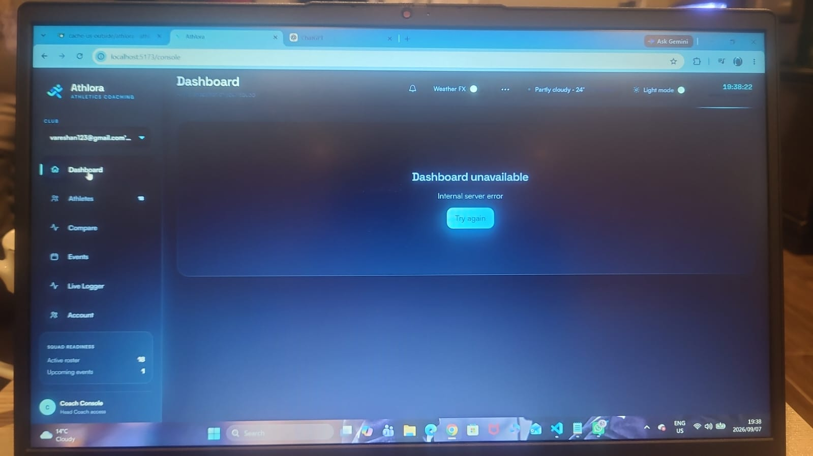

**[19:38:38] Aaliah Reddy:** oh god😭😭😭

**[19:39:33] Vareshan Rajah:** Nah after you do the prompt I sent you, just tell you agent that the dashboard isn't loading coz of an internal server error please check everything

Your agent should know how to fix it

**[19:54:26] Aaliah Reddy:** @⁨Muhammed Bayat⁩ help ‎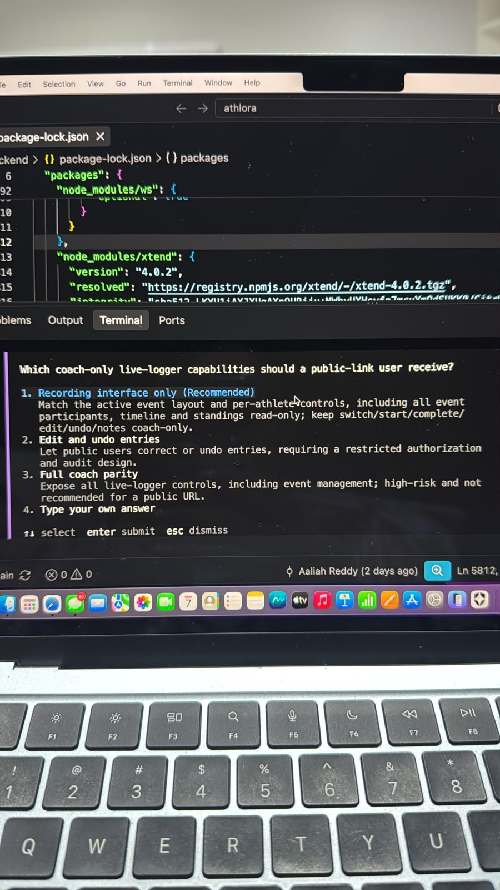

**[19:55:00] Aaliah Reddy:** i feel like it’s 2, but just confirm 😭

**[19:55:50] Vareshan Rajah:** I think it's 1

**[19:56:00] Muhammed Bayat:** Yea they should be able to edit something they enter 😭😭

**[19:56:09] Aaliah Reddy:** kk

**[19:56:41] Aaliah Reddy:** yeah but own entries only right? not others?

**[19:57:43] Muhammed Bayat:** I think all ? What do you think

**[19:57:49] Muhammed Bayat:** Like just say you made a mistake n went home

**[19:57:54] Muhammed Bayat:** I should be able to change it

**[19:57:55] Aaliah Reddy:** i think own only

**[19:58:08] Aaliah Reddy:** i already clicked own only but i can change it

**[19:58:17] Muhammed Bayat:** Anyone

**[19:58:19] Muhammed Bayat:** Okay

**[19:58:25] Muhammed Bayat:** I’m side questing rn

**[19:58:30] Muhammed Bayat:** Playing beach volleyball 😭

**[19:58:36] Aaliah Reddy:** @⁨Vareshan Rajah⁩ what do you think?

**[19:58:39] Muhammed Bayat:** So I’ll be out for an hour or 2

**[19:58:51] Aaliah Reddy:** i feel like you should only be able to change your own entries not other people’s

**[19:59:13] Vareshan Rajah:** Ya exactly

**[19:59:27] Vareshan Rajah:** Only the head coach should be able to override every entry

**[19:59:56] Vareshan Rajah:** Where😭

**[20:11:27] Aaliah Reddy:** it looks bums 😭

but i’ll fix it 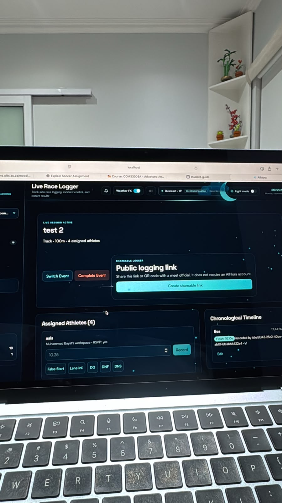

**[20:16:20] Vareshan Rajah:** It just plotted it in the centre🤣

**[20:47:20] Aaliah Reddy:** yoh pooks

**[20:47:36] Aaliah Reddy:** this thing is breaking your dashboard ‎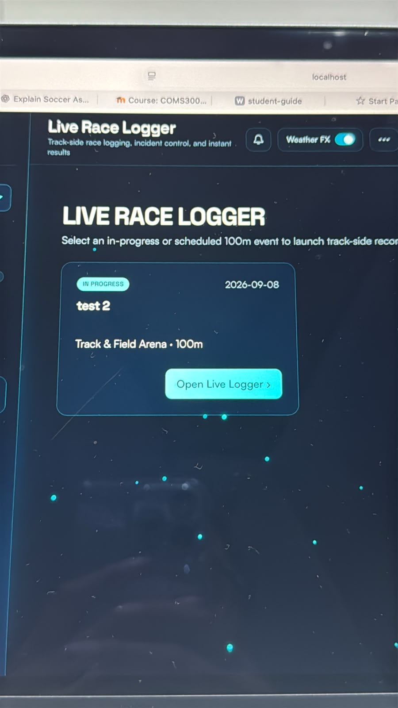

**[20:47:48] Aaliah Reddy:** cause mine looks fine 😭😭 ‎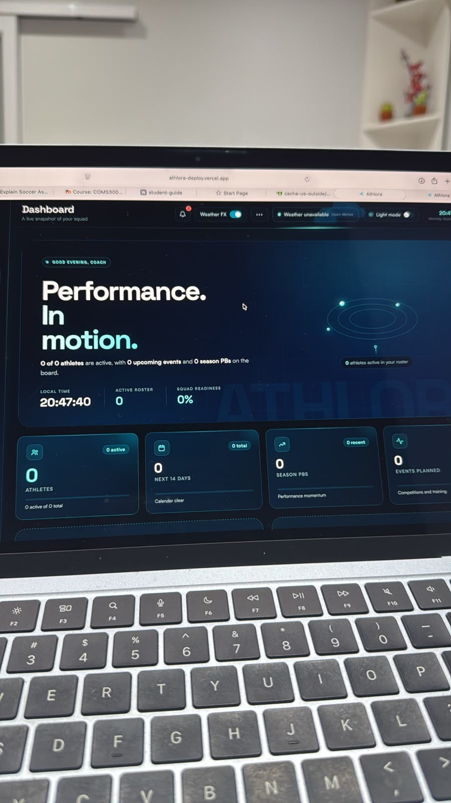

**[20:51:24] Aaliah Reddy:** iwl idk how to fix this😭😭😭

**[20:56:25] Vareshan Rajah:** Okay it's something to do with the live logging, coz when it's a live event the dashboard changes to display the live event

**[20:56:40] Aaliah Reddy:** i think i got it

**[20:56:54] Aaliah Reddy:** i’m just trying to complete that event so it should be fine after

**[20:57:12] Vareshan Rajah:** Ohh okay

**[20:58:02] Aaliah Reddy:** ‎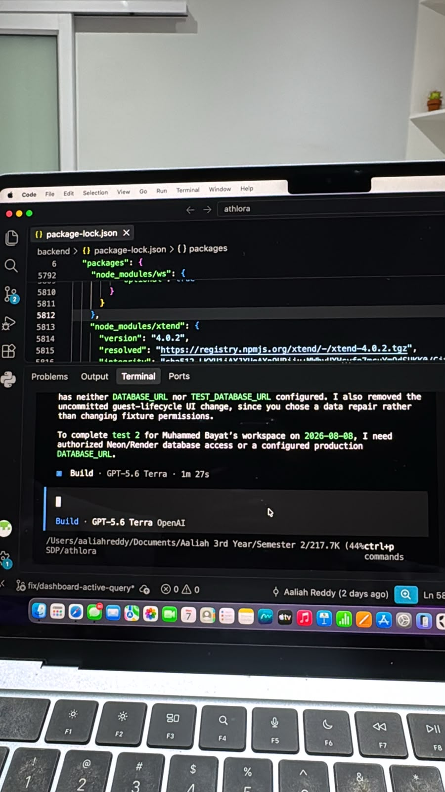

**[20:58:31] Aaliah Reddy:** this is what it’s like rn ‎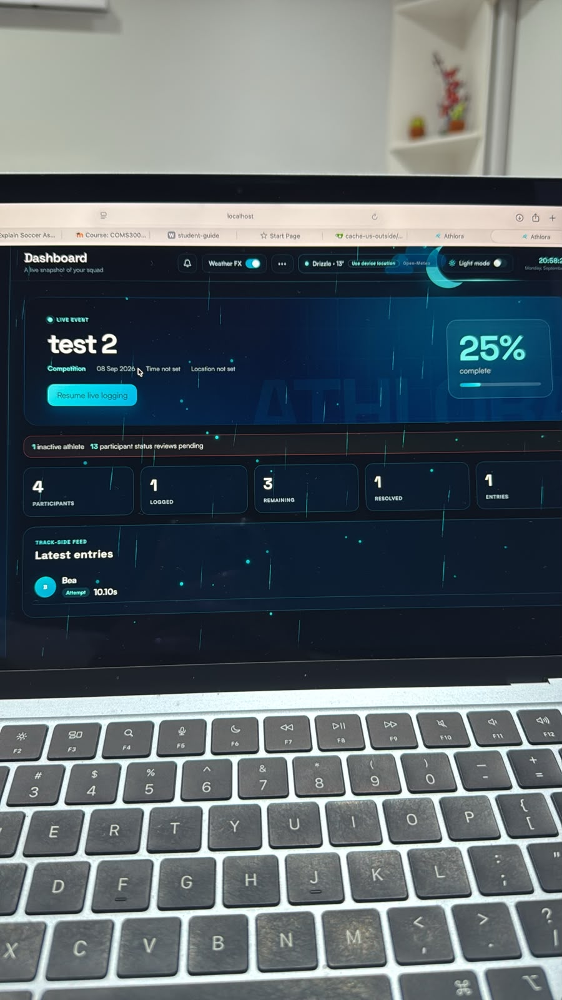

**[20:59:02] Vareshan Rajah:** Ya that's how it was before, unless Moe wanted to make changes to it

**[20:59:25] Aaliah Reddy:** yeah but how do we remove this thing ‎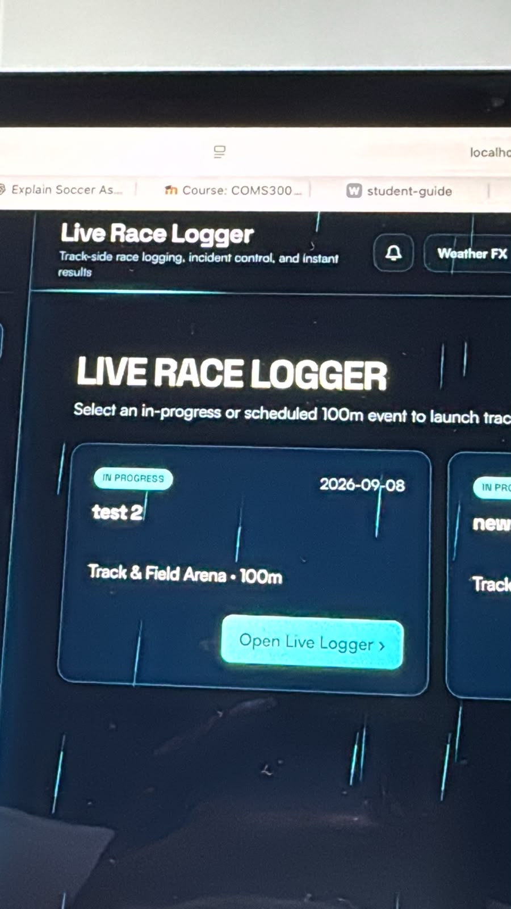

**[21:00:09] Vareshan Rajah:** Wait one second

**[21:01:51] Vareshan Rajah:** Ya I have no idea iwl

**[21:02:00] Vareshan Rajah:** What event is this even😭

**[21:02:09] Aaliah Reddy:** i’m deleting it from the database 😭

**[21:02:15] Vareshan Rajah:** Ya do that

**[21:02:22] Vareshan Rajah:** It should fix I think

**[21:02:28] Aaliah Reddy:** i’m gonna kms ‎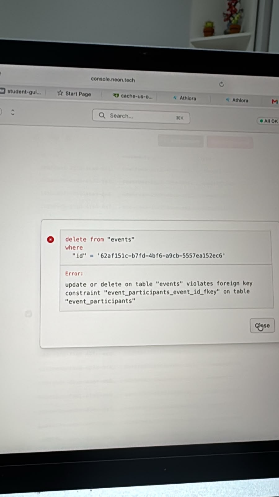

**[21:02:45] Vareshan Rajah:** Oh ffs😭

**[21:03:08] Vareshan Rajah:** I'm trying now as well

**[21:05:14] Aaliah Reddy:** nvm i fixed it

**[21:05:31] Vareshan Rajah:** How

**[21:05:35] Aaliah Reddy:** okay all is well now

**[21:05:42] Vareshan Rajah:** Did you delete it from all the tables

**[21:05:47] Aaliah Reddy:** it wasn’t saving, had to press special buttons to make the database save

**[21:05:54] Aaliah Reddy:** nah i just changed the status to completed

**[21:06:08] Vareshan Rajah:** Smart thinking

**[21:17:43] Aaliah Reddy:** i am done, just trying to get our test coverage back up to 70

**[21:19:23] Vareshan Rajah:** Ohh okay

**[21:19:51] Aaliah Reddy:** my credits ran out 😭💔

**[21:19:53] Vareshan Rajah:** Ohh Aals if you want you can tell you agent to make tests for the ai, coz it currently doesn't have any

**[21:19:56] Aaliah Reddy:** in the middle

**[21:20:00] Vareshan Rajah:** Ya nvm😭😭

**[21:20:07] Vareshan Rajah:** Ohh shit😭

**[21:20:28] Vareshan Rajah:** Switch to deepseek and finish what you were busy with and then push

**[21:32:34] Aaliah Reddy:** i used mimo

**[21:34:11] Aaliah Reddy:** okay so i’ll probably push and merge just now

in the morning can you guys just double check that everything is in order and then we can do the release and send out the forms

**[21:35:59] Aaliah Reddy:** this explains why the coverage dropped so much😭

**[21:37:41] Vikram Mahalingam:** I’ll add new tests after you guys are 100 percent with the fixes

**[21:37:53] Vikram Mahalingam:** Cause I need to make the testing doc as well

**[21:39:53] Aaliah Reddy:** i did already, it should go up to 78% i’m hoping

**[21:40:11] Vikram Mahalingam:** Ok perfect

**[21:41:11] Aaliah Reddy:** you don’t need to do it yet though, we can do it one time when we get the results from the forms?

**[21:41:42] Aaliah Reddy:** or are you just gonna add that we did forms to the doc and then put the results separately in the sprint 2 folder?

**[21:50:42] Tyra:** is there anything I can work on or help with ?

**[21:58:11] Vareshan Rajah:** Ya my bad, I built the ai without the ai agents😭

**[21:59:25] Vareshan Rajah:** Nah I don't think so, coz everything is done so now we just pray it doesn't break overnight and then tomorrow we can send it for testing😭

**[21:59:36] Aaliah Reddy:** eish the coverage is only at 71.8%😐

**[21:59:50] Vareshan Rajah:** Eish😭

**[22:00:33] Vareshan Rajah:** I thought you said it was gonna go up to 78%😭

**[22:00:38] Aaliah Reddy:** nvm

**[22:00:44] Aaliah Reddy:** this ai agent is just stupid

**[22:00:52] Aaliah Reddy:** it’s 77.4

**[22:02:12] Vareshan Rajah:** Ohh okay, I think that's fine right?

**[22:02:47] Aaliah Reddy:** is the weather working now? can i close the issue?

**[22:02:49] Aaliah Reddy:** yep

**[22:02:54] Vikram Mahalingam:** I’m gonna separate the automated testing docs and the user feedback docs so it makes more sense

**[22:03:28] Vareshan Rajah:** That thing has mood swings iwl😭

Sometimes it decides to work sometimes it doesnt😭

**[22:03:54] Aaliah Reddy:** on mine it isn’t working

**[22:04:05] Vareshan Rajah:** Sigh😪😭😭

**[22:04:19] Vareshan Rajah:** Okay I'll try fix it once I get my limit fixed😭

**[22:04:37] Vareshan Rajah:** So that's around 11

**[22:05:30] Vareshan Rajah:** Or @⁨Tyra⁩ would you like to try fix the weather?

**[22:06:06] Aaliah Reddy:** the thing is it doesn’t ask for location permissions for me anymore idk if that’s the issue

**[22:06:28] Vareshan Rajah:** Ya then it's broken

**[22:06:35] Vareshan Rajah:** Well tbf it doesn't ask me either

**[22:07:11] Muhammed Bayat:** Okay I’m getting deployment failures

**[22:07:13] Muhammed Bayat:** 😭😭😭

**[22:07:31] Vareshan Rajah:** Ya ffs😭😭

**[22:07:51] Muhammed Bayat:** Toms problem iwl

**[22:07:58] Muhammed Bayat:** Do whatever yall can tn

**[22:08:03] Muhammed Bayat:** Tom mornings I’ll work on it

**[22:08:14] Muhammed Bayat:** And hopefully by then it’s fine

**[22:08:18] Muhammed Bayat:** To send out

**[22:08:30] Muhammed Bayat:** Just make sure like nothings not pushed before yall go sleep

**[22:08:48] Aaliah Reddy:** my stuff is failing, do you think that’s why?😭

**[22:09:32] Muhammed Bayat:** Probably

**[22:09:35] Aaliah Reddy:** it’s failing front end checks

**[22:09:41] Muhammed Bayat:** 😭😭

**[22:09:43] Muhammed Bayat:** Yea

**[22:09:45] Muhammed Bayat:** That’s it

**[22:10:55] Vareshan Rajah:** @⁨Aaliah Reddy⁩ just push all your stuff even if it's failing, ill fix it at 11

**[22:11:26] Vikram Mahalingam:** Yea it’s just the type check failing so it should be an easy fix

**[22:14:53] Aaliah Reddy:** i’m fixing it now quick

**[22:17:40] Tyra:** Okay I’ll try

**[22:23:30] Aaliah Reddy:** @⁨Muhammed Bayat⁩ should be fine now? lmk

**[22:23:36] Aaliah Reddy:** just waiting for the checks to run

**[22:23:59] Muhammed Bayat:** Are you on the GitHub

**[22:24:04] Muhammed Bayat:** Just check there

**[22:24:08] Muhammed Bayat:** It should have the green circle

**[22:24:16] Muhammed Bayat:** Or just wait abit I’m almost home

**[22:24:18] Aaliah Reddy:** yeah i’m waiting for it

**[22:26:58] Muhammed Bayat:** Innovation day hates to see us coming 😼

**[22:27:01] Aaliah Reddy:** i also think we’ve gone above and beyond with our app😭

so ofc we’re gonna have more issues but it’s okay

**[22:27:25] Aaliah Reddy:** like if we chose a simple sport we would’ve been done😭😭😭

**[22:27:38] Muhammed Bayat:** Gents wouldn’t know what innovation is until they see our app

**[22:27:54] Aaliah Reddy:** okay typecheck for front end passed

**[22:28:03] Aaliah Reddy:** and our coverage is 78.3

**[22:28:13] Vikram Mahalingam:** Yea prod deployment is up as well

**[22:28:28] Muhammed Bayat:** Shii

**[22:28:35] Muhammed Bayat:** Does it all work is the question

**[22:28:38] Muhammed Bayat:** ‎sticker omitted

**[22:29:27] Aaliah Reddy:** iwl i tried to fix that little notification thing with the live logger cause it just kept appearing in the wrong places, eventually took it out😭

i’ll add it back in at some point because ffs, but everything else should be fine

**[22:29:45] Aaliah Reddy:** also our family is gonna use the most basic parts of this app so i don’t think we need to worry too much

**[22:31:00] Vareshan Rajah:** What is that?

**[22:31:19] Vareshan Rajah:** Ya we fr went over and beyond icl😭

**[22:31:37] Aaliah Reddy:** maybe let’s make a set of instructions on how to use the app so that whoever is testing knows how to use it

**[22:32:16] Vikram Mahalingam:** Wouldn’t it be better to let them do it blind so we know what to change for ease of use

**[22:32:34] Vareshan Rajah:** Ya true, you can tell them to use the ai to make athletes so they don't have to type💀

**[22:33:13] Vareshan Rajah:** Ya I don't think we should give them a set of instructions, coz they need to figure it out themselves

**[22:33:54] Vareshan Rajah:** But like low-key stand there when they do it, coz just somehow they find a way to break it then we know immediately where and how it went wrong

**[22:34:42] Vareshan Rajah:** I think @⁨Tyra⁩ is just gonna try fix the weather and then it all should be working

**[22:34:59] Vareshan Rajah:** You only tried it now😭😭

**[22:35:14] Aaliah Reddy:** yes😭

**[22:35:16] Aaliah Reddy:** she’s so nice too

**[22:35:27] Vikram Mahalingam:** Where are we getting tokens for this AI btw😭

**[22:35:43] Vareshan Rajah:** Ya Moe said I should expand its capabilities to other parts of the app, but that's laters problem😭

**[22:35:52] Vikram Mahalingam:** Cause if it’s an external API we gotta set up rate limiters

**[22:36:01] Vareshan Rajah:** The voice actually changes, so we need to decide which one we like the most

**[22:36:11] Vikram Mahalingam:** Lest our users exploit us

**[22:36:14] Aaliah Reddy:** i like the girl, she’s so nice

**[22:36:39] Vareshan Rajah:** Hmm👀

So that's the thing, I can't give you an answer rn😭

**[22:36:41] Aaliah Reddy:** also slight issue

**[22:36:51] Aaliah Reddy:** if i sign out then press the back button i am signed in again

**[22:37:08] Vikram Mahalingam:** Huh?😭😭😭

**[22:37:28] Vareshan Rajah:** From what I know, there are no tokens😭

**[22:37:53] Vareshan Rajah:** Coz I'm pulling it straight from Google's Gemini

**[22:38:15] Vikram Mahalingam:** Awe mize we’ll figure it out when we sort the security of the app out😭

**[22:38:21] Vareshan Rajah:** Ya wtf😭😭

**[22:39:25] Vareshan Rajah:** Ya, but also the way I designed it, it can't be exploited, because it's linked to the apps code, so it doesn't do the calls to the database at all, it calls our built in functions that are already there

**[22:39:38] Vareshan Rajah:** So we are protected from exploitation in that sense

**[22:39:51] Muhammed Bayat:** Think it’s just a free model

**[22:40:02] Vikram Mahalingam:** Yea but they can still call it a billion times 💀

**[22:40:14] Vikram Mahalingam:** And potentially crash something

**[22:40:38] Vikram Mahalingam:** Or rewrite code💀

**[22:40:49] Vareshan Rajah:** That is true

**[22:40:58] Vareshan Rajah:** Nah nah nah, it can't do that

**[22:41:08] Vikram Mahalingam:** Oh ok at least

**[22:41:58] Vareshan Rajah:** It only sends the data it receives from users as a json in the correct format to our functions, so like if something is invalid then it won't send the data

**[22:42:13] Vareshan Rajah:** So we can't be sql injected I'm pretty sure

**[22:42:30] Vikram Mahalingam:** Imma try break it tomorrow

**[22:42:38] Muhammed Bayat:** ‎sticker omitted

**[22:42:57] Vareshan Rajah:** Please do try😭

**[22:43:19] Vareshan Rajah:** Ohh and to make the AI switch off just say Sleep or type Sleep

**[22:43:25] Vikram Mahalingam:** Cause I know Brendan is gonna try break it as well😭

**[22:43:49] Vareshan Rajah:** To speak to it you need to click on enable hands free and then accept the microphone access

**[22:43:59] Vareshan Rajah:** Ya true, so try break it

### 2026/09/08

**[09:00:25] Muhammed Bayat:** If rsvp is pending/maybe -> don't let the match start until its attending or not attending

if rsvp is not attending -> don't let them be part of the roster

move the sharable QR code section from the event to the live logger

It crashes after an event when you go to athlete but just needs a refresh

If Club A sends an invite and Club B accepts and plays Club Bs player stats aren't updated after the event

**[09:00:28] Muhammed Bayat:** current issues

**[09:00:37] Muhammed Bayat:** idk if you want me to fix it

**[09:00:50] Muhammed Bayat:** or just send it out lmk

**[09:02:58] Muhammed Bayat:** theres just quite abit of fine tunes needed before we can say we're done with Intermediate and we need to check if the offline version works

**[09:03:29] Muhammed Bayat:** i think we can send it out today and then thursday - we carry on working and making fixes

**[09:08:23] Aaliah Reddy:** i think leave this for now, send it out first

**[09:08:29] Aaliah Reddy:** then we can continue to fix

**[09:11:04] Aaliah Reddy:** if we’re all doing it with our siblings the forms will probably get filled in today😭

it’s only harshil that we might have to wait for

**[09:11:28] Muhammed Bayat:** Yea fr 😭😫

**[09:11:38] Muhammed Bayat:** Let’s send it out

**[09:12:03] Aaliah Reddy:** okay, can you do the release quick so i can change the form quick then i’ll send the link

**[09:12:42] Muhammed Bayat:** It’s currently 0.2.0

**[09:12:48] Muhammed Bayat:** What should the new one be

**[09:12:55] Aaliah Reddy:** yeah vik said we must create a new release

**[09:13:04] Aaliah Reddy:** then you’ll see the new version

**[09:13:05] Muhammed Bayat:** 0.3.0?

**[09:13:13] Muhammed Bayat:** Or 0.2.1

**[09:13:34] Aaliah Reddy:** @⁨Vikram Mahalingam⁩ 😭😭

**[09:13:47] Aaliah Reddy:** this guy probably still sleeping😭

**[09:13:55] Muhammed Bayat:** Yea 😭😭😭

**[09:14:03] Muhammed Bayat:** Lemme see the docs

**[09:14:06] Aaliah Reddy:** oh wait, don’t we have to wait for the weather to be fixed

**[09:14:17] Muhammed Bayat:** It was fine when I check it now

**[09:14:32] Aaliah Reddy:** on the deployed site?

**[09:14:37] Muhammed Bayat:** Yup

**[09:14:39] Aaliah Reddy:** idk if it’s my location permissions then

**[09:14:59] Muhammed Bayat:** ‎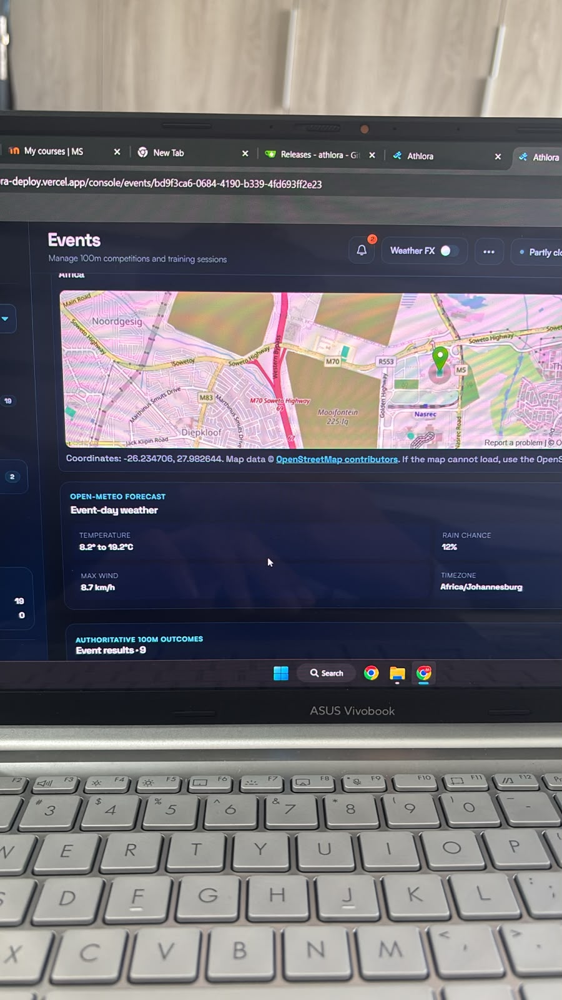

**[09:15:13] Aaliah Reddy:** switch on weather fix at the top

**[09:15:32] Muhammed Bayat:** ‎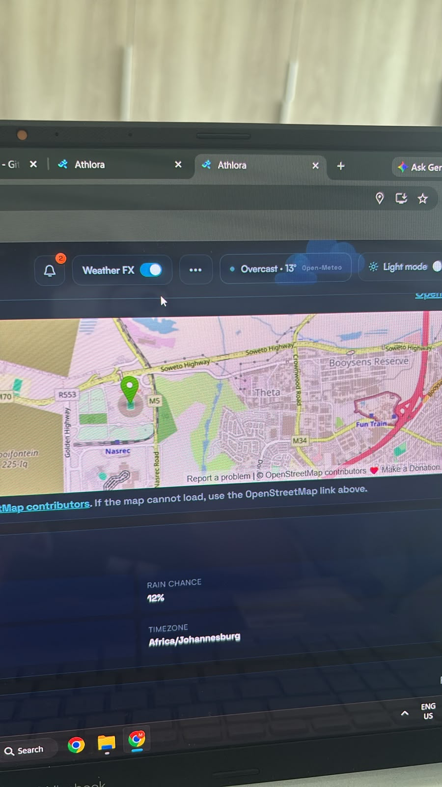

**[09:15:41] Aaliah Reddy:** okay slay

**[09:15:53] Muhammed Bayat:** Fully thought it was 24 outside

**[09:15:56] Muhammed Bayat:** ‎sticker omitted

**[09:16:42] Muhammed Bayat:** Yea honestly I have no idea

**[09:17:10] Aaliah Reddy:** also you have a pull request that you never merged, what’s that for?

**[09:17:34] Muhammed Bayat:** I don’t see any open pull requests ?

**[09:17:59] Aaliah Reddy:** there’s no pr for it yet ‎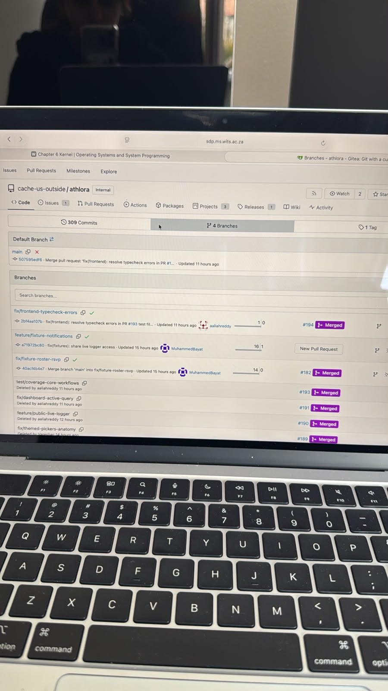

**[09:18:06] Aaliah Reddy:** i mean branch

**[09:18:19] Muhammed Bayat:** Uhh idk 🤷‍♂️

**[09:18:33] Aaliah Reddy:** bruh😭😭😭

**[09:18:39] Aaliah Reddy:** okay the weather is working now

**[09:18:47] Muhammed Bayat:** I was crashing out bruh

**[09:18:51] Muhammed Bayat:** Every fix I made

**[09:18:55] Muhammed Bayat:** Broke like 10 other stuff

**[09:19:17] Aaliah Reddy:** isn’t the shareable QR code already in the live logger

**[09:19:31] Muhammed Bayat:** Nopes

**[09:19:39] Muhammed Bayat:** Was still in the events page

**[09:19:49] Aaliah Reddy:** ‎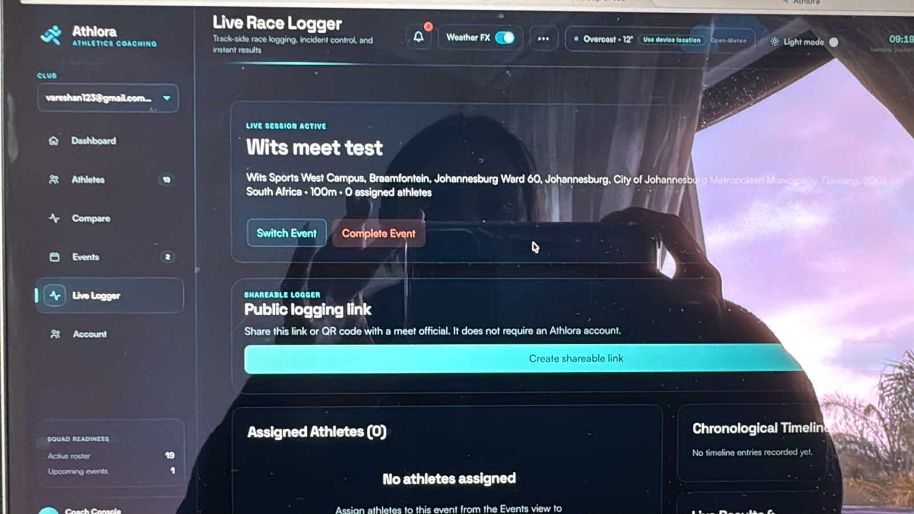

**[09:20:03] Aaliah Reddy:** cause i did this yesterday

**[09:20:19] Muhammed Bayat:** Swear I didn’t see that

**[09:20:20] Muhammed Bayat:** 😭😭

**[09:21:03] Aaliah Reddy:** see i wanna do a new release but idk what title to use 😭 ‎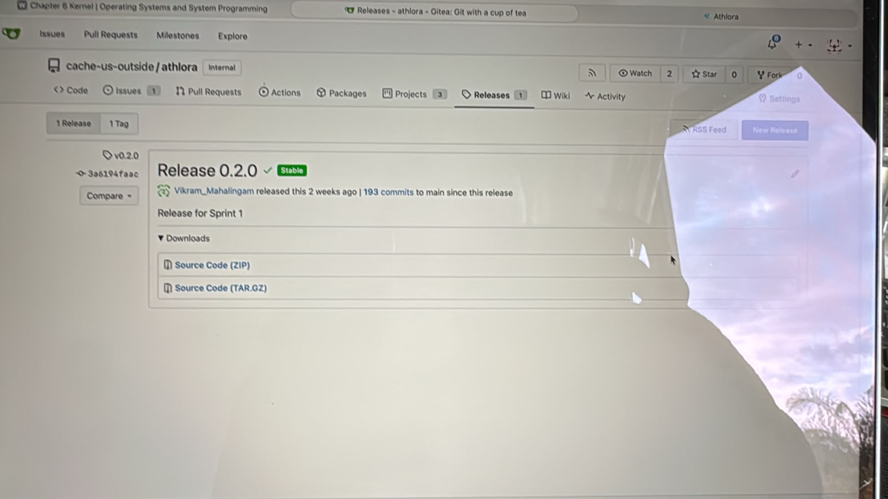

**[09:21:13] Muhammed Bayat:** Yea same 😭😭

**[09:21:31] Muhammed Bayat:** Also I’m sure we need a few releases

**[09:21:33] Aaliah Reddy:** yeah so if you create any new bug fixes leave that one out

**[09:21:35] Muhammed Bayat:** Not just one per sprint

**[09:21:43] Muhammed Bayat:** Ight

**[09:21:45] Vareshan Rajah:** Ya

**[09:22:58] Vareshan Rajah:** Remember that Shervaan guy told us like if we have small changes then change like the last number, if it's big changes then change the middle, if it's huge then you change the first😭

**[09:23:02] Aaliah Reddy:** ‎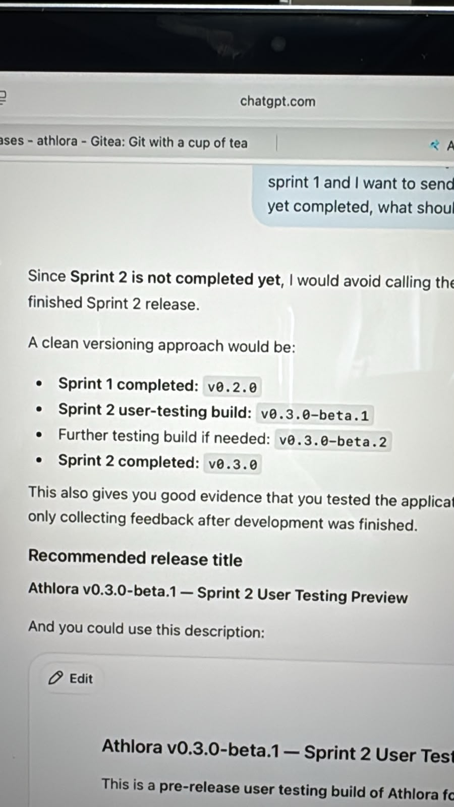

**[09:24:09] Muhammed Bayat:** 4. Versioning (Semantic Versioning)

We use Semantic Versioning (SemVer): MAJOR.MINOR.PATCH, e.g. 1.4.2.

Segment	Bump when...

MAJOR	You make incompatible/breaking changes

MINOR	You add functionality in a backwards-compatible way

PATCH	You make backwards-compatible bug fixes

In practice

Track the version in package.json (or equivalent).

Tag releases in Git when you cut a version:

git tag -a v1.4.2 -m "Release 1.4.2"

git push origin v1.4.2

Pre-1.0 (0.x.y): expect breaking changes at any time — this is fine while the app is early/unstable.

Once the app is in production and stable, move to 1.0.0 and follow SemVer strictly from there.

**[09:24:16] Muhammed Bayat:** this is how the docs say we must do i t

**[09:24:22] Muhammed Bayat:** but im i don tunderrstand it

**[09:25:32] Vareshan Rajah:** So during development it's always going to start with 0

**[09:25:43] Aaliah Reddy:** ‎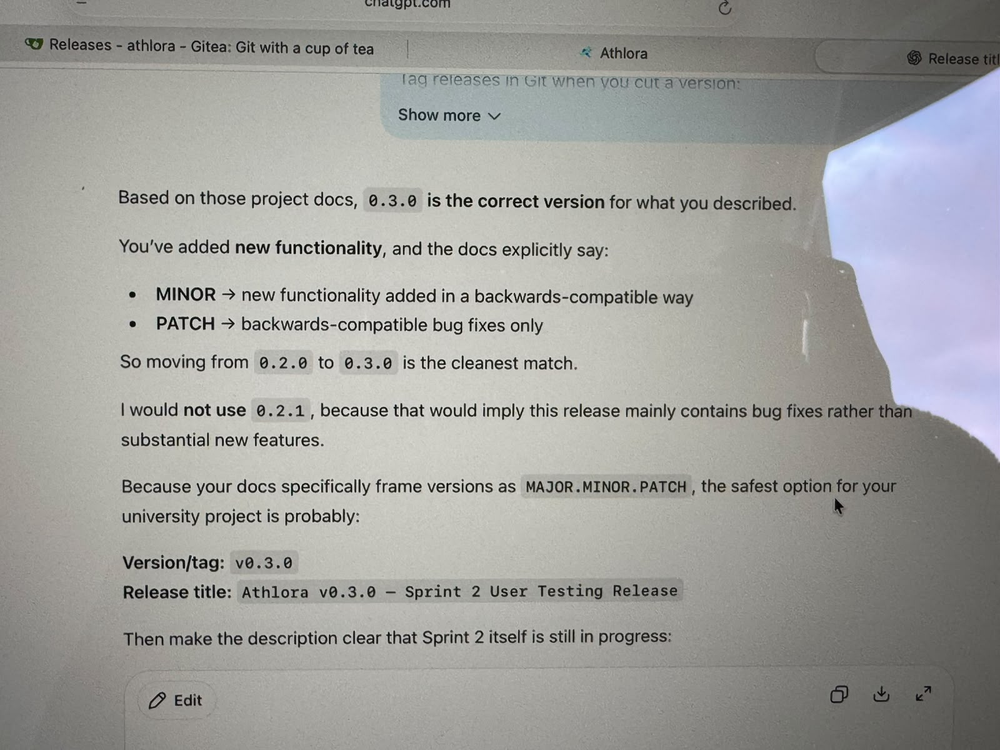

**[09:25:44] Aaliah Reddy:** ‎video omitted

**[09:25:48] Vareshan Rajah:** I think this is how we should do it

**[09:25:51] Aaliah Reddy:** so 0.3.0

**[09:26:06] Muhammed Bayat:** cools

**[09:26:18] Aaliah Reddy:** then when we release again it should be 0.3.1 for bug fixes and then 0.4.0 when we add new functionality

**[09:26:39] Muhammed Bayat:** must i make it./

**[09:26:41] Vareshan Rajah:** What about that beta testing one

**[09:26:50] Aaliah Reddy:** it’s fine i’ll do it

**[09:26:58] Aaliah Reddy:** i don’t think we use that cause it’s not part of the docs

**[09:27:20] Vareshan Rajah:** Alrighty

**[09:27:30] Aaliah Reddy:** we must actually start doing more releases ‎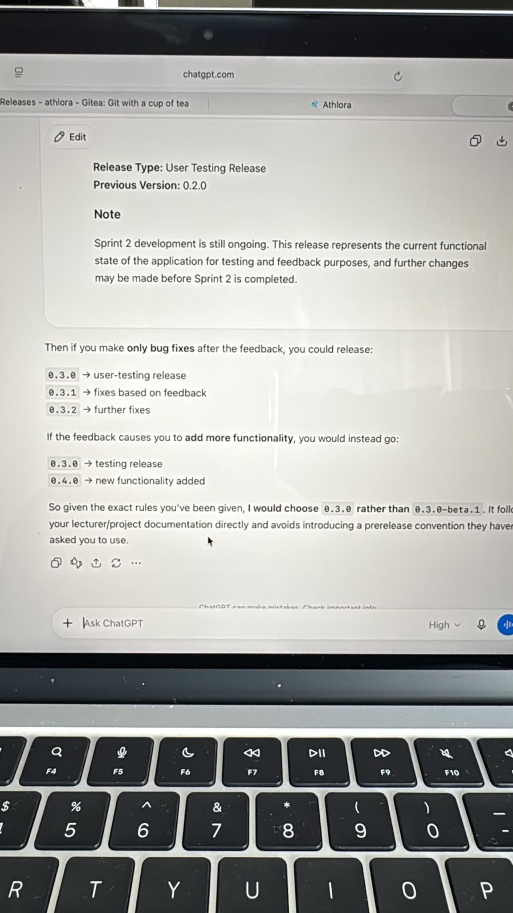

**[09:29:24] Vareshan Rajah:** Ya the issue is that currently we not fixing bugs, we doing major changes coz it's still in development

**[09:32:58] Aaliah Reddy:** stakeholder feedback form: https://docs.google.com/forms/d/e/1FAIpQLSf-xFEwLchzZ4CBUa-km10bYpuQXXWrI662CgtDrGP8h52pHA/viewform?usp=header

user feedback form: https://docs.google.com/forms/d/e/1FAIpQLSfOHFipdWqCi4i5rajCJ5AKPmxHWK2_2Lx3gKcM0wSQ8isIRA/viewform?usp=header

just double check it for me pls

**[09:33:41] Aaliah Reddy:** can someone please send the deployed link & form to harshil on discord

**[09:33:47] Aaliah Reddy:** i need to go eat

**[09:34:23] Muhammed Bayat:** Wait

**[09:34:25] Muhammed Bayat:** Before you go

**[09:34:40] Muhammed Bayat:** Don’t you want to add the deployed link on the form

**[09:36:26] Vareshan Rajah:** These are both solid

**[09:37:48] Aaliah Reddy:** mxah bruh😭

**[09:38:02] Aaliah Reddy:** okay my food is already ready

**[09:38:09] Aaliah Reddy:** give me like 20 minutes

**[09:38:19] Muhammed Bayat:** No biggie

**[09:50:13] Aaliah Reddy:** User feedback: https://docs.google.com/forms/d/e/1FAIpQLSfOHFipdWqCi4i5rajCJ5AKPmxHWK2_2Lx3gKcM0wSQ8isIRA/viewform?usp=header

Stakeholder feedback: https://docs.google.com/forms/d/e/1FAIpQLSf-xFEwLchzZ4CBUa-km10bYpuQXXWrI662CgtDrGP8h52pHA/viewform?usp=header

**[09:50:39] Aaliah Reddy:** just make sure the link works

**[09:51:11] Muhammed Bayat:** Yup

**[09:51:25] Aaliah Reddy:** kk, yall can send it then

**[09:53:38] Vareshan Rajah:** Alrighty

**[09:55:31] Vareshan Rajah:** Can I send it on the discord for Harshil?

**[10:08:44] Muhammed Bayat:** Yes

**[17:53:39] Vareshan Rajah:** Ya so the landing page is broken I think😔

**[17:55:20] Muhammed Bayat:** How 😭😭

**[17:55:43] Vareshan Rajah:** Well just the background

**[17:55:49] Vareshan Rajah:** The 3d thing

**[17:56:14] Vareshan Rajah:** Coz it didn't work now on my brother's laptop

**[17:56:37] Vikram Mahalingam:** It works on my computer

**[17:57:10] Aaliah Reddy:** who’s done the forms so far?

**[17:57:14] Aaliah Reddy:** i got 2 responses

**[18:01:03] Vikram Mahalingam:** I’ll get one tonight

**[18:01:09] Aaliah Reddy:** yeah same

**[18:01:27] Muhammed Bayat:** My brother did one

**[18:01:42] Aaliah Reddy:** so the responses come as charts right, can i just put those charts in an md file?

**[18:01:54] Muhammed Bayat:** Should be fine

**[18:02:42] Aaliah Reddy:** did the landing page work for him?

**[18:04:33] Muhammed Bayat:** Yea

**[18:04:36] Muhammed Bayat:** It’s working for me too

**[18:04:54] Muhammed Bayat:** ‎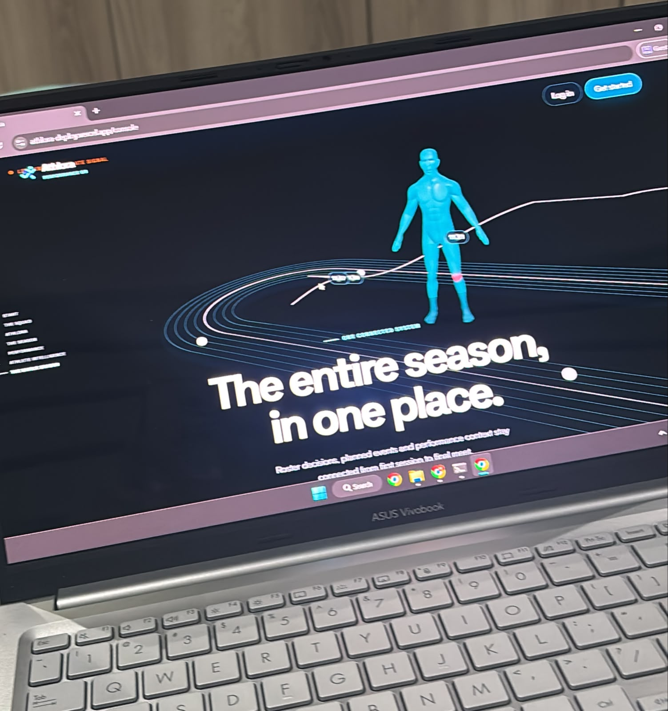

**[18:06:33] Vareshan Rajah:** Ya nvm it is working

**[18:06:46] Vareshan Rajah:** I don't know why it's not running on his

**[18:07:02] Muhammed Bayat:** Mobile ?

**[18:07:15] Vareshan Rajah:** Nah gaming laptop💀

**[18:53:19] Muhammed Bayat:** ‎sticker omitted

**[18:58:05] Vareshan Rajah:** Ya I don't know why it didn't work on his laptop

**[18:58:54] Vareshan Rajah:** Okay but there is a bug :(

So he tried to resolve an injury but there was an internal error😪

**[19:02:48] Aaliah Reddy:** just tell him to put it on the doc

**[19:02:57] Vareshan Rajah:** Ya I did

**[19:03:16] Vareshan Rajah:** He submitted his response

**[20:02:23] Vikram Mahalingam:** My sister sent a response as well

**[20:48:34] Aaliah Reddy:** guys how is the member invitation supposed to work

**[20:48:43] Aaliah Reddy:** kieran sent one to my email and i logged in but nothing comes up

**[20:49:05] Vareshan Rajah:** Go to account it should be there

**[20:49:22] Aaliah Reddy:** is it a link? or does it come to my account when i log in?

**[20:49:38] Vareshan Rajah:** Iwl I have no idea

**[20:49:49] Aaliah Reddy:** yeah that doesn’t work properly 😭

**[20:50:09] Vareshan Rajah:** But there is a place to see requests to join your club ‎[edited]

**[20:50:15] Muhammed Bayat:** If they request

**[20:50:18] Muhammed Bayat:** Click like

**[20:50:21] Muhammed Bayat:** Your account

**[20:50:26] Muhammed Bayat:** And you should see the request

**[20:50:40] Aaliah Reddy:** no i’m talking about inviting someone else as an assistant

**[20:51:09] Muhammed Bayat:** Idk if that’s still there just tell him to search ur club n join 💀

**[20:51:24] Vareshan Rajah:** Ya that's not supposed to be working anymore

**[20:51:35] Vareshan Rajah:** Coz we did this request to join a club thing

**[20:53:54] Aaliah Reddy:** ‎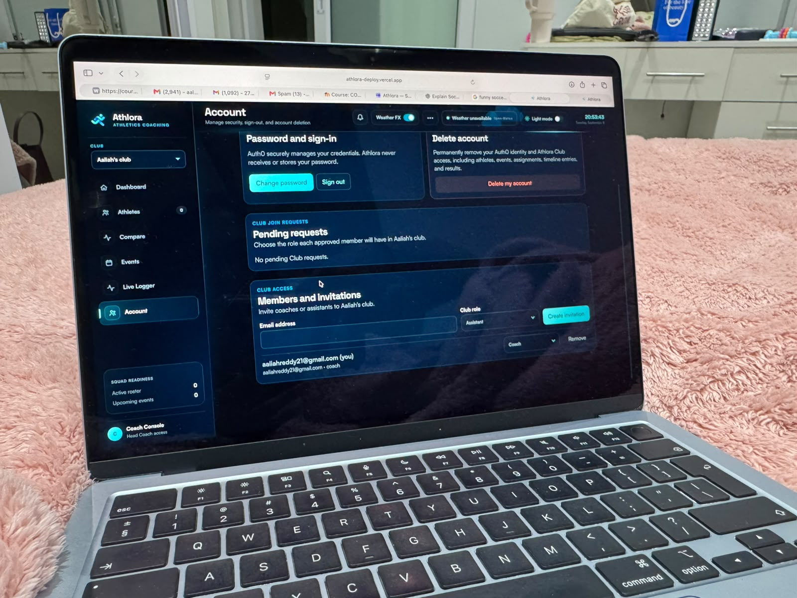

**[20:53:55] Aaliah Reddy:** ‎video omitted

**[20:54:03] Aaliah Reddy:** so this members/invitations thing shouldn’t be here anymore

**[20:54:24] Muhammed Bayat:** Wait so when you entered his

**[20:54:28] Muhammed Bayat:** He doesn’t see it anywhere ?

**[20:54:38] Aaliah Reddy:** no he entered my email and it’s nowhere

**[20:54:43] Aaliah Reddy:** he created his own club

**[20:54:48] Muhammed Bayat:** Ah

**[20:54:54] Muhammed Bayat:** Just add it to the list of bugs

**[20:54:54] Aaliah Reddy:** then entered my email so i logged into my account and it doesn’t work

**[20:55:07] Aaliah Reddy:** bug 1: be able to search on calendar when adding athlete

bug 2: resolve injury - internal server error

bug 3: the chronological timeline is showing recorded by v1, v2 instead of name/email

bug 4: the invitations don’t work

bug 5: explore season statistics button on landing page is unnecessary because it refreshes the page

**[20:57:06] Vareshan Rajah:** So now we just waiting for Harshil right?

**[20:58:36] Aaliah Reddy:** i think so

**[20:58:45] Aaliah Reddy:** pooks imma send you an invite

**[20:58:49] Aaliah Reddy:** go check your account

**[20:59:13] Vareshan Rajah:** Alrighty

**[20:59:28] Muhammed Bayat:** Also just make sure

**[20:59:34] Muhammed Bayat:** It’s an account that’s not part of a club

**[20:59:40] Muhammed Bayat:** Coz I can only be in one club at a time

**[21:00:01] Aaliah Reddy:** wait why 😭

**[21:00:12] Aaliah Reddy:** shouldn’t you be able to invite anyone, even people with other clubs

**[21:00:18] Aaliah Reddy:** ‎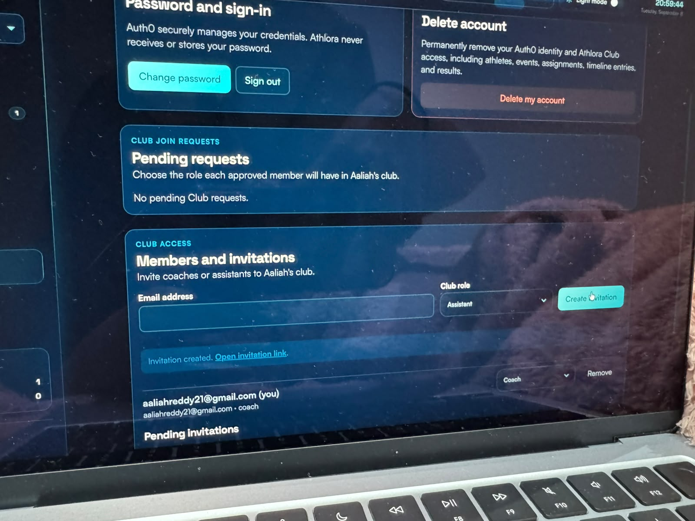

**[21:00:19] Aaliah Reddy:** ‎video omitted

**[21:00:41] Aaliah Reddy:** but then when you invite where would the invite even go?

**[21:00:46] Vareshan Rajah:** Well Vik did it right ig ‎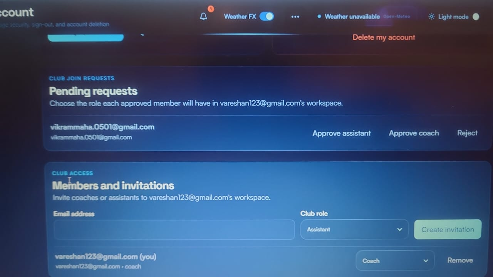

**[21:00:56] Muhammed Bayat:** Idk if you can invite them but ik there should be some restriction saying a coach or assistant can only be part of one club

**[21:01:02] Aaliah Reddy:** that’s from signup though

**[21:01:20] Aaliah Reddy:** i don’t feel like that seems right thought

**[21:01:31] Muhammed Bayat:** Haibo how 😭

**[21:01:45] Muhammed Bayat:** Imagine you have the same coach for 2 opposing teams

**[21:02:01] Aaliah Reddy:** like you should be able to invite other coaches or assistants to your club, cause wouldn’t they need to have accounts to be added to it anyway? cause they don’t get emails

**[21:02:43] Muhammed Bayat:** Yea maybe we can let them invite them but In order to join they’d have to leave their current clu

**[21:05:08] Aaliah Reddy:** so then why would you need to invite anyone if they can just request access to your account when signing in?

**[21:05:40] Muhammed Bayat:** Yea we can remove it

**[21:06:00] Aaliah Reddy:** cause say i’m a coach for a school and a coach for another school needs my help and wants to add me to their club, then they can add me and it comes to my account where i can accept and once im no longer needed the coach can remove me

**[21:06:38] Aaliah Reddy:** that was my logic behind it cause i also don’t understand how to add an assistant if they don’t have an account

**[21:07:59] Aaliah Reddy:** maybe instead of the invites we can do the chat where you can add a coach as a friend and send messages to eachother

**[21:10:59] Vareshan Rajah:** Okay how about before we delete and remove stuff, we meet with Harshil

**[21:11:16] Vareshan Rajah:** And see what he thinks

**[21:11:36] Aaliah Reddy:** is she the one that destroyed our stats here 😭😭😭

**[21:12:04] Aaliah Reddy:** 😭😭😭 ‎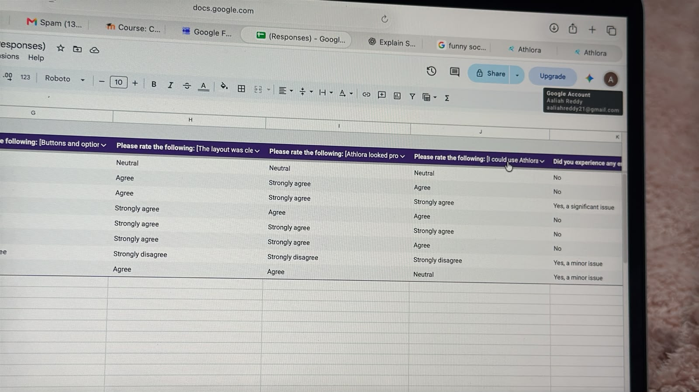

**[21:12:05] Vareshan Rajah:** What happened to our stats😭

**[21:12:15] Aaliah Reddy:** no like the stats for responses

**[21:12:19] Muhammed Bayat:** Yuhh

**[21:12:26] Aaliah Reddy:** she said strongly disagree for everything 😭😭😭

**[21:12:36] Vareshan Rajah:** Nah what😭💀

**[21:12:46] Muhammed Bayat:** 💀💀💀

**[21:13:03] Vareshan Rajah:** What was wrong with the layout😭

**[21:13:04] Vikram Mahalingam:** Fr💀

**[21:13:05] Muhammed Bayat:** It’s due on Tuesday

**[21:13:08] Muhammed Bayat:** 😭😭

**[21:13:23] Aaliah Reddy:** yeah manual entering of birthdays is a must idk why it’s a calendar 😭

**[21:13:26] Vikram Mahalingam:** I thought that was the good side😭

**[21:13:40] Aaliah Reddy:** mf what

**[21:13:40] Vareshan Rajah:** Ya we could try meet on Wednesday, coz also I think we should go over the rubric with him again just to make sure we covered everything😭

**[21:13:57] Muhammed Bayat:** Wednesday as in Tom ? We on break ?

**[21:14:03] Vareshan Rajah:** You fucking idiot😭🤦‍♂️

**[21:14:06] Aaliah Reddy:** vik so smart but so silly ‎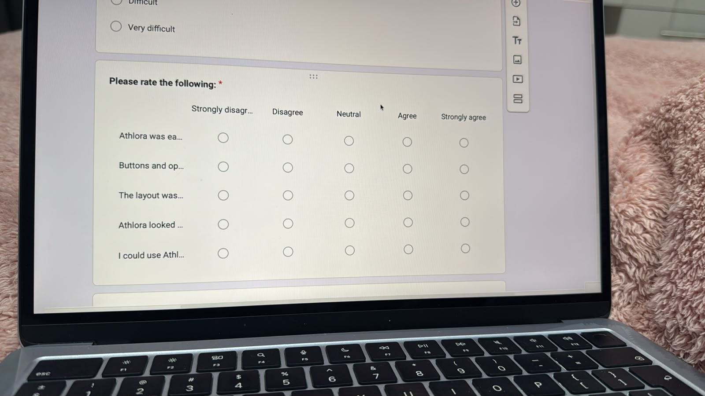

**[21:14:07] Muhammed Bayat:** Maybe a call if he’s down 😭😭

**[21:14:27] Vareshan Rajah:** Ohh sorry my bad, I meant Monday next week😭

**[21:14:30] Vikram Mahalingam:** Lowkey just read strongly and nothing else😭

**[21:14:41] Aaliah Reddy:** you messed it up

**[21:14:46] Aaliah Reddy:** ask her to redo

**[21:14:48] Aaliah Reddy:** pretty please

**[21:14:56] Vikram Mahalingam:** Yea yea np

**[21:15:08] Vikram Mahalingam:** Just remove that response

**[21:15:10] Muhammed Bayat:** Ay iwl one day to make changes isn’t gonna be great

**[21:15:16] Muhammed Bayat:** 😭😭😭

**[21:15:54] Vareshan Rajah:** No but this stuff is fine for Tuesday coz most things are solid

**[21:16:32] Vareshan Rajah:** I'm talking about like going through the testing docs, show him how we did it and make sure we've got all that done properly

**[21:16:41] Aaliah Reddy:** Athlora — Sprint 2 User Testing & Feedback.pdf • ‎4 pages ‎[Attachment: 00004003-Athlora — Sprint 2 User Testing & Feedback.pdf](./screenshots/00004003-Athlora — Sprint 2 User Testing & Feedback.pdf)

**[21:17:32] Vareshan Rajah:** This invitation issue is a massive fix that has to happen so I think we should leave it for next sprint, coz I liked how the request to join a club worked😭

It took me back to fifa💀

**[21:17:32] Aaliah Reddy:** i really don’t think it’s necessary tbh

**[21:17:49] Aaliah Reddy:** we removing it and adding a messaging feature instead

**[21:17:52] Aaliah Reddy:** to add friends and chat

**[21:18:13] Aaliah Reddy:** but atm just remove it

**[21:18:38] Vareshan Rajah:** Alrighty

**[21:19:02] Vareshan Rajah:** Hmm did any of yall test the AI?

And if you did was there any issues with it?

**[21:19:12] Aaliah Reddy:** iwl next sprint we have to grind for both of these projects 😭

**[21:19:15] Vareshan Rajah:** Well not yall, I mean the users

**[21:19:19] Aaliah Reddy:** i didn’t experience issues

**[21:19:24] Vikram Mahalingam:** She resubmitted 🫡

**[21:19:30] Aaliah Reddy:** thank you😭😭

**[21:19:30] Vikram Mahalingam:** My bad oaks💀

**[21:20:48] Vareshan Rajah:** Ohh okay atleast😭

**[21:21:00] Aaliah Reddy:** next sprint we have to push guys, cause we have to fix everything and add all the other sports 😭

**[21:21:28] Vikram Mahalingam:** Adding the other sports shouldn’t be too bad it’s the fixing that’s gonna be the issue😭

**[21:26:14] Aaliah Reddy:** so you think we should do everything first, keep all the bugs and then fix at the end of sprint 3? cause we can fix these bugs now before our marking on tuesday, and then do all the other sports

**[21:26:29] Aaliah Reddy:** then fix all the bugs at the end of sprint 3 and then sprint 4 will just be fixing

**[21:26:39] Muhammed Bayat:** Yup

**[21:26:54] Muhammed Bayat:** Coz for the actual requirement we only need 1 sport

**[21:27:08] Aaliah Reddy:** okay slay

**[21:27:13] Vikram Mahalingam:** Yea

**[21:28:58] Vareshan Rajah:** Iwl, the word fix came up so much, it scrambled my head😭💀

So wait what are we gonna do😭😭

**[21:30:00] Muhammed Bayat:** For the rest of this week

**[21:30:01] Vikram Mahalingam:** I think we ignore all the non major bugs until the end of the sprint and fix them all in one go

**[21:30:05] Muhammed Bayat:** Just keep fixing stuff

**[21:30:17] Muhammed Bayat:** Coz there’s nothing rly new to implement for this sprint ?

**[21:30:18] Vikram Mahalingam:** For future sprints

**[21:30:44] Vikram Mahalingam:** Instead of fixing and rebreaking the same thing

**[21:30:55] Muhammed Bayat:** So we’ll just make sure everything all in accordance to the rubric and to the docs and just keep fixing

**[21:31:09] Muhammed Bayat:** Bruh it’s an endless cycle

**[21:32:10] Vareshan Rajah:** This stupid ass weather thing keeps breaking, but i swear it's not us tho😭

**[21:32:29] Tyra:** I fixed it earlier though 🫪

**[21:32:55] Vareshan Rajah:** Ya and it's broken again😭

That's why I don't think it's us, I think it's that API or something

**[21:34:18] Vikram Mahalingam:** Yea it could be the service going down periodically

**[21:38:48] Muhammed Bayat:** Should we not find a better one

**[21:38:51] Muhammed Bayat:** 😭😭

**[21:42:19] Vareshan Rajah:** I'll try find one😭

**[21:43:13] Vareshan Rajah:** Okay so we need to create issues for all the bugs we want fixed by Tuesday next week, but let's wait for Harshil's response to see of he finds more bugs😭😭

### 2026/09/09

**[10:17:54] Muhammed Bayat:** can we start fixing bugs

**[10:26:23] Vareshan Rajah:** I think you can

**[10:34:07] Muhammed Bayat:** Okay I’m not home rn does someone mind starting

**[11:58:43] Aaliah Reddy:** if anyone starts yet please tell your agent to create the issues 🙏

**[16:48:57] Muhammed Bayat:** Does someone have another club account I can borrow for something

**[16:49:53] Vareshan Rajah:** You can try my student one

**[16:50:05] Vareshan Rajah:** [REDACTED -- email address]

[REDACTED -- password]

**[17:42:17] Muhammed Bayat:** I’m busy w stuff now please no one else push or make any changes 😭😭

**[20:23:02] Muhammed Bayat:** Okay

**[20:23:11] Muhammed Bayat:** Everything that has to do with the live logger

**[20:23:12] Muhammed Bayat:** Is done

**[20:23:14] Muhammed Bayat:** And works

**[20:23:17] Muhammed Bayat:** Issues recorded and closed

**[20:23:27] Muhammed Bayat:** Just note only the person that started the event can end it ‎[edited]

**[20:24:00] Muhammed Bayat:** Is there anything else that needs fixing while I’m busy

**[20:26:23] Muhammed Bayat:** Even the event creation n sending invites and stuff all that’s fine

**[20:28:03] Muhammed Bayat:** 1 isn’t done

2 is done

3 is done

4 idk if it’s event invitation or like account but event invitations done

5 no idea what’s that

**[20:29:01] Muhammed Bayat:** Tom I’ll go through the rubric to see what specifics we need and I’ll get to implementing / assigning them

**[20:30:32] Muhammed Bayat:** @⁨Aaliah Reddy⁩ Ik the code cov is fine for now as we have it with the npm stuff but can you ask Shayna and them if they have a better thingi that shows it without having to go into the actions

**[20:30:59] Muhammed Bayat:** @⁨Vikram Mahalingam⁩ can you make sure the offline logging stuff works properly

**[20:58:23] Aaliah Reddy:** i’ll ask

**[21:50:14] Aaliah Reddy:** they didn’t implement one

**[21:50:18] Aaliah Reddy:** so it’s like ours

**[22:06:20] Muhammed Bayat:** Okk

**[22:35:18] Vikram Mahalingam:** Yea I’ll do that tomorrow

### 2026/09/10

**[16:12:08] Muhammed Bayat:** ‎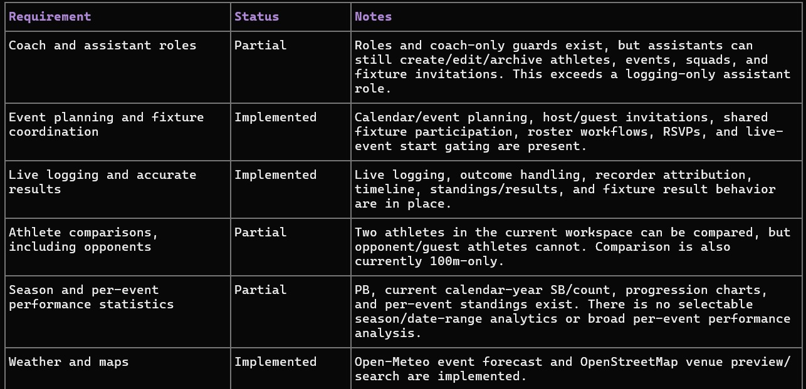

**[16:12:37] Muhammed Bayat:** ‎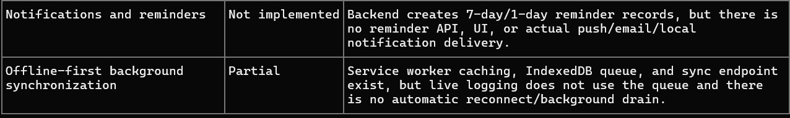

**[16:16:57] Muhammed Bayat:** right first one is fine we leave the assitant coaches roles as is, what we leave to simple logging-only is the people that join via QR code / link

2)  done

3) done

4) need to make more comparisons so athelte vs athlete in the club, athlete vs athlete across clubs, club stats , club vs club stats

5)we havent yet implemnted seasons at all need help on thinking how were going to go on about this

6) done

7) not done notifications need a rework, id like to beable to delete notifcations thats weve read star some importnat ones . mainly notifications for when an event is coming up, when the live logger started , when the event ended.

8) vik your still busy with this

**[16:18:04] Muhammed Bayat:** @⁨Vareshan Rajah⁩ can i leave 4 to you as itll be similar / almost the same to what will be seen on the alternate landing page

**[16:18:23] Muhammed Bayat:** @⁨Tyra⁩ can you cover 7

**[16:19:04] Muhammed Bayat:** and then lets talk about how wed want to implement seasons and what coz im sure this would need to tie in when were doing comparison s of any sort so sent ideas through

**[16:26:38] Tyra:** To start with 7, do I need to wait for 1-6 to be completed first ?

**[16:26:49] Muhammed Bayat:** Nope

**[16:28:28] Muhammed Bayat:** Also just note when doing stuff  do it like one instruction at a time launch it on local host see it’s working n then do the next instructions and then once it’s all done and you see it’s working on the local host then you can commit and push with the MR

**[16:32:44] Vareshan Rajah:** For this one, okay so I'll implement it when you logged in under the comparisons and I'll also do it on the alternate landing page at the same time

**[17:42:02] Muhammed Bayat:** Yup

**[19:33:07] Tyra:** Completed number 7 👍

**[19:56:43] Vareshan Rajah:** Okay I'm going to start with 4 now

**[19:57:25] Vikram Mahalingam:** 8 is about 50% done but it’s giving me a lot of trouble so I’ll try finish it tomorrow

**[19:57:59] Vikram Mahalingam:** I also need to ask Harshil some questions about what he wants for the offline logging

**[19:58:15] Aaliah Reddy:** idk if he answered the quiz yet

**[19:58:18] Aaliah Reddy:** lemme ask

**[19:59:42] Aaliah Reddy:** sorry i’ve been a AFK today, the groomers messed up my dog💔

let me know if there’s anything i can do, just packing and will be away for the weekend but ill do the docs and quiz replies on monday👍

**[20:01:04] Aaliah Reddy:** do we need seasons?

**[20:15:10] Muhammed Bayat:** I was thinking right so when all the offline logging like entries are done and the user comes back online maybe be take the avg of them and let that be the final result but idk

**[20:15:21] Muhammed Bayat:** Msg him on discord 😭😭

**[20:15:56] Vikram Mahalingam:** Nah it’s fine it’s stuff we only need for the future sprints

**[20:16:00] Muhammed Bayat:** It’s in the handout says they want like seasonal stats

**[20:16:06] Muhammed Bayat:** Calms

**[20:32:19] Aaliah Reddy:** oh ell

**[23:53:18] Vareshan Rajah:** Okay so 4 is completely done

**[23:53:40] Vareshan Rajah:** As well as the public viewing of the stats from the landing page

**[23:54:35] Vareshan Rajah:** A coach has to decide whether they would like to publish their teams results publicly, this can be done on the Compare page, and then the club will be available to see the results on the public viewing

### 2026/09/11

**[08:03:52] Muhammed Bayat:** Smarty

**[09:21:49] Vareshan Rajah:** ☺️

### 2026/09/12

**[14:20:45] Vareshan Rajah:** Heyy guys, so I added a little tweak to the landing page just to give to allow the user to feel more engaged with the site, and also give it a more cinematic feel

**[14:21:07] Vareshan Rajah:** Please check it out and tell me what yall think

**[15:00:39] Muhammed Bayat:** ‎image omitted

**[15:01:00] Muhammed Bayat:** Okay it’s letting me select now

**[15:01:08] Muhammed Bayat:** See if you can do something so we don’t have to wait

**[15:01:39] Vareshan Rajah:** Ya so it takes a bit of time coz it's pulling from the database, I don't why that takes so long tho😭

**[15:01:40] Muhammed Bayat:** Damn in a full ass tunnel

**[15:01:43] Muhammed Bayat:** Looks tuff

**[15:02:15] Vareshan Rajah:** Ya, so it's meant to be like you the athlete that runs out onto the track and then it changes into a drone camera

**[15:02:28] Muhammed Bayat:** It’s just fifa atp 😭😭

**[15:02:36] Vareshan Rajah:** 😭😭

### 2026/09/13

**[12:26:55] Muhammed Bayat:** @⁨Vareshan Rajah⁩ can you change/fix this weather api coz its broken again 😭😭

**[12:38:33] Muhammed Bayat:** @⁨Aaliah Reddy⁩ how many responsises did we get for the user testings

**[12:42:10] Aaliah Reddy:** i think 5, each of us did one

**[12:42:22] Aaliah Reddy:** idk why harshil is taking so long 🫣

**[12:42:47] Aaliah Reddy:** @⁨Tyra⁩ pls also don’t forget the user stories and UAT’s for this sprint, i’m sure your agent will do it for you though

**[12:43:03] Aaliah Reddy:** i’ll do our meetings and the responses tomorrow when i get home

**[12:43:43] Muhammed Bayat:** @⁨Vikram Mahalingam⁩ is this offline logger working coz I’m trying but uhh not looking good 😭😭

**[12:44:00] Muhammed Bayat:** Bruh 😭

**[12:44:19] Vikram Mahalingam:** Nope😭

**[12:44:19] Muhammed Bayat:** Guys can we get more

**[12:44:27] Aaliah Reddy:** i saw your message though, it doesn’t let me check responses on my phone for some reason

**[12:44:39] Muhammed Bayat:** Well just cook some ourselves

**[12:44:41] Vikram Mahalingam:** I tried all day but it was breaking everything so I didn’t push anything

**[12:44:47] Aaliah Reddy:** he said 5 was fine? but if you want you can send it to hemesh and them

**[12:44:53] Vikram Mahalingam:** Yea np

**[12:45:16] Muhammed Bayat:** Let’s just get a few more 😭

**[12:45:30] Muhammed Bayat:** Chai 😭 okay lmk when it’s done pls

**[12:45:42] Vikram Mahalingam:** Yea I will

**[12:45:47] Aaliah Reddy:** he still hadn’t responded ‎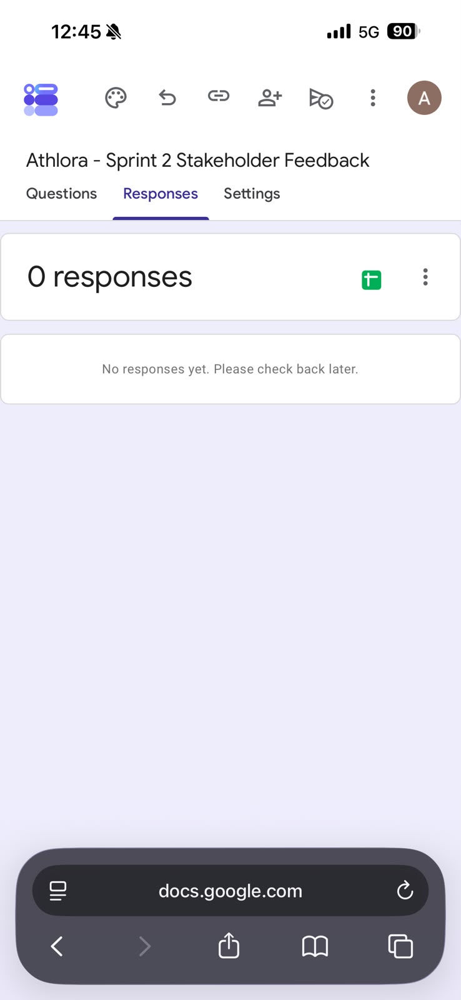

**[12:46:01] Muhammed Bayat:** ‎sticker omitted

**[12:46:34] Aaliah Reddy:** we have 8 sorry ‎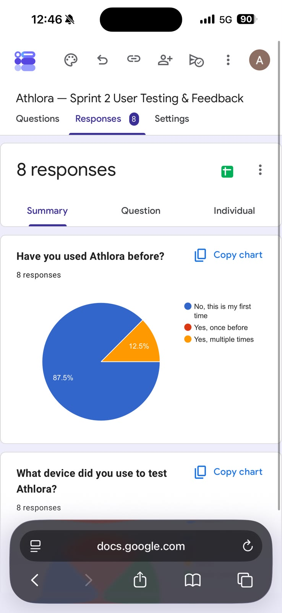

**[12:46:59] Muhammed Bayat:** Okay that’s fine the.

**[12:47:29] Tyra:** Alrighty , I’ll do that later

**[12:48:18] Aaliah Reddy:** yoh i also made a typo in the form, whoops but it’s fine i think my autocorrect changes bugs to buys

**[12:48:27] Tyra:** I think there is more because I asked 3 people to do it

**[12:48:50] Aaliah Reddy:** no i didn’t this thing is tweaking nvm

**[12:50:33] Muhammed Bayat:** 😭😭

**[12:51:58] Muhammed Bayat:** And the testing doc is the e2e thing fine now including policy and stuff and also I think once Aals does the feedback stuff you can add it to the testing doc or Aals you can add it coz the rubric wants it too

**[12:52:31] Aaliah Reddy:** kk, i’ll create a sprint 2 file and put the feedback in there and then ask it to just add that we did that to the testing doc

**[12:53:16] Aaliah Reddy:** i was trying to figure out how to export it into sheets but it doesn’t include the graphs 🫠

but i’ll figure it out tomorrow

**[12:53:34] Aaliah Reddy:** also SDP is compulsory on thursday morning 🥲

**[12:54:05] Muhammed Bayat:** I need to be doing Os I don’t have time for this 😭

**[12:54:06] Vikram Mahalingam:** Yea add what you have for now I can make the auto testing stuff if you want

**[12:54:21] Aaliah Reddy:** yoh OS is so bad 😭😭😭😭

**[12:54:29] Muhammed Bayat:** ‎sticker omitted

**[12:54:35] Muhammed Bayat:** Bruh and vik kept saying

**[12:54:56] Muhammed Bayat:** And I was like nah I’ll have a whole day I’ll get thought it mean time whole day goes n I’m still struggling w one chapter

**[12:55:37] Vikram Mahalingam:** Broski I’ve been doing this nonsense for a month now I’m still behind 😭

**[13:01:32] Aaliah Reddy:** I TOLD YOU

**[13:01:42] Aaliah Reddy:** took me 4 days to do all the chapters once

**[13:01:53] Aaliah Reddy:** and that was me pushing cause i needed to finish before this weekend

**[13:21:14] Vareshan Rajah:** Okay I messaged Harshil on whatsapp hopefully he does it now😭

**[14:22:35] Muhammed Bayat:** Awes I fixed that loading issue for the comparisons

**[16:48:06] Vareshan Rajah:** Okay calm

**[18:08:31] Aaliah Reddy:** yoh🫠 ‎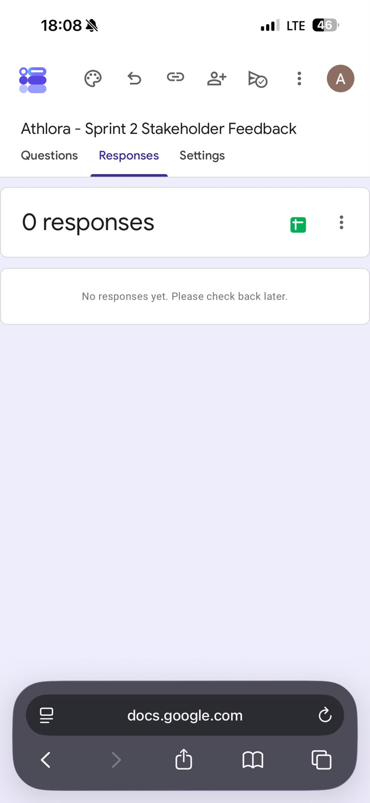

**[18:40:54] Vikram Mahalingam:** Ok the offline logging works you need to scan the qr code while online then if you turn the network off on your phone you should get an indicator that your offline in a few seconds

**[18:41:15] Vikram Mahalingam:** Try add a time while offline then turn WiFi on again and it should sync

**[18:41:43] Vikram Mahalingam:** Lmk if there are any problems I missed ‎[edited]

**[18:49:54] Muhammed Bayat:** Cools I’ll check it out Tom

**[18:52:02] Vareshan Rajah:** Okay so harsil says he did the testing

**[18:52:13] Vareshan Rajah:** @⁨Aaliah Reddy⁩ please just check responses

**[18:52:47] Vikram Mahalingam:** I’m doing the auto testing docs so you don’t have to do anything for that

**[19:03:56] Vikram Mahalingam:** Added the auto testing docs

**[19:07:36] Aaliah Reddy:** yep he did

**[19:07:51] Aaliah Reddy:** do i just need to add the forms to it?

**[19:08:24] Vikram Mahalingam:** Yea just a doc for user/stakeholder feedback

**[19:08:35] Vikram Mahalingam:** Just check the rubric for the contents

**[19:08:50] Vikram Mahalingam:** You can add it to the testing section

**[19:09:31] Aaliah Reddy:** yeah so i was gonna create a sprint 2 folder and then put it in there? so just lmk how i must do it

**[19:09:55] Aaliah Reddy:** oh wait that makes sense, i can call it a sprint 2 testing inside there

**[19:10:08] Vikram Mahalingam:** I think make that folder for our meeting and stuff but put this stuff in the testing section

**[19:10:22] Vikram Mahalingam:** Yea sounds good

**[19:10:47] Aaliah Reddy:** okay perfect

### 2026/09/14

**[04:54:12] Vareshan Rajah:** Okay the weather has been fixed, it's using GraySky as the new weather api

**[05:31:54] Muhammed Bayat:** Bro why are you awake

**[06:34:41] Vareshan Rajah:** My limit only reset at that time😭

**[12:49:57] Muhammed Bayat:** I implemented the seasons  and stuff I think in terms of functionality we’re all good

**[12:50:31] Muhammed Bayat:** Still haven’t gotten a chance to check the offline logging but if someone does pls check it

**[12:51:09] Vikram Mahalingam:** Please do check it idk if it works for everyone

**[12:51:20] Vikram Mahalingam:** I only checked on my computer and phone

**[12:52:28] Muhammed Bayat:** Damn guys I added sm cool stuff

**[12:52:33] Muhammed Bayat:** Prepare to be wowed Tom

**[12:53:13] Muhammed Bayat:** Vik if the actions all pass w my latest MR can you create another release

**[12:53:26] Muhammed Bayat:** Idk how the naming convention works icl

**[12:53:45] Vikram Mahalingam:** Ok np

**[12:59:52] Aaliah Reddy:** i’m gonna do the docs now quick

**[13:00:26] Vikram Mahalingam:** Yea I’ll do the release at night after we iron out any bugs we find

**[13:05:13] Muhammed Bayat:** PLEASEE make sure before you export the chats you ask ur agent to remove any pats or like personal stuff 😭😭

**[13:05:25] Aaliah Reddy:** i will

## AI Declaration

This document was converted and redacted from supplied project-chat evidence with the assistance of OpenCode[openai/gpt-5.6-terra].
