# Sprint 3 Raw Meeting Transcript

This is the retained, date-bounded WhatsApp project-chat export for Sprint 3. It is chronological source evidence for the concise [Sprint 3 meeting records](./meeting-records). The archive includes messages from 15 through 28 September 2026 only. Sensitive values, including credentials, tokens, database URLs, API keys, and access-bearing public logger URLs, have been redacted. One credential-bearing attachment has been excluded.

## Attendees

- Aaliah Reddy
- Vareshan Rajah
- Vikram Mahalingam
- Muhammed Bayat
- Tyra Mohamed

## Chat Transcript

### 2026/09/15

**[09:49:04] Muhammed Bayat:** can someone create the release

**[09:49:32] Vikram Mahalingam:** I’m just adding a few more doc, I’ll do it right after

**[09:50:42] Muhammed Bayat:** okay i was also busy with docs

**[09:51:07] Muhammed Bayat:** idk for some reason the docs action failed so can u just check that out

**[09:51:22] Muhammed Bayat:** and just see if u pull in database overview there should be an erd

**[09:51:58] Vikram Mahalingam:** Can you update the database schema doc cause I don’t know how to do that😭

**[09:52:19] Vikram Mahalingam:** I did the 3rd party code doc and I’m doing the external api stuff now

**[09:52:23] Muhammed Bayat:** Yea I think I did

**[09:52:31] Muhammed Bayat:** Wait o did this too

**[09:52:33] Muhammed Bayat:** 😭😭😭

**[09:52:55] Vikram Mahalingam:** Where did you add it?

**[09:53:15] Muhammed Bayat:** Under the api references there’s like an over view called external

**[09:53:28] Muhammed Bayat:** N then each one has its own in that folder

**[09:54:18] Vikram Mahalingam:** Oh ok so the api stuff is done I’ll just add the 3rd party code doc and add an api doc for the new weather api

**[09:54:29] Muhammed Bayat:** That’s all done too

**[09:54:31] Muhammed Bayat:** 😭😭

**[09:54:51] Vikram Mahalingam:** I’m not seeing it tho💀

**[09:55:14] Muhammed Bayat:** Yea I think it’s coz the MR is failing on the docs

**[09:56:01] Muhammed Bayat:** I’m out if limit so just try to fix that first and see what’s missing

**[09:56:12] Vikram Mahalingam:** Ok np

**[10:02:13] Vikram Mahalingam:** Mo the build error is cause none of the docs have been added 😭😭😭😭

**[10:02:40] Muhammed Bayat:** ‎sticker omitted

**[10:02:49] Muhammed Bayat:** Bruh it’s the dumb other ai 😭😭

**[10:02:52] Vikram Mahalingam:** Your commit only modified the existing files and changed the sidebar

**[10:03:06] Vikram Mahalingam:** Broski I’m using the same *** 😭

**[10:03:09] Muhammed Bayat:** I ran out just before I created the MR so I switched

**[10:03:16] Muhammed Bayat:** And then it messed up the MR

**[10:03:24] Muhammed Bayat:** Okay can you just do all the docs stuff then

**[10:03:32] Muhammed Bayat:** I’ll send you the erds

**[10:03:49] Vikram Mahalingam:** Yea np💀

**[10:05:15] Muhammed Bayat:** Just update the schema overview to what it’s currently using  
 
The apis internal + external  
 
Update project methodology like the stages were in and what was done like the roadmap part  
 
The database documentation 
 
Third party code documentation

**[10:05:21] Muhammed Bayat:** Haddes bruh 😭😭

**[10:05:37] Muhammed Bayat:** And testing but I think you did that alrdy

**[10:05:55] Muhammed Bayat:** ERD.png ‎document omitted

**[10:06:03] Vikram Mahalingam:** Ok imma be busy so can you do the final checks for what everything we’re showing the tutor

**[10:06:14] Muhammed Bayat:** Yea

**[10:06:36] Muhammed Bayat:** I added entries to the database for better stats n stuff as well

**[10:06:54] Muhammed Bayat:** ERD.zip ‎document omitted

**[10:07:01] Muhammed Bayat:** idk why whatsapp doesnt let me send a svg

**[10:52:42] Vikram Mahalingam:** Docs updated and I made the release

**[11:43:21] Vareshan Rajah:** So Kamal is our tutor for today😝😝

**[14:30:31] Aaliah Reddy:** 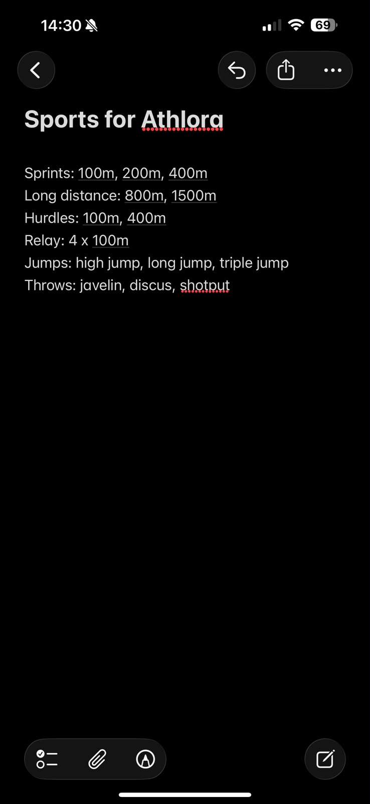

**[16:09:19] Aaliah Reddy:** make the charts more distinct for every new athlete

**[16:40:42] Vareshan Rajah:** Okay I can do this coz I want to make them look really nice😭

**[17:06:46] Muhammed Bayat:** 😭😭

### 2026/09/16

**[12:15:54] Vareshan Rajah:** Are we all available to meet with Harshil tomorrow?

**[12:16:36] Vareshan Rajah:** And could we possibly do it during @⁨Muhammed Bayat⁩ and @⁨Tyra⁩ tutoring time😭

**[12:16:56] Vikram Mahalingam:** Yup

**[12:19:49] Vareshan Rajah:** Okay, coz I need to leave before 2, coz I have tutoring😭

**[12:38:20] Vareshan Rajah:** Okay so I told Harshil we can meet with him tomorrow at about 12:30 in the labs

**[12:39:25] Muhammed Bayat:** Calm

### 2026/09/17

**[13:10:27] Aaliah Reddy:** 17/09/2026 
showed our current version  
downloadable stats to be implemented  
all the other sports to be implemented  
instructions for AI to go to sleep  
fix the line graph colours  
switch order of past events  
change privacy of clubs to use their results and publish schedule  
personalisation  
leaderboard stats  
export stats from landing page and create a link that you can send to everyone  
link for taking results for athletes of multiple disciplines  
changing UI based on multiple disciplines  
have a select as final for every entry to mitigate multiple logs  
add places (1st, 2nd, 3rd) to live loggers  
add club logos pics

### 2026/09/20

**[11:42:42] Aaliah Reddy:** @⁨Muhammed Bayat⁩ when you can pls create the issues 🙏

**[11:52:14] Muhammed Bayat:** Yuhh

**[11:52:28] Muhammed Bayat:** My weekly limit is up so once it’s back I’ll get to it

**[11:52:52] Muhammed Bayat:** I’m not gonna do it like the last time coz I feel it did whatever and then there was a lot we had to go behind and fix / redo

**[11:52:55] Muhammed Bayat:** But yea

**[11:53:00] Muhammed Bayat:** I’ll make it

**[13:17:02] Muhammed Bayat:** 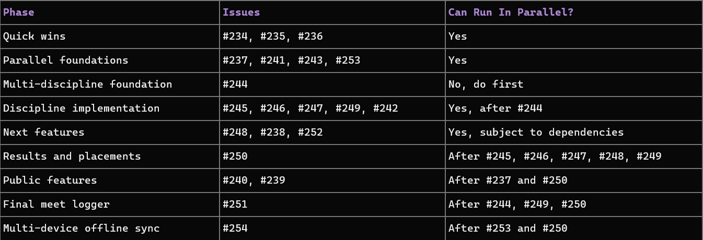

**[14:01:38] Vikram Mahalingam:** ‎Vikram Mahalingam pinned a message

### 2026/09/22

**[20:10:12] Muhammed Bayat:** Don’t forget to start these and say which ones your doing

**[20:10:29] Muhammed Bayat:** You should beable to just pull the issue read it and code it like how we previously done

**[20:10:43] Muhammed Bayat:** Let’s try to get this done by Friday please

**[20:10:55] Muhammed Bayat:** Weekend will be spent fixing n what not

**[20:11:27] Vikram Mahalingam:** I’m happy to do row 2 just let me know when row 1 is finished

**[20:11:37] Muhammed Bayat:** And then from after the sprint we need to push cgv

**[20:11:56] Muhammed Bayat:** Try doing it now where you can but ik it won’t be the main focus

**[20:21:11] Tyra:** I need to get my commits higher so I can do row 3 and 4

**[20:24:20] Aaliah Reddy:** i’ll start row 1 just now, not sure if i’ll finish all issues though but i’ll try

**[20:33:01] Aaliah Reddy:** also i’ll remake the google forms on like thursday/friday so we can quickly get responses this weekend lmk what i should add to them

**[20:40:41] Aaliah Reddy:** let me know when you’re doing those so i can work on cgv at the same time

**[21:50:48] Aaliah Reddy:** @⁨Muhammed Bayat⁩ did you get a deployment failure?🙂

**[21:51:58] Muhammed Bayat:** Not yet 💀

**[21:52:23] Aaliah Reddy:** no cause the stuff i did is working but my merge didn’t pass anything so im confused

**[21:53:15] Aaliah Reddy:** oh nvm, it didn’t fail it just stopped

**[21:53:43] Vikram Mahalingam:** I think the runners are busy

**[21:54:10] Aaliah Reddy:** are we using yours or brendan’s?

**[21:54:18] Vikram Mahalingam:** It deployed fine I think

**[21:54:32] Vikram Mahalingam:** Brendan’s

**[21:54:40] Vikram Mahalingam:** Mine are offline atm

**[21:54:44] Aaliah Reddy:** oh okay that explains it then

**[22:34:51] Aaliah Reddy:** @⁨Vikram Mahalingam⁩ row 1 is done

**[22:35:22] Vikram Mahalingam:** Cool I’ll do row 2 in the morning

### 2026/09/23

**[15:00:35] Aaliah Reddy:** lmk when 2, 3 and 4 are done, cause i can continue after that

**[16:15:01] Vikram Mahalingam:** Row 2 is done

**[16:15:38] Vikram Mahalingam:** The UI for the dashboard customisation looks pretty bums at the moment but we can fix that after everything else😭

**[16:52:32] Vareshan Rajah:** Wait, we can customize the dashboard now?

**[17:05:15] Aaliah Reddy:** i think it’s for the picture stuff

**[17:05:57] Vikram Mahalingam:** Yea you can select/deselects what’s on the dashboard

**[17:06:13] Aaliah Reddy:** oh that’s cool

**[17:55:28] Tyra:** I’ll row 3 as soon as I get home

**[19:22:47] Aaliah Reddy:** let’s try get to like row 6 by end of tomorrow

**[21:07:32] Muhammed Bayat:** Which row do I need to do

**[21:07:41] Tyra:** I’m still busy

**[21:08:14] Muhammed Bayat:** I’ll do 4

**[21:08:21] Muhammed Bayat:** Lmk when you’re done

**[22:09:39] Muhammed Bayat:** Someone broke something

**[22:10:28] Tyra:** My stuff has merged successfully so far so I don’t think it was me 🫪

**[22:13:34] Aaliah Reddy:** i just used the deployed site and it’s working

**[22:14:05] Muhammed Bayat:** 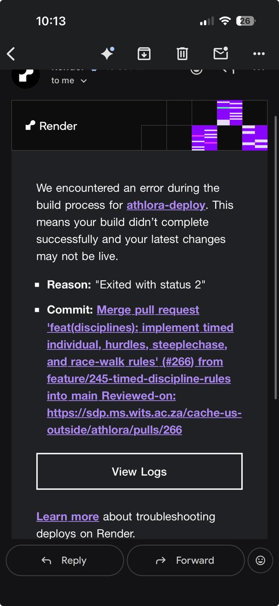

**[22:14:31] Muhammed Bayat:** Yea it will be I just don’t think it’ll be showing the latest commit/merge

**[22:15:09] Vikram Mahalingam:** try test/build frontend and backend locally

### 2026/09/24

**[07:31:00] Tyra:** I completed row 3 last night and issues 245 and 246 from row 4, but I’m failing the backend typecheck for 245 and 246 from row 4 so I’m fixing that right now

**[09:21:30] Tyra:** I’ve fixed the typecheck errors

**[09:22:00] Tyra:** Doing the issue 247 now 👍

**[10:36:47] Tyra:** @⁨Muhammed Bayat⁩ I finished #247 so could you please do the other 2 issues in row 4 then tonight I’ll work on other issues

**[10:51:15] Muhammed Bayat:** dont forget to assign and close ur issues

**[11:49:01] Muhammed Bayat:** I’m working on it

**[15:57:20] Vikram Mahalingam:** Lmk when row 4 is done

**[15:57:54] Muhammed Bayat:** My limit shout be back in a few mins n I’ll finish up

**[15:58:03] Vikram Mahalingam:** 👍

**[17:54:31] Muhammed Bayat:** Done

**[17:58:35] Vikram Mahalingam:** cool I'm starting row 5 now

**[17:59:02] Tyra:** I can do row 6 and row 7 afterwards

**[17:59:28] Muhammed Bayat:** How are you not out of usage limit 😭

**[17:59:46] Tyra:** This morning I was but it reset now 😭😭 ‎&lt;This message was edited&gt;

**[18:00:02] Muhammed Bayat:** Lool okay

**[18:00:19] Aaliah Reddy:** @⁨Vareshan Rajah⁩ can you do row 8 or 9 and i’ll do one too, then we each did something

**[18:00:36] Vareshan Rajah:** Alrighty

**[18:00:48] Vareshan Rajah:** Which one do you want to do?

**[18:01:05] Aaliah Reddy:** i can do 8 when tyra is done

**[18:02:46] Vareshan Rajah:** Okay, then I'll do 9

**[18:03:17] Vareshan Rajah:** Then I will also see what I can do about the dashboard customization UI

**[18:22:48] Muhammed Bayat:** raj wakes up thinking about UI i swear

**[18:28:20] Tyra:** ‎sticker omitted

**[18:28:59] Vareshan Rajah:** The UI is like the first impression, and you always want to give a great first impression🤣🤣

**[18:31:48] Muhammed Bayat:** Fairs 😭

**[18:32:19] Vikram Mahalingam:** He has an eye for it tbf💀

**[19:05:41] Aaliah Reddy:** there’s a performance thing on the rubric for 5%, maybe we should implement the pinger before tuesday as well so we don’t lose any marks on performance

**[19:06:06] Muhammed Bayat:** We can

**[19:06:52] Muhammed Bayat:** But I don’t think it’s a backend issue I think what takes long the first time is loading the entire dashboard with all the paitients and all those body’s but I’ll research and check it out

**[19:07:42] Aaliah Reddy:** kk lmk what you find, cause in the sprint 4 rubric it’s about how your API handles significant load

**[19:07:53] Muhammed Bayat:** Yeee I’ve been seeing

**[19:07:58] Aaliah Reddy:** 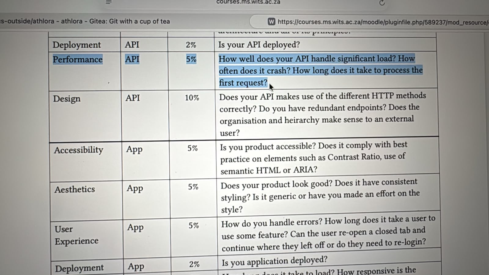

**[19:08:02] Muhammed Bayat:** Think for sprint 3 were like mostly done

**[19:08:21] Aaliah Reddy:** i think we’re done after spring 3, just small fixes probably for sprint 4

**[19:08:34] Muhammed Bayat:** Yup sounds good

**[19:08:42] Aaliah Reddy:** we must keep our 100% streak😭😭

**[19:09:08] Muhammed Bayat:** Frr innovation day has our name there 😤

**[19:09:08] Aaliah Reddy:** i’ll make the new forms for sprint 3 tomorrow and we can send it

**[19:09:15] Muhammed Bayat:** Yoh guys iwl I feel like I’m on holiday

**[19:09:26] Aaliah Reddy:** and we’re one

**[19:09:57] Muhammed Bayat:** For the user testing it says extensive testing idk what extensive is but let’s just do it ourselves a few times each as well 😭

**[19:10:04] Muhammed Bayat:** Like let’s aim for 15-20?

**[19:10:14] Aaliah Reddy:** yeah it probably means more users

**[19:10:31] Vikram Mahalingam:** I think just add a few more questions as well

**[19:10:34] Aaliah Reddy:** idk if we need more feedback for sprint 4 tbh

**[19:10:37] Aaliah Reddy:** yeah i will

**[19:11:15] Aaliah Reddy:** also sprint 4 i’ll try get our coverage up to above 80, momo everytime you do something it goes down😭😭😭😭

**[19:11:26] Aaliah Reddy:** but we just need above 60 for this sprint

**[19:12:16] Vareshan Rajah:** For the user testing I think let's send it to like Milla, Keanu etc. I don't think we should send it to other groups😭

**[19:12:40] Aaliah Reddy:** yeah that’s fine😭😭😭

**[21:30:45] Vikram Mahalingam:** I’ve done 2 issues in row 5 but my opencode gave up when I was doing the third one so can someone take over😭

**[21:31:20] Vikram Mahalingam:** I don’t want to push the half completed code

**[21:31:48] Vareshan Rajah:** Wait which issues did you do?

**[21:31:53] Vareshan Rajah:** I'll take over

**[21:32:12] Vikram Mahalingam:** Just 252 left to do

**[21:32:30] Vareshan Rajah:** Okay are the other 2 issues pushed already?

**[21:34:54] Vikram Mahalingam:** Yup

**[21:35:49] Vareshan Rajah:** Okay calm

**[21:51:30] Vareshan Rajah:** Is the custom logo upload meant to be working?😭

**[21:51:44] Vikram Mahalingam:** Lowkey I have no idea😭

**[21:51:59] Vikram Mahalingam:** It said it added something but I didn’t really test it

**[21:52:24] Vikram Mahalingam:** We might need another API service for storage though

**[21:52:56] Vikram Mahalingam:** Cause apparently storing pictures in the database is not a good idea

**[21:53:48] Vareshan Rajah:** Ya true, coz our tables will look weird

**[21:56:07] Vikram Mahalingam:** Apparently cloudflare has a service for that but I think wait till everything is done before we deal with that

**[21:56:30] Vareshan Rajah:** Alrighty

**[22:02:41] Vareshan Rajah:** Okay so there's quite a few things that aren't working properly, but once we finish these issues, then I think we just need to go through everything to make sure they work properly

**[22:02:57] Vareshan Rajah:** And the stuff that doesn't work we can create bugs for them and fix it

**[22:37:32] Vareshan Rajah:** Okay row 5 is done

**[22:37:47] Vareshan Rajah:** @⁨Tyra⁩ you can start with 6 and 7 tomorrow

### 2026/09/25

**[09:08:57] Aaliah Reddy:** @⁨Tyra⁩ lmk when you’re done or if your credits run out i can continue for you

**[09:22:45] Tyra:** Alrighty I just finished row 6 so I’m starting row 7 but I think I’ll only have enough credits to complete #240 in row 7

**[09:22:55] Tyra:** Then you can do 239

**[09:23:08] Tyra:** So I’ll message once I’m done with 240

**[09:23:58] Aaliah Reddy:** okay cool

**[11:03:20] Tyra:** done with issue #240 👍

**[12:14:04] Aaliah Reddy:** yall icl there’s a few things that are broken😭😭😭

**[12:14:20] Aaliah Reddy:** i needed to test the reports page thing, but when i create an event it doesn’t go to the live logger at all😭

**[12:14:34] Aaliah Reddy:** and everytime i try to start an event it says resource not found 😭

**[12:14:51] Aaliah Reddy:** imma complete the issues and stuff first but we have some fixing to do 😭

**[12:15:06] Muhammed Bayat:** A lot of 😭😭

**[12:15:14] Muhammed Bayat:** Let’s try to get everything done today

**[12:15:25] Muhammed Bayat:** And then we’ll start fixing Tom

**[12:15:41] Aaliah Reddy:** i can’t test the reports page 😭🙂

**[12:15:54] Muhammed Bayat:** So you wanna fix that first ?

**[12:16:24] Aaliah Reddy:** i think i’ll leave it for now, cause it is there, but i just can’t test it

**[12:16:36] Aaliah Reddy:** i have no idea what’s cooking here😭 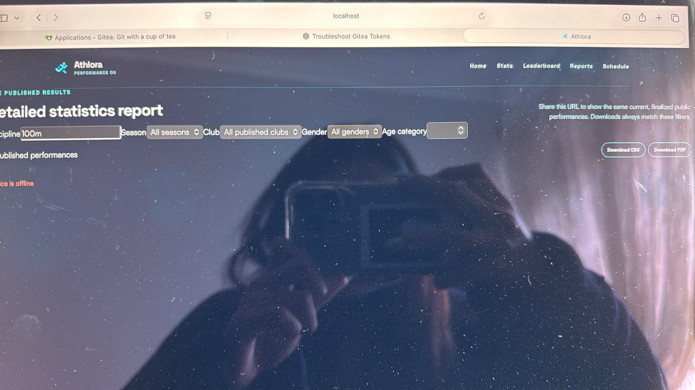

**[12:17:10] Aaliah Reddy:** 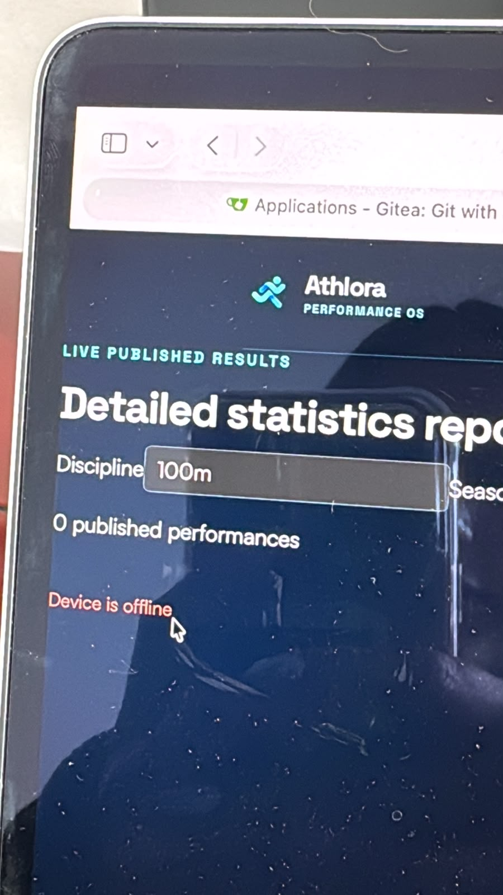

**[12:17:34] Muhammed Bayat:** Eh 😭

**[12:17:45] Muhammed Bayat:** Habana 😭😭

**[12:18:28] Vikram Mahalingam:** 😭😭😭

**[12:19:09] Aaliah Reddy:** i might try to just complete the last 3 issues if my credits don’t run out and then pooks can fix

**[12:19:44] Muhammed Bayat:** Just remember when fixing don’t give it a list of things to fix coz that almost never works like give one fix then check locally then next fix

**[12:20:13] Vareshan Rajah:** Okay, just let me know when you done or if you run out of credits

**[12:20:18] Vareshan Rajah:** Alrighty

**[12:22:35] Aaliah Reddy:** I FIXED IT

**[12:22:37] Aaliah Reddy:** ‎sticker omitted

**[12:23:49] Aaliah Reddy:** not too sure about the logic of the report but we can fix that later

**[12:33:12] Vareshan Rajah:** Okay so are you done now?

**[12:33:33] Aaliah Reddy:** i just did 239

**[12:33:39] Aaliah Reddy:** gonna do row 8 now

**[12:54:38] Vareshan Rajah:**

**[12:54:38] Vareshan Rajah:** @⁨Vikram Mahalingam⁩ so aaliah fixed this thing then she merged, but now the branch is still open and the merge hasn't gotten to the deployed site yet 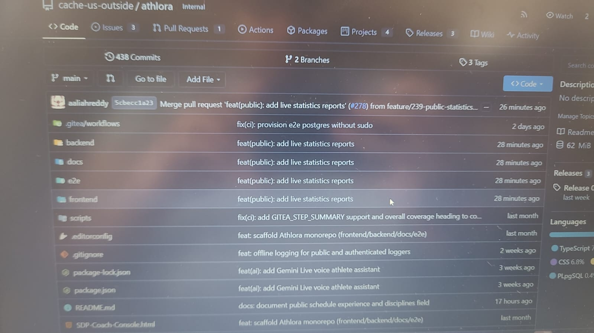

**[12:54:38] Vareshan Rajah:** 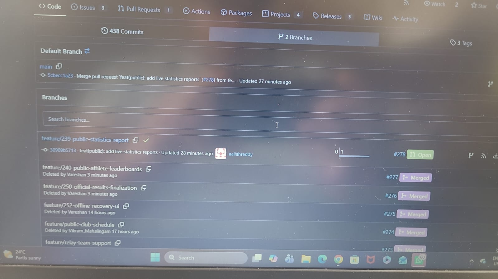

**[12:54:39] Vareshan Rajah:** 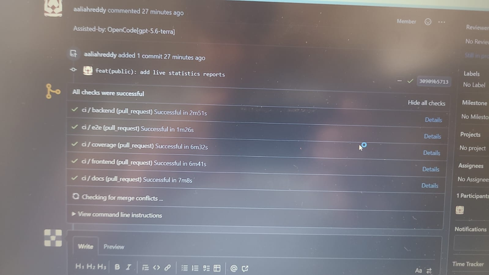

**[12:54:51] Vareshan Rajah:** So should I just wait for Gitea to sort itself out?

**[12:55:37] Vikram Mahalingam:** Lemme check real quick

**[12:55:48] Vareshan Rajah:** Okay

**[13:03:40] Vikram Mahalingam:** Yea gitea is tweaking

**[13:04:19] Vareshan Rajah:** Chaai😭

**[13:04:48] Vikram Mahalingam:** It’s fine tho her work is on main

**[13:04:55] Vikram Mahalingam:** So you can just ignore the pull request

**[13:05:11] Vareshan Rajah:** Should I just wait till it like stops tweaking, coz the mirror repo has Tyra's merge as the latest update

**[13:05:12] Vikram Mahalingam:** If it’s still there by tonight I’ll try fix it somehow

**[13:05:24] Vikram Mahalingam:** Oh fr

**[13:05:31] Vareshan Rajah:** So I think aaliah's fix is still floating somewhere in the air😭

**[13:05:33] Vikram Mahalingam:** That’s not good😭

**[13:05:37] Vareshan Rajah:** Ya😭

**[13:05:52] Vikram Mahalingam:** Is her code on gitea main though?

**[13:06:04] Vikram Mahalingam:** Like when you pull do you have her stuff? ‎&lt;This message was edited&gt;

**[13:06:12] Vareshan Rajah:** Wait let me pull and test locally

**[13:12:44] Vareshan Rajah:** Ya it's there on main

**[13:12:58] Vareshan Rajah:** Okay I'm just going to do row 8 and pray nothing breaks😭

**[13:13:05] Aaliah Reddy:** okay😭😭

**[13:15:12] Aaliah Reddy:** it should be fine then, lmk when you done

**[13:15:29] Vareshan Rajah:** Alrighty

**[13:23:56] Aaliah Reddy:** let’s see when you push, hopefully it works😭💔

**[13:39:19] Vareshan Rajah:** Ya hopefully😭

**[13:41:51] Aaliah Reddy:** i tried to re trigger the deployment, i think there just might be something wrong with gitea rn

**[13:42:10] Aaliah Reddy:** cause it’s not triggering an action, so it’s in the commits but not actions

**[13:45:45] Aaliah Reddy:** idk what’s going on here 😐

**[13:46:25] Vareshan Rajah:** It's fine, hopefully my merge will fix it😭

**[13:47:04] Muhammed Bayat:** Might be ik lamp was also having some issues

**[13:47:10] Muhammed Bayat:** Idk if it has to do with anything

**[13:47:18] Aaliah Reddy:** wait

**[13:47:28] Aaliah Reddy:** this thing didn’t merge to main properly either

**[13:47:40] Aaliah Reddy:** i fixed this but now it’s back like this again 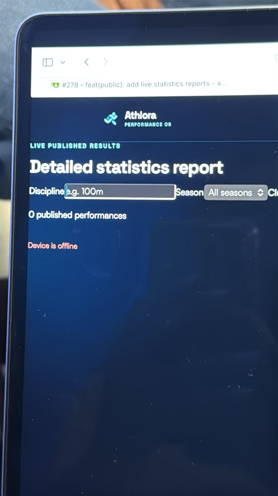

**[13:48:07] Vikram Mahalingam:** I think it’s that cause even commits to main aren’t triggering actions

**[13:48:24] Vareshan Rajah:** Nah but wait, when I tested locally I never got that

**[13:48:48] Aaliah Reddy:** try test the reports again quick

**[13:49:28] Aaliah Reddy:** oh nvm

**[13:49:33] Aaliah Reddy:** it wasn’t running properly

**[13:50:55] Vareshan Rajah:** Is it fine now?

**[13:51:08] Aaliah Reddy:** yeah it’s running fine locally

**[13:51:16] Vikram Mahalingam:** Yea last push to the mirror was 3 hours ago 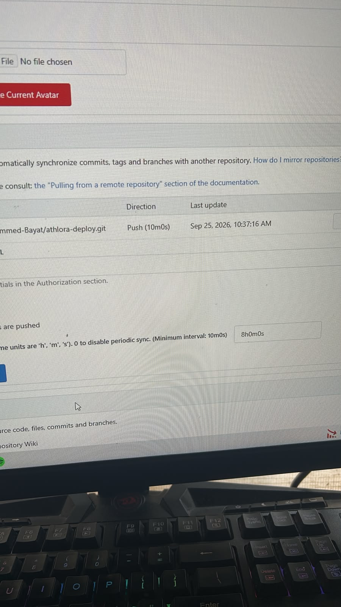

**[13:51:54] Vareshan Rajah:** Ya we will see when I merge if it fixes that

**[14:01:01] Vikram Mahalingam:** Ask Nayan and them if they’re having issues as well or if it’s just us

**[14:01:26] Vareshan Rajah:** Okay I will

**[14:06:22] Vareshan Rajah:** Okay so I pushed my branch my branch

**[14:06:39] Vareshan Rajah:** It was out of date with the main branch, coz I think aaliah changed something

**[14:06:50] Vareshan Rajah:** So it's busy checking for merge conflicts

**[14:06:56] Vareshan Rajah:** There should be any hopefully

**[14:07:10] Vareshan Rajah:** Once it's done please can someone merge it, I'm late for tutoring😭

**[14:07:26] Vikram Mahalingam:** Yea np

**[14:10:09] Aaliah Reddy:** i just pushed main again so there was no changes to your branch or anything, i genuinely think gitea is cooked

**[14:15:36] Vikram Mahalingam:** Yea looks like gitea is just cooked😭 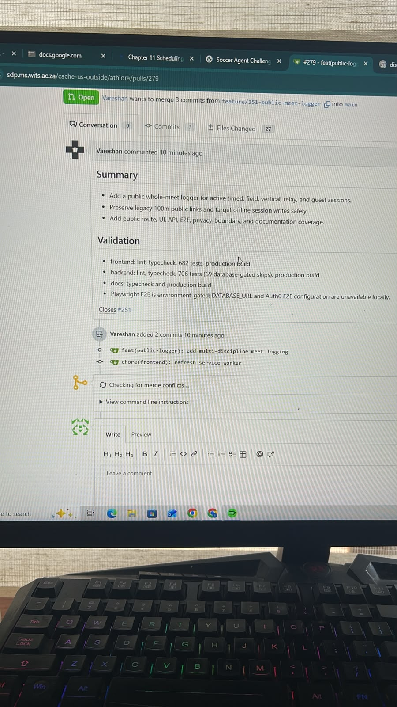

**[14:21:53] Aaliah Reddy:** ffs

**[14:22:00] Aaliah Reddy:** but it’s not merging 💔💔

**[14:22:06] Aaliah Reddy:** so idk if i must do row 9 now

**[14:22:35] Aaliah Reddy:** 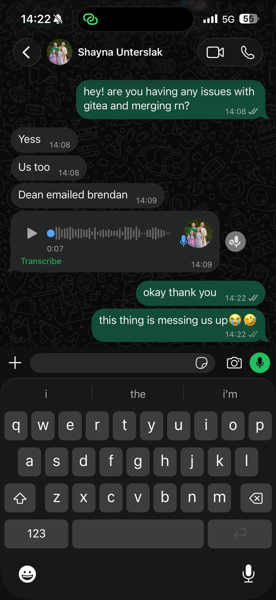

**[14:22:43] Vikram Mahalingam:** I think wait for a bit

**[14:22:46] Aaliah Reddy:** i think they’re trying to fix it

**[14:22:56] Aaliah Reddy:** i created our sprint 3 forms though

**[14:23:02] Aaliah Reddy:** lemme check if pooks’ stuff is on main

**[14:23:26] Vikram Mahalingam:** Nah it’s not letting me merge manually 😭

**[14:23:43] Aaliah Reddy:** ‎sticker omitted

**[14:23:46] Aaliah Reddy:** ffs

**[14:26:28] Aaliah Reddy:** so now what must be done? nothing?😭

**[14:26:54] Vikram Mahalingam:** CGV?💀

**[14:27:20] Aaliah Reddy:** maybe that’s a good idea

**[14:27:27] Aaliah Reddy:** yoh but we need to finish this ***😭😭

**[14:27:45] Muhammed Bayat:** Fairs 😭😭

### 2026/09/26

**[09:13:17] Vareshan Rajah:** @⁨Aaliah Reddy⁩ you can start with row 9

**[11:53:47] Aaliah Reddy:** @⁨Muhammed Bayat⁩ please look at the reports on the dashboard and tell me what you think, idk about the logic of it so i can change it but idk how i would change it😭 
 
imma do row 9 and see what bugs i find then i’ll make issues for the bugs

**[11:54:33] Vareshan Rajah:** Okay so Moe is busy looking for bugs now

**[11:54:52] Vareshan Rajah:** You can start with 9,

**[11:55:24] Aaliah Reddy:** i saw 😭😭 
imma do it now, only woke up now😭😭

**[11:55:34] Aaliah Reddy:** ohh okay no problem

**[11:55:45] Vareshan Rajah:** With regards to the reports it looks fine, but like like I think we should only display the best result of each athlete and not all the results

**[11:55:59] Vareshan Rajah:** Coz it's just looking a but chunky

**[11:56:25] Aaliah Reddy:** yeah it shows like PB’s then also all results, the ordering is also a bit strange

**[11:58:35] Muhammed Bayat:** I’ll get it to it when I do there’s a lot of broken stuff 😭😭

**[11:59:08] Aaliah Reddy:** you’re not doing any fixes now right?

**[11:59:19] Muhammed Bayat:** I’m finding stuff to fix

**[11:59:46] Muhammed Bayat:** But i also need to fix stuff to beable to find fixes for more stuff 😭

**[11:59:53] Muhammed Bayat:** So lmk when your done and I’ll start

**[12:00:31] Aaliah Reddy:** the only one i found is the live logger 😭

**[12:01:05] Vikram Mahalingam:** What’s wrong with the logger😭

**[12:01:39] Aaliah Reddy:** so when you create an event it doesn’t appear in the live logger and when you say start event it says resource not found

**[12:20:27] Muhammed Bayat:** There’s stuff broken with adding athletes n what not so lmk when your done

**[12:20:31] Muhammed Bayat:** Here’s the current issues

**[12:20:54] Muhammed Bayat:** from the landing page when I go to schedule it takes way too long to load  
 
add all top bottons or whatever they are on the top across like when I go from reports I should beable to get to everywhere else on the landing page similary to how when Im on the landing page I can go everywhere  
 
reports page hella ugly so get that right search by toggels for disciples and stuff like that  
 
add leaderboard to the main landing page and get that ready and working leaderboard should show public clubs in positions based of results from events and then sort by disciple  
 
fix the dashboard customization stuff  
 
find out what the button on the top of the dashboard does and if its dumb remove it please 
 
For the Add Athelete right . improve the UI for picking a disciple then an athlete can be part of 1 or many disciples right and they should each be a part of that discipline . In here get rid of the season goals, make it a nice like panel its all disproportional should only shoukd scoll downwards not horizontally and its not working

**[12:21:03] Muhammed Bayat:** im making the issues and ill start working  on them

**[12:21:07] Muhammed Bayat:** once ur donw

**[12:25:15] Muhammed Bayat:** @⁨Aaliah Reddy⁩ lmk once ur done

**[12:54:58] Aaliah Reddy:** WHAT DA HELL 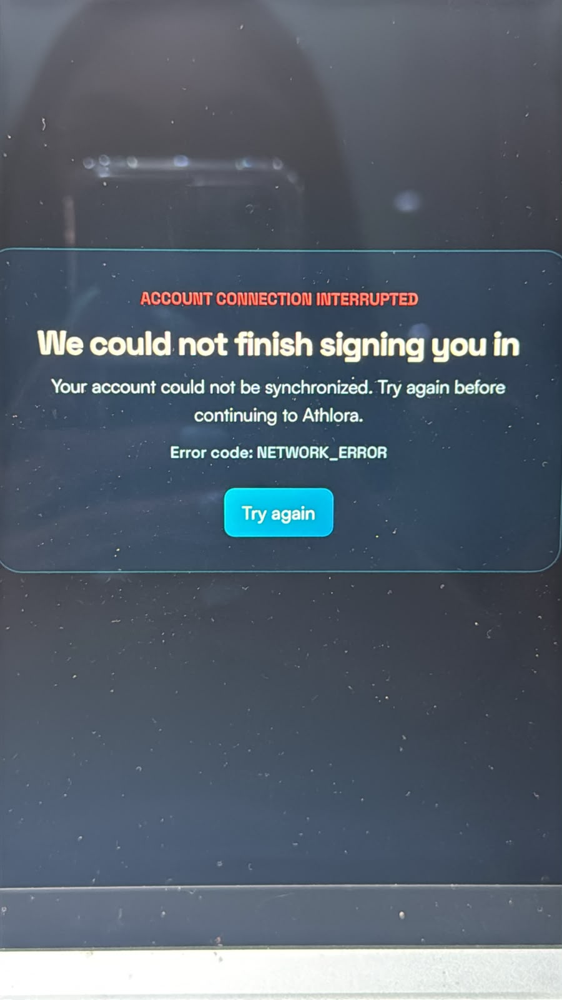

**[12:55:50] Vikram Mahalingam:** Yea it does that sometimes

**[12:56:05] Aaliah Reddy:** mines not working at all😭😭😭

**[12:56:05] Vikram Mahalingam:** Try open it again in a new tab or new browser

**[12:56:17] Aaliah Reddy:** i tried chrome 😭😭😭

**[12:56:20] Vareshan Rajah:** Clear your cache and try again

**[12:56:22] Aaliah Reddy:** still not working

**[12:56:33] Muhammed Bayat:** Try incognito

**[12:57:43] Vikram Mahalingam:** I can log in fine

**[12:59:18] Aaliah Reddy:** i cleared my cache and it’s still not working

**[12:59:32] Muhammed Bayat:** Is this locally?

**[12:59:51] Aaliah Reddy:** yep

**[13:03:38] Aaliah Reddy:** so weird idk why my .env files changed

**[13:03:49] Aaliah Reddy:** can someone send me backend .env and frontend

**[13:04:02] Muhammed Bayat:** Broski what’s cooking 😭😭

**[13:04:12] Aaliah Reddy:** i have no idea wtf is happening

**[13:04:24] Aaliah Reddy:** this is the backend and idk why [Attachment omitted — contained environment credentials]

**[13:04:41] Muhammed Bayat:** Lemme find n send

**[13:04:53] Vikram Mahalingam:** Yea mize the S3 stuff that’s for media storage we don’t have the keys for that yet

**[13:05:22] Muhammed Bayat:** Which model you using

**[13:05:53] Aaliah Reddy:** terra

**[13:07:21] Aaliah Reddy:** i can’t test my changes until i have the proper env 😭😭

**[13:08:01] Vikram Mahalingam:** It should be somewhere in this chat

**[13:08:14] Vikram Mahalingam:** Try search .env

**[13:08:46] Vikram Mahalingam:** Just fill in what’s there

**[13:10:36] Muhammed Bayat:** AUTH0_AUDIENCE=https://api.athlora.app 
AUTH0_DOMAIN=athlora.eu.auth0.com 
CORS_ORIGINS=https://athlora-deploy.vercel.app 
DATABASE_URL=[REDACTED — database credential] 
GEMINI_API_KEY=[REDACTED — API key] 
NODE_VERSION=22

**[13:23:27] Aaliah Reddy:** I’m gonna kms

**[13:23:38] Aaliah Reddy:** everytime i restart the app this happens

**[13:23:51] Aaliah Reddy:** goes back to blank🙂 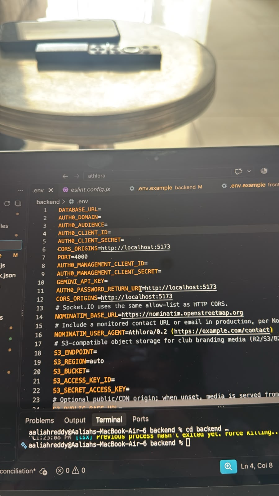

**[13:24:45] Muhammed Bayat:** Put it in the not example

**[13:24:50] Muhammed Bayat:** Just .env

**[13:25:02] Aaliah Reddy:** yes i know

**[13:25:26] Aaliah Reddy:** everytime i change .env and then restart the app and then go back to .env it removes all the links

**[13:25:28] Aaliah Reddy:** idk why

**[13:27:20] Aaliah Reddy:** i fixed it ffs

**[13:31:37] Aaliah Reddy:** so with the multi device offline sync thing i can’t really test it locally and because so many things are broken it’s kind of a pain to test😭 
so im just gonna push now and then once we fix everything i can test it on the deployed site

**[13:32:35] Muhammed Bayat:** Yea just push

**[13:32:38] Muhammed Bayat:** I’ll start working

**[13:33:50] Aaliah Reddy:** done, lmk if you need help with the bug fixes

**[13:33:53] Aaliah Reddy:** also

**[13:34:05] Aaliah Reddy:** i did make the forms, yall can just fill it in tbh 😭😭😭

**[13:36:22] Aaliah Reddy:** https://docs.google.com/forms/d/e/1FAIpQLSfczJzQOHjPjxnKbDkbTO__wUCX73WfQMrekazVws_63OFncQ/viewform?usp=publish-editor

**[13:36:58] Aaliah Reddy:** https://docs.google.com/forms/d/e/1FAIpQLSfIRNF6zK0o6r2H-QCCJzMuktdk-tT9GodFehz3dM46fVJkSw/viewform?usp=publish-editor

**[15:27:46] Muhammed Bayat:** what was wrong coz i think for some odd reason im having the same issues now

**[16:08:05] Aaliah Reddy:** ‎audio omitted

**[16:08:54] Aaliah Reddy:** i asked my agent and it told me to fix it and run some db migrate thing

**[17:12:44] Muhammed Bayat:** Kayy I’m busy working don’t make any changes please

**[17:38:09] Muhammed Bayat:** Okay so I’ve redone the athletes tab but I’m out of credits soo you guys wanna just wait until it resets which is like at 8

**[20:46:00] Muhammed Bayat:** Okay see the athlete stuff how it’s done and what not so tryna to make it similar for whatever other fixes

**[20:46:06] Muhammed Bayat:** I’m busy with fixed for the comparisons

**[20:46:16] Muhammed Bayat:** Maybe if someone can start it for event creation and stuff

**[20:46:38] Muhammed Bayat:** Like try working and using it and just prompt and work along side small prompts so it doesn’t do nonsense 😭

**[20:46:57] Muhammed Bayat:** And idk why logging in is broken on the deployed so if someone can fix that 🥹

**[20:58:20] Muhammed Bayat:** In out of credits so I’ll carry on working on the comparisons public and private once It’s back

**[21:06:38] Vareshan Rajah:** Can I go in and do UI fixes now?

**[21:07:09] Muhammed Bayat:** Mize UI bigger problems is like actual flows 😭and getting stuff working the way we intended

**[21:07:27] Vareshan Rajah:** Okay calm😭

**[21:07:33] Muhammed Bayat:** Do this first

**[21:07:47] Muhammed Bayat:** Then check this n start on events

**[21:07:50] Vareshan Rajah:** Okay I will start now

### 2026/09/27

**[00:43:17] Vareshan Rajah:** Okay so the logging in works, and I've fixed all the event stuff

**[11:32:09] Muhammed Bayat:** did you guys send the from to harshil

**[11:41:38] Vareshan Rajah:** Ohh my bad I didn't, coz I thought we still had errors and stuff to fix

**[11:42:00] Muhammed Bayat:** Nah just send it iwl I doubt he’ll use it he can just answer whatever 😭

**[11:42:25] Muhammed Bayat:** You guys don’t forget to do responses too

**[11:42:34] Vareshan Rajah:** Okay calm

**[15:28:54] Aaliah Reddy:** @⁨Muhammed Bayat⁩ can i do these?? 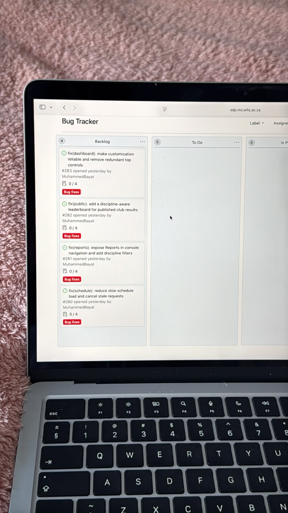

**[15:42:56] Aaliah Reddy:** also pls remember to send

**[15:43:08] Aaliah Reddy:** i’ve got 5 responses so far

**[15:46:11] Muhammed Bayat:** Yuhh but please don’t just ask ur chat to fix the issue coz half the time we don’t know what it ends up doing 😭😭

**[15:46:39] Muhammed Bayat:** Like find out what the actual issue Is n try to fix n check locally n then push

**[15:47:19] Aaliah Reddy:** okay okay cool, will let you know how many i can get done before my limit runs out

**[15:47:35] Aaliah Reddy:** also did you figure out a way to use a pinger to make performance a bit faster?

**[15:48:00] Muhammed Bayat:** Raj and I were busy fixing stuff with the event creation which was quite broken

**[15:48:16] Muhammed Bayat:** So once I get my limit I’ll check the live event

**[15:48:24] Muhammed Bayat:** Cox I’m sure that’s going to be broken as well

**[15:48:53] Muhammed Bayat:** Most of these stuff are the public stuff that you dont need to login for

**[15:48:59] Muhammed Bayat:** I’ll get to it 😭

**[15:49:31] Aaliah Reddy:** yeah it’s all dashboard stuff

**[15:52:12] Aaliah Reddy:** so the one issue is about the schedule page taking long to load

**[15:52:18] Aaliah Reddy:** but when i use it it’s quick 😭

**[15:52:41] Aaliah Reddy:** ‎video omitted

**[15:55:42] Aaliah Reddy:** also found a bug in the reports page, so when you search you have to put the full discipline and when you remove the discipline from search then it says “device is offline”

**[15:56:24] Muhammed Bayat:** Ehh should be fine then

**[15:56:36] Muhammed Bayat:** Yea just play around and whatever needs fixing try to fix 😭😭

**[15:56:53] Muhammed Bayat:** My usage comes back at 5 so I’ll carry on then with the live logger

**[16:06:16] Aaliah Reddy:** @⁨Muhammed Bayat⁩ help😭😭😭 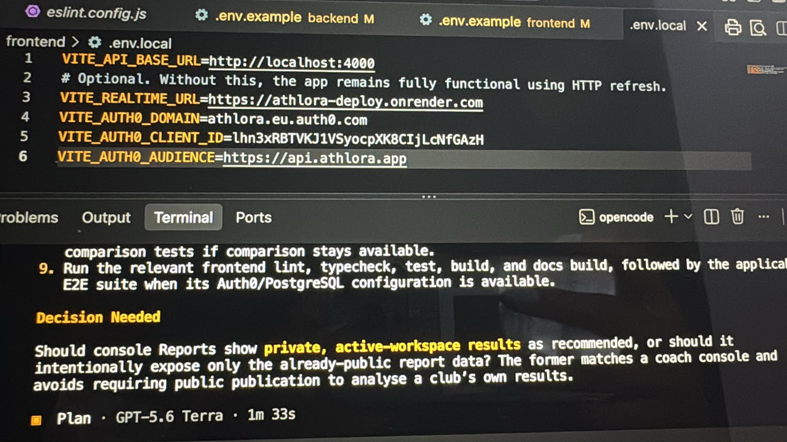

**[16:07:11] Muhammed Bayat:** Is this the reports from when you aren’t logged in?

**[16:07:19] Aaliah Reddy:** yeah

**[16:07:40] Muhammed Bayat:** Should only show for clubs that publish

**[16:08:21] Aaliah Reddy:** oh no i think its the logged in one

**[16:08:26] Aaliah Reddy:** it says console report

**[16:08:45] Muhammed Bayat:** Iwl idk what’s a console report 😭

**[16:08:52] Aaliah Reddy:** neither do i

**[16:08:55] Aaliah Reddy:** i’m so confused

**[16:09:01] Muhammed Bayat:** ‎sticker omitted

**[16:09:17] Aaliah Reddy:** 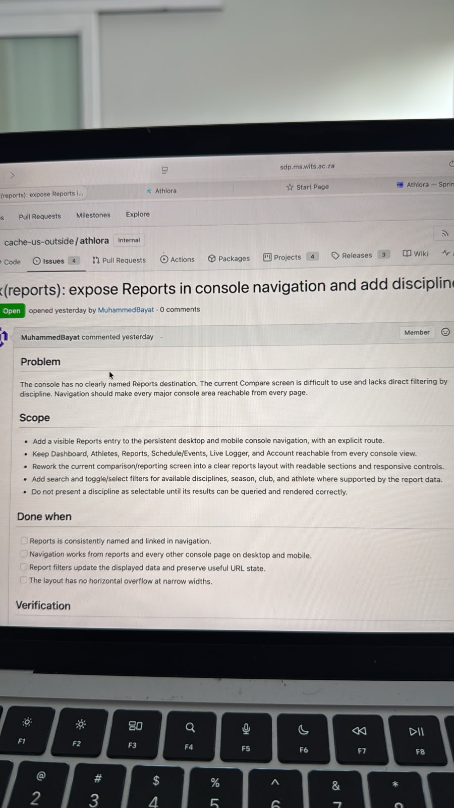

**[16:09:33] Aaliah Reddy:** @⁨Vareshan Rajah⁩ what report are you referring to?

**[16:09:34] Muhammed Bayat:** Ohh

**[16:09:38] Muhammed Bayat:** No mahn

**[16:09:40] Muhammed Bayat:** This is just

**[16:09:46] Muhammed Bayat:** Yk when u on the Home Screen

**[16:09:52] Muhammed Bayat:** U can go to stats

**[16:09:59] Muhammed Bayat:** And schedule

**[16:10:14] Muhammed Bayat:** So just make sure when you go to another screen you can go to every other screen

**[16:10:26] Vareshan Rajah:** Me?

**[16:10:30] Aaliah Reddy:** yeahh i thought as much, there’s a few things broken with the reports then

**[16:10:31] Aaliah Reddy:** nvm

**[16:10:37] Aaliah Reddy:** it says you added it to the bug tracker

**[16:11:04] Muhammed Bayat:** Yea

**[16:11:07] Vareshan Rajah:** Ohh ya I just added everything to the bug tracker

**[16:13:19] Aaliah Reddy:** yeah but my agent doesn’t seem to know what the issue is talking about

**[16:14:24] Muhammed Bayat:** Just tell it ignore the issue and tell it manually

**[16:15:34] Aaliah Reddy:** yeah no it wanted to change the signed in compare thing to reports but i told it no

**[16:16:43] Muhammed Bayat:** For all the issues just like walk through using the app if i u see something wrong manually fix

**[16:47:32] Aaliah Reddy:** has anyone taken any other results for other disciplines? cause the reports page only shows 100m so just lmk

**[16:48:00] Muhammed Bayat:** I don’t think so imma run it on the live logger n see

**[16:48:10] Aaliah Reddy:** okay lmk, still fixing this reports page

**[16:48:21] Aaliah Reddy:** it had so many issues and my chat is getting confused

**[16:48:21] Muhammed Bayat:** You can just put no result tho see how the compare stats is

**[16:48:30] Muhammed Bayat:** On the public or when logged in

**[16:48:33] Muhammed Bayat:** It does it quite nicely

**[16:49:45] Aaliah Reddy:** also what is this leaderboard for? it doesn’t seem to work😭 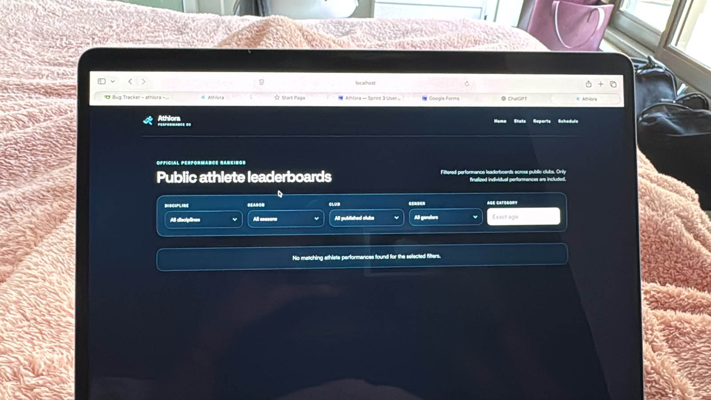

**[16:50:15] Aaliah Reddy:** huh?😭

**[16:50:20] Muhammed Bayat:** It’s supposed to be implemented

**[16:51:00] Muhammed Bayat:** ‎audio omitted

**[16:51:33] Aaliah Reddy:** it just says 0 published results yeah

**[16:51:43] Muhammed Bayat:** Yea so you can say that for the report

**[16:51:47] Aaliah Reddy:** yeah i did that already

**[16:51:58] Muhammed Bayat:** Okay yea then it’s fine

**[16:52:04] Aaliah Reddy:** i just did it like this 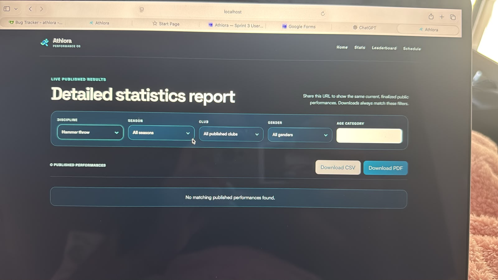

**[16:52:11] Aaliah Reddy:** okay so what’s up with the leaderboard

**[16:52:15] Aaliah Reddy:** how is it supposed to be?

**[16:52:46] Muhammed Bayat:** Honestly idek it’s just a requirement in the brief that there should be a ladder board 😭😭

**[16:53:15] Muhammed Bayat:** Maybe it can be like count like the places or lowest stats or something and show idk tbh 😭😭

**[16:53:55] Aaliah Reddy:** yeah idk what the logic behind it should be

**[16:54:16] Muhammed Bayat:** Ask ur agent for some ideas coz me too idk

**[16:54:45] Aaliah Reddy:** i will😭😭😭

**[16:58:46] Aaliah Reddy:** where in the brief does it say we have to have a leaderboard?

**[16:59:11] Muhammed Bayat:** Does it not 😭

**[17:00:05] Muhammed Bayat:** 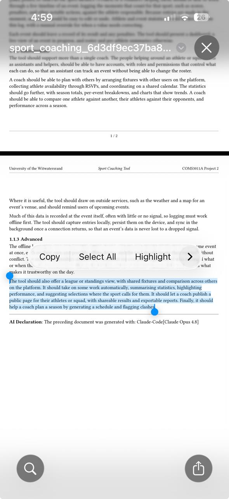

**[17:00:19] Muhammed Bayat:** League / leaderboard idk 🤷‍♂️

**[17:00:30] Aaliah Reddy:** oh i see

**[17:07:18] Aaliah Reddy:** momo i’m still busy, so just give me a bit before you continue

**[17:07:37] Muhammed Bayat:** Lmk when you’re done

**[17:07:46] Aaliah Reddy:** pray my credits don’t run out

**[17:14:00] Aaliah Reddy:** @⁨Vareshan Rajah⁩ let me know if Harshil says he did the form

**[17:17:40] Aaliah Reddy:** okay so the leaderboard is done, the leaderboard has athlete standings and then i implemented club standings as well, i don’t have the logic there 100% but my credits are about to run out

**[17:19:38] Muhammed Bayat:** Yea it’s okay just push

**[17:19:44] Muhammed Bayat:** If I have left over I’ll work on it

**[17:20:42] Vareshan Rajah:** Will do

**[17:24:10] Aaliah Reddy:** had to use a free one to commit and push, hope it didn’t break anything

**[17:25:44] Aaliah Reddy:** this is the plan for the standings stuff 
The zero values are consistent with the current query, but reveal a gap in its data source. 
Why It Happens 
- backend/src/services/standings.ts starts with every public club that participated in an eligible completed shared fixture. 
- It then calculates points only from session_results.final_place. 
- final_place is populated only when a discipline session is explicitly finalized in backend/src/services/meets.ts:87. 
- Legacy 100m fixture rows live in results.placing, not session_results.final_place, and are not included in the standings calculation at all. 
So every club will show 0 when: 
- Your shared fixtures use the legacy 100m result flow, or 
- Your session results are completed but not finalized, leaving final_place as NULL. 
Recommended Fix Plan 
1. Keep finalized session results as the authoritative source for multi-discipline standings. 
2. Extend the standings scored CTE with a UNION ALL for legacy results: 
- Use results.placing as the place. 
- Include completed shared fixtures only. 
- Require valid positive effective results, active athletes, public clubs, and accepted current fixture membership. 
- Apply the same 5 / 3 / 1 mapping. 
3. Keep unfinalized session results at zero by design: 
- Standings should only use official results. 
- Add UI text explaining that points appear after session finalization. 
4. Add real-Postgres integration coverage for: 
- Legacy 100m first/second/third fixture results. 
- Finalized session individual results. 
- Finalized relay results counted once for the club. 
- Completed but unfinalized sessions producing no points. 
- Tie placements receiving the correct shared-place points. 
5. Add a frontend test showing a legitimate zero-point club separately from a loading or query failure. 
One decision is needed before implementation: should unfinalized session results remain excluded, as recommended for official standings, or should the page show provisional points with a clear “provisional” label?

**[19:23:29] Muhammed Bayat:** Yoh iwl guys

**[19:23:33] Muhammed Bayat:** Stuff just keeps breaking

**[19:23:35] Muhammed Bayat:** 😭😭

**[19:29:31] Muhammed Bayat:** Lowkey worse case scenario is we have to mize the whole multiple sport thing n just leave it as 100m 😭😭 coz istg

**[19:34:53] Vikram Mahalingam:** Give me a list of things that are still breaking and I’ll try my best😭

**[19:35:16] Muhammed Bayat:** Imma work now on it I’ll let you know when I’m done

**[19:35:29] Vikram Mahalingam:** 👍

**[19:36:00] Vikram Mahalingam:** Oh is the assistant stuff supposed to be implemented cause I can’t sign in as an assistant 😭

**[19:44:01] Vareshan Rajah:** Ohh chaai😭😭

**[20:18:46] Muhammed Bayat:** It was 😭😭

**[20:20:01] Muhammed Bayat:** I signed it w mine and it was fine ?

**[20:20:21] Vikram Mahalingam:** Maybe it’s just mine

**[20:20:49] Aaliah Reddy:** let us know if anyone needs to help you

**[21:32:10] Muhammed Bayat:** Okay I got the event creation and stuff working I think but the live logger isn’t working at all like when you click start event it doesn’t even start up a live logger

**[21:32:25] Muhammed Bayat:** Soo I’m using open code rn I have about 40% left

**[21:32:49] Muhammed Bayat:** So either someone else will have to finish up or if you guys don’t mind just send ur open code details and I’ll use ur account n carry on

**[21:33:03] Muhammed Bayat:** Tokens reset on the 30th September so we’ll be fine for the test

**[21:33:32] Muhammed Bayat:** It actually lasts a decent amount so I’ll let you guys know

**[22:05:23] Muhammed Bayat:** I meant qoder sorry

**[22:05:37] Muhammed Bayat:** Again I meant qoder 😭

**[22:16:22] Muhammed Bayat:** Anyways I’m pushing my changes and stuff I’ll work on it more Tom morning

**[22:25:22] Vareshan Rajah:** @⁨Aaliah Reddy⁩ harshil says he has done the stakeholder feedback

### 2026/09/28

**[09:03:42] Aaliah Reddy:** kk, lmk when you’ve all done with the user one so i can do the docs

**[09:09:17] Muhammed Bayat:** A lot of stuffs failing for deployment I’ll fix it once I’m done w everything locally

**[09:31:37] Muhammed Bayat:** @⁨Vikram Mahalingam⁩ could you maybe on ur runners for abit coz I think Brendan’s are quite busy rn

**[09:32:02] Vikram Mahalingam:** Yup

**[09:32:09] Vikram Mahalingam:** Give me a sec

**[09:35:19] Vikram Mahalingam:** It’s on

**[09:36:47] Muhammed Bayat:** Thankss

**[11:32:24] Muhammed Bayat:** Progress is being made 😭

**[11:32:52] Muhammed Bayat:** Imma just check that once an event completes the stats are uploaded and then that the offline logger works n it should be good to go

**[11:33:29] Aaliah Reddy:** okay cool! i also just want to make sure the offline logging still works cause i couldn’t test that but ill do it when you’re done and then i’ll finish up our meetings and the form stuff

**[11:33:41] Aaliah Reddy:** and tyra can do the user stories 😭

**[11:33:58] Muhammed Bayat:** It’s looking quite nice

**[11:34:18] Aaliah Reddy:** why didn’t we think to use qoder 😭😭😭😭

**[11:34:36] Muhammed Bayat:** ‎video omitted

**[11:35:03] Muhammed Bayat:** Bro 😭 I’m actually flying through credits but it’s like lasting a decent amount icel

**[11:35:07] Aaliah Reddy:** so noice

**[11:35:25] Aaliah Reddy:** okay that’s good, if you need any help just let us know

**[11:35:32] Muhammed Bayat:** I can’t wait to be done with this yoh 😭

**[11:35:48] Vareshan Rajah:** Ya I'm out of qoder credits😭

**[11:35:52] Aaliah Reddy:** atleast the app will be fully done now and we can hand in and stuff

**[11:36:07] Muhammed Bayat:** Frr

**[11:36:10] Aaliah Reddy:** we can also start just planning our presentation and stuff so that’s done well in advance

**[14:24:03] Muhammed Bayat:** from the reports and leaderboard section just fix the ui for the age category or you can remove it just make sure it works after you do the change 
 
check if the ai still works now when you can assign disciplines 
 
check offline logging

**[14:24:39] Muhammed Bayat:** 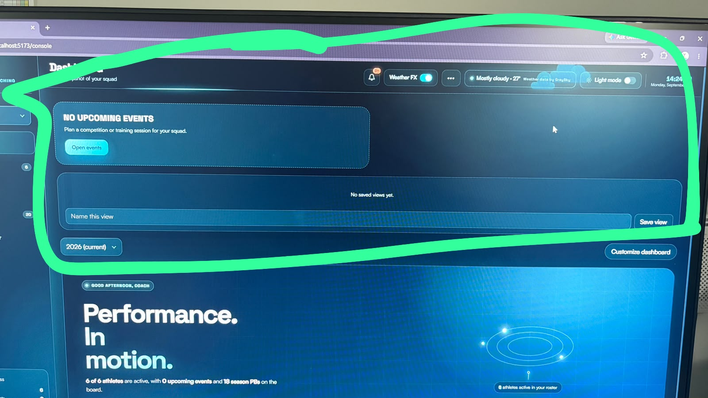

**[14:24:46] Muhammed Bayat:** remove these two stuff here

**[14:25:10] Muhammed Bayat:** check the customization just someone figure out how it works and make sure the panels that show actually work

**[14:25:38] Muhammed Bayat:** and lastly when you go to accoutn ur supposedly should beable to add like a profile pic which does work

**[14:25:59] Muhammed Bayat:** im going to push soon so then you guys can pick up and do these checks/fixes

**[14:31:41] Aaliah Reddy:** i’ll get started now

**[14:34:51] Muhammed Bayat:** It’s pushed just check idk their might be some deployment issues @⁨Vikram Mahalingam⁩ is the runner still on

**[14:35:04] Muhammed Bayat:** But yea most of the logic should be good

**[14:35:35] Vikram Mahalingam:** Nah I’ll turn it on in a sec

**[14:35:43] Muhammed Bayat:** Just wait I’m getting some deployment errors lemme try to fix them so you won’t have to

**[14:35:49] Aaliah Reddy:** why are there 2 responses for the stakeholder feedback😭😭 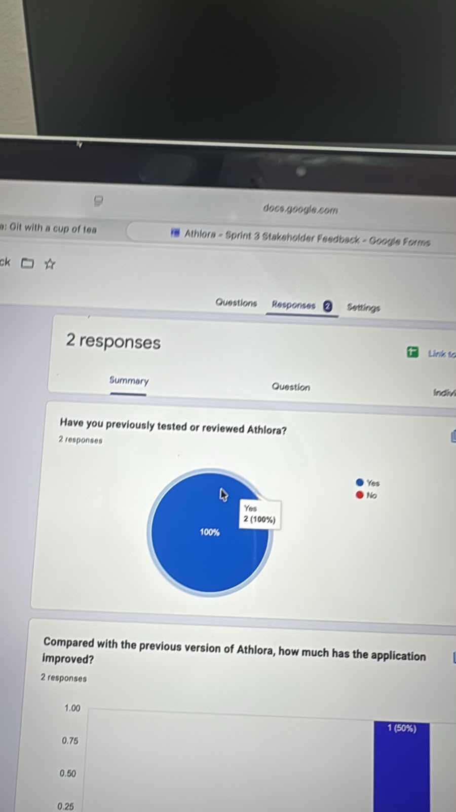

**[14:36:13] Muhammed Bayat:** Maybe he did it twice

**[14:36:19] Aaliah Reddy:** 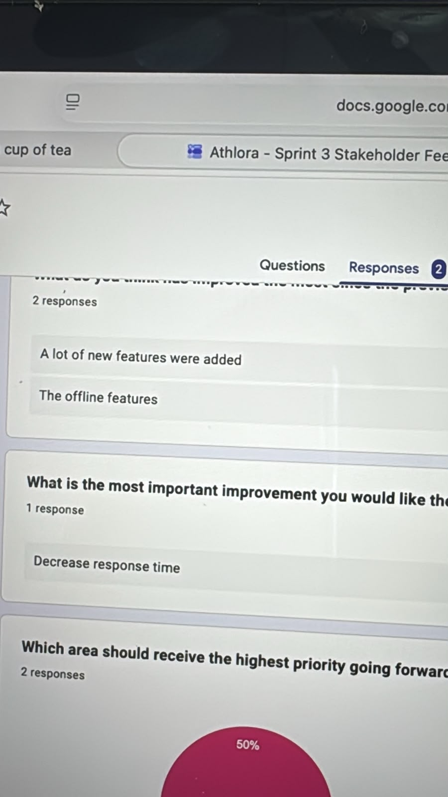

**[14:36:23] Aaliah Reddy:** this is very important

**[14:37:13] Vikram Mahalingam:** How many user responses do we have so far?

**[14:37:21] Vikram Mahalingam:** I’ll try get two more today

**[14:37:45] Muhammed Bayat:** Iwl I was using it now it looked decent

**[14:37:55] Aaliah Reddy:** i’m trying to do it now😭

**[14:37:58] Aaliah Reddy:** we have 7

**[14:37:58] Muhammed Bayat:** You can try when ur working n lmk

**[14:38:10] Aaliah Reddy:** response time?

**[14:38:16] Muhammed Bayat:** Yea

**[14:38:28] Aaliah Reddy:** the loading usually takes quite long

**[14:38:46] Muhammed Bayat:** It’s just the first load so we’ll just have it loaded and signed in before we show them

**[14:38:58] Aaliah Reddy:** i was gonna do the docs and stuff now first but it’s fine then i’ll do the fixes and do the docs later then

**[14:39:26] Aaliah Reddy:** yeah but that’s the whole point of fixing it😭 
i’m pretty sure that’s what harshil means about response time

**[14:40:03] Muhammed Bayat:** Let’s focus on these core features to be working first 😭

**[14:40:12] Muhammed Bayat:** Performance is for sprint 4

**[14:40:18] Aaliah Reddy:** and sprint 3

**[14:40:30] Muhammed Bayat:** ‎sticker omitted

**[14:40:48] Aaliah Reddy:** 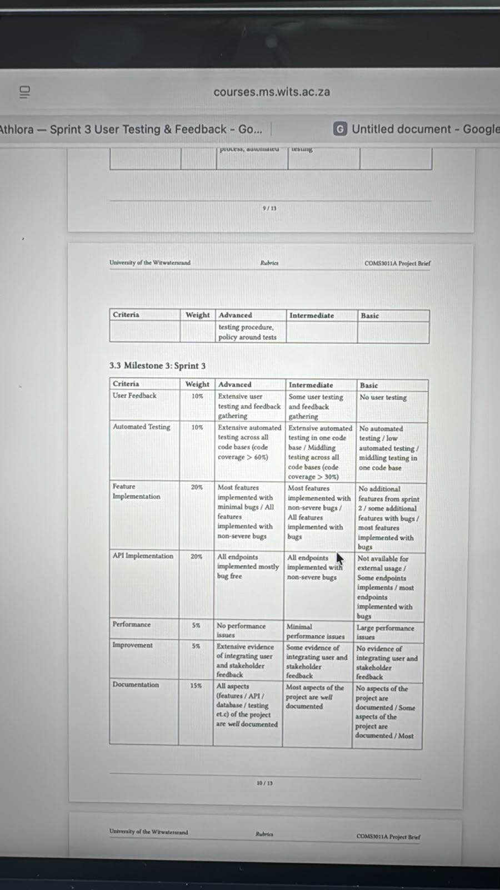

**[14:40:54] Muhammed Bayat:** Oh shoot

**[14:40:56] Muhammed Bayat:** Yea okay

**[14:41:15] Muhammed Bayat:** I’ll do it once we’re done with these

**[14:45:00] Vikram Mahalingam:** @⁨Vareshan Rajah⁩ just make sure Harshil filled out the form for client meetings as well

**[14:47:05] Muhammed Bayat:** kayy @⁨Aaliah Reddy⁩ all urs

**[14:48:21] Muhammed Bayat:** the deploumnets fixed

**[14:48:37] Vareshan Rajah:** Ya I sent him a message now

**[14:48:57] Aaliah Reddy:** okay so the offline logger is a bit *** 😭

**[14:49:12] Muhammed Bayat:** why

**[14:49:53] Aaliah Reddy:** okay so idk why it’s not letting me scroll, and all of these people are assigned to different disciplines for the meet but it doesn’t account for those different disciplines 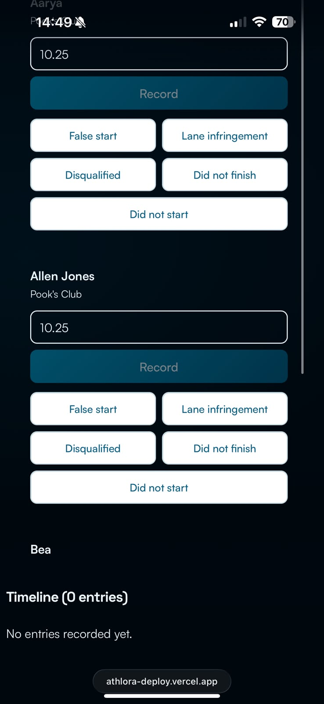

**[14:50:17] Muhammed Bayat:** okay so

**[14:50:20] Muhammed Bayat:** tell ur agen t

**[14:50:34] Muhammed Bayat:** wait was this when u scanned the qr code?

**[14:50:39] Muhammed Bayat:** its not supposed to look like that

**[14:50:42] Aaliah Reddy:** yes

**[14:50:43] Muhammed Bayat:** lemme just check

**[14:51:05] Aaliah Reddy:** oh wait

**[14:51:11] Aaliah Reddy:** my phone was tweaking wtf😭

**[14:51:23] Muhammed Bayat:** dont scare me like that dawg

**[14:51:33] Muhammed Bayat:** is it fine?

**[14:51:43] Aaliah Reddy:** why is it saying 0 athletes 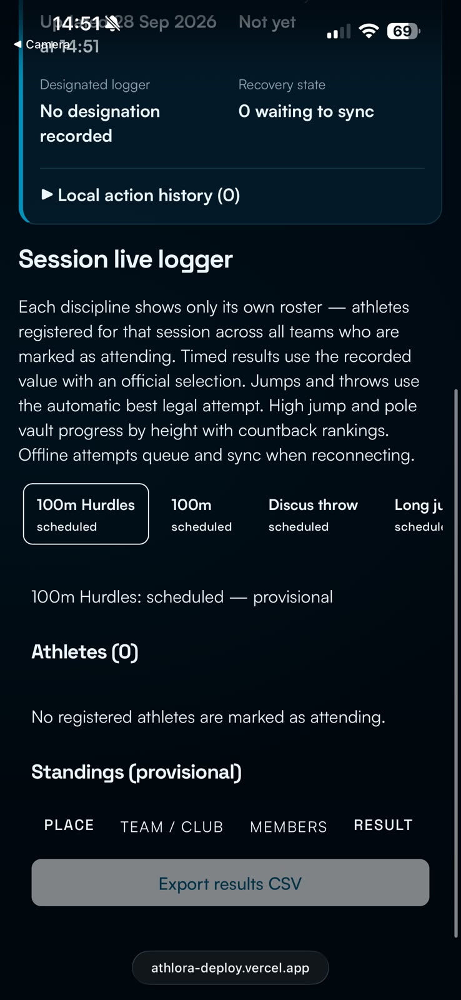

**[14:51:54] Aaliah Reddy:** oh wait

**[14:52:10] Muhammed Bayat:** yea performance

**[14:52:13] Muhammed Bayat:** its because

**[14:52:16] Aaliah Reddy:** do i have to start each one separately and then it’ll appear in the logger? 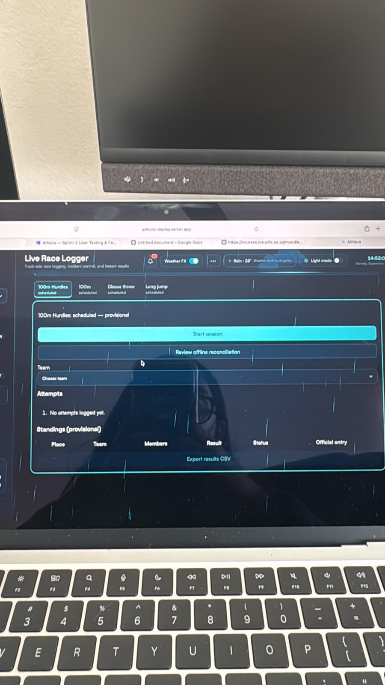

**[14:52:23] Muhammed Bayat:** its updating across every like device

**[14:52:30] Muhammed Bayat:** so its constantly reloading

**[14:52:45] Vareshan Rajah:** I do need to fix the scrolling, but it's not a train smash for now

**[14:52:49] Aaliah Reddy:** no what i’m asking is how do we get the athletes to show on the offline logger

**[14:52:58] Aaliah Reddy:** no my phone was using an old one

**[14:53:10] Muhammed Bayat:** wait so the online qr code logger right

**[14:53:16] Muhammed Bayat:** that shows the athletes?

**[14:53:24] Aaliah Reddy:** [REDACTED — public logger session URL]

**[14:54:40] Muhammed Bayat:** lemme just try something real quick

**[14:54:43] Muhammed Bayat:** which club u using

**[14:54:45] Muhammed Bayat:** pooks/

**[14:54:46] Muhammed Bayat:** ?

**[14:55:05] Aaliah Reddy:** wait

**[14:55:42] Aaliah Reddy:** okay i got it

**[14:55:49] Aaliah Reddy:** i didn’t mark the athletes as attending

**[14:56:01] Muhammed Bayat:** make a new event

**[14:56:07] Aaliah Reddy:** 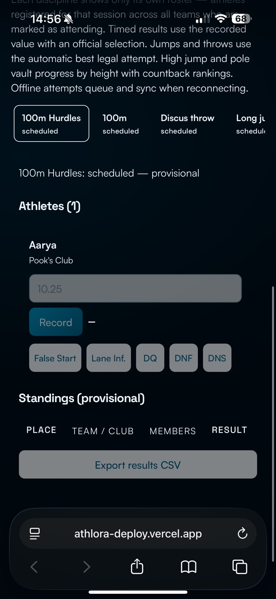

**[14:56:07] Muhammed Bayat:** and try it there

**[14:56:11] Aaliah Reddy:** the event is offline test meet

**[14:56:25] Aaliah Reddy:** but now i can’t enter values

**[14:56:38] Vareshan Rajah:** 😭😭

**[14:56:43] Muhammed Bayat:** wait wait

**[14:56:48] Tyra:** I’ll do the user stories and user testing tonight 🫣

**[14:56:48] Aaliah Reddy:** okay no i figured it out

**[14:56:51] Muhammed Bayat:** bro

**[14:56:55] Aaliah Reddy:** so you have to start each one separately

**[14:56:59] Muhammed Bayat:** 😭😭😭

**[14:57:02] Muhammed Bayat:** yea

**[14:57:05] Aaliah Reddy:** this was confusing 😭

**[14:57:09] Muhammed Bayat:** but once ur start the event

**[14:57:19] Muhammed Bayat:** the full event should appear in the live logger

**[14:57:29] Muhammed Bayat:** and then in the single live logger you start each discipline seperatly

**[14:57:38] Aaliah Reddy:** okay i see

**[14:57:46] Muhammed Bayat:** then the host can undo all records, unless ur the host u can only undo ur own record

**[14:58:13] Muhammed Bayat:** and then you pick a final value .. a coach has to do this

**[14:58:17] Muhammed Bayat:** and then it orders

**[14:58:34] Muhammed Bayat:** so just see how the offline logger works and if it does

**[15:00:35] Muhammed Bayat:** also its running with the assumption everyone at the meet is on and using athlora ik we wanted to fix it but its actually an insane amount of work and fixing so we can leave it as is im pretty sure

**[15:01:01] Vikram Mahalingam:** Yea mize💀

**[15:01:28] Vareshan Rajah:** 😭🤣🤣

**[15:02:27] Muhammed Bayat:** and then once everythings done either tonight or tom ill seed the database abit so the stats and report pages look decent

**[15:02:52] Aaliah Reddy:** okay the only issue i found was if you press like DQ, or DNF and you want to remove it you can’t

**[15:03:01] Aaliah Reddy:** like it won’t go away 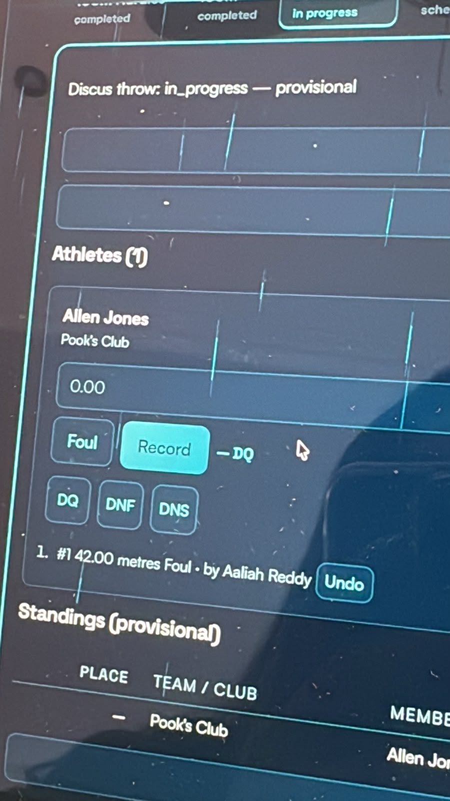

**[15:03:06] Vikram Mahalingam:** Lmk when you want me to do the release

**[15:03:38] Muhammed Bayat:** small potatoe?

**[15:03:45] Aaliah Reddy:** and there’s no make official for discus 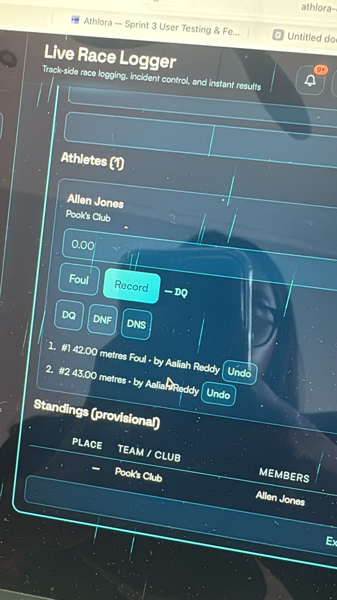

**[15:03:48] Vareshan Rajah:** Well tbf, if they DQ they don't have another chance😭

**[15:04:11] Aaliah Reddy:** also when you press refresh data nothing happens, have to refresh the entire page to get the offline stuff

**[15:04:23] Aaliah Reddy:** yeah but i even pressed undo

**[15:04:37] Muhammed Bayat:** okay i think the field ones dont have a make official so can u just add these

**[15:05:10] Aaliah Reddy:** nvm

**[15:10:28] Aaliah Reddy:** he did it fill it out, he did it twice though but it’s fine

**[15:16:47] Aaliah Reddy:** also uploading a logo gives an internal server error 😭

**[15:17:16] Aaliah Reddy:** the colour stuff also works kinda weirdly

**[15:20:53] Vareshan Rajah:** Ohh chaai😭

**[15:21:33] Vikram Mahalingam:** Yea the s3 bucket api isn’t set up 💀

**[15:21:54] Vikram Mahalingam:** It’s not critical so we can that first thing next sprint

**[15:22:29] Aaliah Reddy:** okay no problem, but then must i leave the colours and stuff too? idk what the point of it really is 😭

**[15:22:54] Vikram Mahalingam:** Idk what that stuff is icl😭

**[15:23:21] Aaliah Reddy:** it just changes the logo colour so idek what the accent is for either 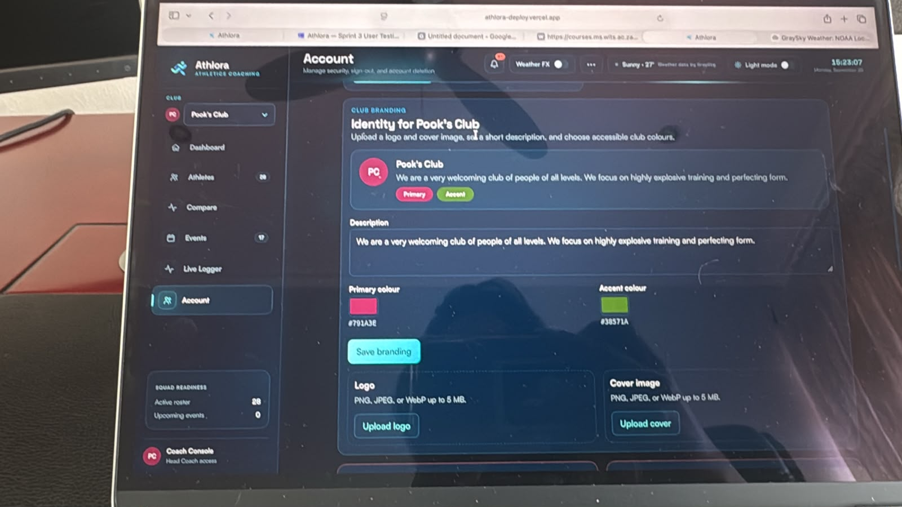

**[15:26:16] Vikram Mahalingam:** Oh I see

**[15:39:12] Vareshan Rajah:** Who's changing my colours to this😭🤣🤣

**[15:40:42] Aaliah Reddy:** i was trying to see how this works

**[15:40:44] Muhammed Bayat:** If ur done with the rest of the stuff and you can then implement it

**[15:40:53] Muhammed Bayat:** If you cant lmk and ill try

**[15:51:06] Aaliah Reddy:** is the weather working fine?

**[15:51:21] Aaliah Reddy:** cause for some reason it’s raining on mine but it’s very sunny outside

**[16:03:57] Aaliah Reddy:** okay so the AI doesn’t work for adding disciplines, it adds it as a note instead of selecting them

**[16:06:11] Muhammed Bayat:** @⁨Vareshan Rajah⁩

**[16:06:15] Muhammed Bayat:** Can you fix ?

**[16:07:30] Vareshan Rajah:** Ya that's a simple fix

**[16:07:40] Vareshan Rajah:** I'll do it once my credits are back

**[16:08:01] Vareshan Rajah:** The rain is coming Aals😭

**[16:08:16] Vareshan Rajah:** But the weather should be working perfectly

**[16:10:17] Muhammed Bayat:** Mines was

**[16:17:21] Aaliah Reddy:** i’m just trying to fix the offline logger rn

**[16:17:26] Aaliah Reddy:** and i think you’re right

**[16:17:38] Aaliah Reddy:** using qoder so it might take some time

**[16:19:45] Aaliah Reddy:** also yall i just want opinions on the dashboard rn  
i personally feel like the dashboard customisation is unnecessary and i feel like it’s too cluttered, there’s roster snapshot, PB’s and recent results which doesn’t work correctly, also the upcoming events doesn’t work and neither does the squad PB trend

**[16:20:49] Vikram Mahalingam:** Yea I agree maybe remove some stuff and move other things elsewhere

**[16:21:04] Vikram Mahalingam:** The saved views thing is also unnecessary imo

**[16:21:13] Aaliah Reddy:** i removed it

**[16:21:25] Vikram Mahalingam:** Ok cool

**[16:55:17] Vareshan Rajah:** @⁨Aaliah Reddy⁩ can I start fixing the AI?

**[17:08:54] Aaliah Reddy:** no😭

**[17:09:01] Aaliah Reddy:** qoder takes long asf

**[17:09:20] Vareshan Rajah:** Alrighty😭

**[17:09:30] Vareshan Rajah:** Which qoder platform are you using?

**[17:09:35] Aaliah Reddy:** i’m still trying to fix the logger but when i’m done i’ll push

**[17:09:43] Vareshan Rajah:** Are you using the same ones that were in the lab?

**[17:09:43] Aaliah Reddy:** cli on vs code

**[17:09:52] Vareshan Rajah:** Ohh okay

**[17:09:56] Vareshan Rajah:** Ohh shit I see

**[17:10:16] Aaliah Reddy:** since it takes so long and i still need to use my chat later for the docs stuff can you also fix the dashboard

**[17:10:30] Aaliah Reddy:** i’ll send what to change now

**[17:10:37] Vareshan Rajah:** Alrighty

**[17:12:07] Aaliah Reddy:** so for the dashboard 
- remove customize dashboard completely it’s unnecessary  
- ⁠remove squad PB trend, recent results and recent PB’s  
- ⁠for the athlete roster - just change it to be the athletes name and their PB’s per discipline that they have and remove the part where it says “no squad assigned” 
- ⁠the upcoming events should work as showing the events for the next 7 days

**[17:12:39] Vareshan Rajah:** Okay just let me know when I can start

**[17:12:51] Aaliah Reddy:** i think my qoder is almost done then i’ll push

**[17:13:15] Vareshan Rajah:** Alrighty

**[17:13:19] Aaliah Reddy:** won’t be able to test the offline logger until it’s deployed so i’ll wait a bit and see if it’s working  
if it’s still not someone might have to use their chat to fix it

**[17:13:38] Muhammed Bayat:** What was wrong

**[17:13:38] Vareshan Rajah:** Ohh chaai😭

**[17:14:23] Aaliah Reddy:** it was just the whole DNF, DQ and DNS thing, if that’s a mistake it should be able to be undone and replaced by another result

**[17:19:32] Muhammed Bayat:** Ohhkay

**[17:39:09] Vareshan Rajah:** @⁨Aaliah Reddy⁩ Is your qoder still busy😭

**[17:39:32] Aaliah Reddy:** yeah😭🤣

**[17:39:49] Muhammed Bayat:** Lowkey this is UI stuff so I surely you can do it seperarly and it shouldn’t affect anything

**[17:39:50] Muhammed Bayat:** ?

**[17:40:24] Vareshan Rajah:** Ya true, coz I'll be busy on the dashboard and the ai only

**[17:41:12] Vareshan Rajah:** I'm gonna start now

**[17:44:27] Aaliah Reddy:** i think it’s committing now😭😭

**[17:49:39] Aaliah Reddy:** nvm it’s still taking its time

**[17:51:39] Vareshan Rajah:** 😭😭

**[17:59:16] Aaliah Reddy:** i’m actually gonna kms

**[17:59:38] Vareshan Rajah:** Whats wrong

**[17:59:46] Aaliah Reddy:** 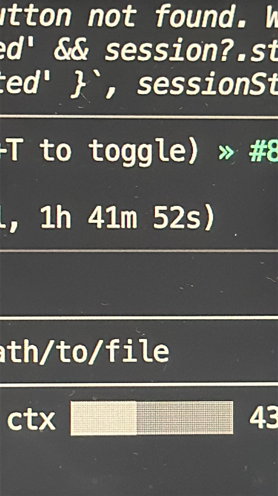

**[18:00:02] Muhammed Bayat:** 💀💀💀💀💀💀💀

**[18:00:09] Vareshan Rajah:** What the hell😭

**[18:00:21] Vareshan Rajah:** Is it still busy?

**[18:00:28] Aaliah Reddy:** DUDE

**[18:00:29] Aaliah Reddy:** YES

**[18:00:39] Aaliah Reddy:** it’s been committing and checking tests for like an hour

**[18:01:33] Vareshan Rajah:** What tf😭

**[18:01:49] Vareshan Rajah:** Iwl the qoder we were using is so much better

**[18:02:22] Vikram Mahalingam:** These agents get stuck in loops sometimes just tell it to do one final check and push💀

**[18:02:35] Muhammed Bayat:** Ask it how long left

**[18:02:38] Muhammed Bayat:** I kept don’t that

**[18:04:06] Aaliah Reddy:** did you press escape first?

**[18:04:16] Muhammed Bayat:** Nah just sent it

**[18:04:26] Muhammed Bayat:** It should take amin or 2

**[18:04:29] Aaliah Reddy:** mine just queues it

**[18:04:34] Vareshan Rajah:** Dawg she's not using the one we did

**[18:04:40] Aaliah Reddy:** oh nvm

**[18:04:43] Muhammed Bayat:** Nah I used that one

**[18:04:51] Muhammed Bayat:** I switched

**[18:04:54] Muhammed Bayat:** 😭😭

**[18:04:56] Vareshan Rajah:** Ohh😭

**[18:05:07] Aaliah Reddy:** okay it seems to be working a bit faster now

**[18:05:24] Aaliah Reddy:** what do you mean?

**[18:05:34] Muhammed Bayat:** We were using the ide

**[18:05:37] Muhammed Bayat:** Not the cli

**[18:05:59] Aaliah Reddy:** i think the ide is faster though, but it may also be cause there’s so many files and stuff

**[18:06:10] Vareshan Rajah:** The one looks nice and the other looks like a vscode copy😭

**[18:06:21] Vareshan Rajah:** Ya could be

**[18:15:25] Aaliah Reddy:** icl

**[18:15:31] Aaliah Reddy:** my qoder broke everything so i’m not gonna merge

**[18:15:37] Aaliah Reddy:** so pooks yours should be fine when you merge

**[18:23:05] Vareshan Rajah:** Okay calm

**[18:23:27] Vareshan Rajah:** @⁨Aaliah Reddy⁩ is it really important to have the changes that you were making for this sprint?

**[18:24:31] Aaliah Reddy:** i was just trying to fix the offline lovger

**[18:24:35] Aaliah Reddy:** logger*

**[18:25:08] Vareshan Rajah:** The offline logger works tho right?

**[18:25:28] Muhammed Bayat:** Yea

**[18:25:35] Vareshan Rajah:** You just wanted to add the buttons to undo DQ and something else right, but the basic functionality is fine right?

**[18:25:38] Muhammed Bayat:** It’s just this

**[18:25:50] Vareshan Rajah:** Coz then we don't need to implement it now

**[18:25:51] Aaliah Reddy:** it does work, just if you hit any of those buttons you can’t change it, you can’t make it final ‎&lt;This message was edited&gt;

**[18:25:56] Muhammed Bayat:** My agents running it now I’ll test n see but Raj you can carry on working

**[18:26:05] Vareshan Rajah:** Okay calm

**[18:45:07] Muhammed Bayat:** Also note the relay stuff idk if it works

**[18:45:14] Muhammed Bayat:** Well just say it works

**[18:45:16] Muhammed Bayat:** Don’t have to show

**[18:53:50] Aaliah Reddy:** okay we’ll figure it out😭

**[19:00:44] Muhammed Bayat:** Okay I fixed the undo just need to make one other fix but it looks like it’s gonna take a while n I’m going out now so I won’t be back soo Raj you can do ur changes n push n when I’m back or Tom morning I’ll push n hopefully that’ll be it

**[19:05:28] Aaliah Reddy:** my credits should be back now for me to do the docs

**[19:05:31] Aaliah Reddy:** so i’ll get to that now

**[19:06:34] Vareshan Rajah:** Alrighty

**[19:16:23] Muhammed Bayat:** Fixed and merged

**[19:16:42] Muhammed Bayat:** Raj if ur busy just before you submit pull again n then push

**[19:17:05] Vareshan Rajah:** Alrighty

**[19:17:16] Aaliah Reddy:** lmk when you’re done pooks

**[19:17:28] Vareshan Rajah:** Nah Aals start

**[19:17:39] Vareshan Rajah:** Coz I don't know when my thing will finish😭

**[19:17:54] Aaliah Reddy:** okay, they weren’t big fixes so it shouldn’t be too bad

**[19:18:06] Vareshan Rajah:** I might run out and continue later

**[19:18:12] Aaliah Reddy:** oh god 😭

**[19:18:18] Vareshan Rajah:** Ohh ya, I'm doing other stuff as well😭

**[19:18:25] Aaliah Reddy:** what other stuff?😭

**[19:19:07] Vareshan Rajah:** Hmm it's to do with the ai and extending its ability slightly

**[19:19:14] Aaliah Reddy:** oh yeah

**[19:19:48] Aaliah Reddy:** also for the presentation i was gonna do like videos in a powerpoint to show how everything works, do yall agree with that?

**[19:20:04] Vareshan Rajah:** Ya I think that will be really cool

**[19:20:29] Vareshan Rajah:** I think we should also ask Harshil for some advice on how to do the power point

**[19:20:40] Aaliah Reddy:** imma use like that athlora email and create an account and what not and then like populate it with athletes and stuff

**[19:20:50] Aaliah Reddy:** yeah we will, we can meet him on thursday again

**[19:21:09] Vareshan Rajah:** Ya probably

**[19:21:41] Muhammed Bayat:** Don’t u want to do a live demo rather ?

**[19:23:16] Vikram Mahalingam:** I think a mix of both

**[19:23:36] Vikram Mahalingam:** Like demo of the cool features and presentation of the project as a whole

**[19:23:56] Aaliah Reddy:** we have to have a powerpoint i think kamal said

**[19:26:02] Vareshan Rajah:** Ya I think so 

## AI Declaration

This document was transcribed from supplied WhatsApp project-chat evidence with the assistance of OpenCode[openai/gpt-5.6-terra].
